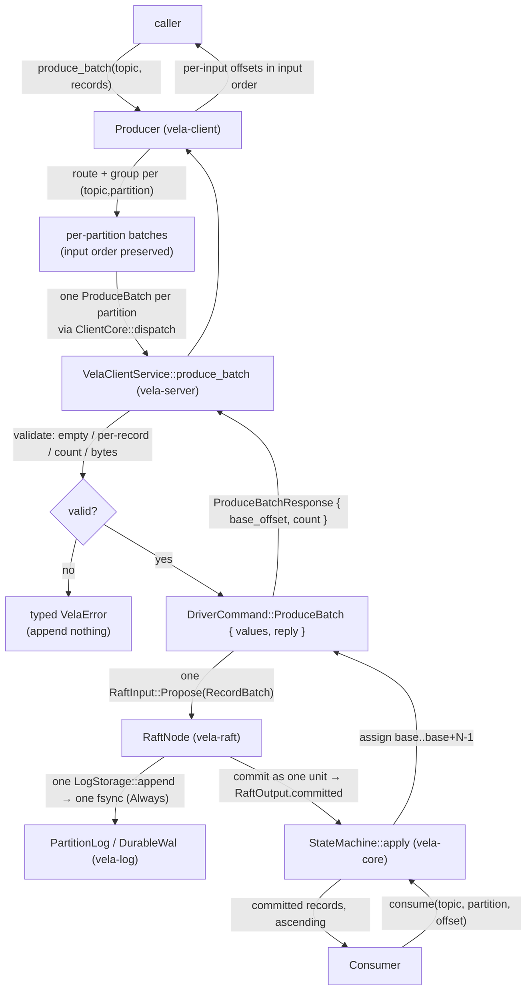

# Design Document

## Overview

Batched produce lets a Producer submit an ordered set of Records to a single
`(topic, partition)` in **one** produce request. The Vela_Cluster appends those
Records together, preserving their order, commits them as a single replicated
unit, makes them durable with a single durability sync, and reports each
Record's Committed_Offset. The existing single-record produce path is preserved
unchanged (Requirement 4).

The motivation is throughput. Today every produced Record costs a full round
trip: a `Produce` RPC, a Raft propose, a log `append`, a durable WAL fsync (the
`DurableWal` runs with `SyncPolicy::Always` — one force per `append` call), a
commit, and an apply. Measured produce throughput is correspondingly low
(~12–44 records/sec). The single highest-leverage change is to amortize that
fixed per-Record cost over many Records: append and commit a whole batch as
**one Raft log entry**, fsynced **once** (Requirement 7).

The design is grounded entirely in the code that exists today:

- **`vela-proto`** — `ProduceRequest { topic, partition, Record record }`,
  `ProduceResponse { offset }`, the `Produce` RPC; `EntryPayload` is a oneof
  `{ Record, Noop, ClusterCommand }`; a `LogEntry { index, term, payload }`
  replicates inside `AppendEntriesRequest { repeated LogEntry entries }`.
  `MAX_MESSAGE_BYTES = 64 MiB` (the raised tonic encode/decode limit).
- **`vela-log`** — `PayloadKind { Record, Cluster, Noop }`,
  `EntryPayload { kind, bytes }` (opaque bytes plus a tag),
  `LogStorage::append(payload, term) -> index` and
  `append_entries(&[LogEntry])`. Under `SyncPolicy::Always`, `DurableWal::append`
  performs exactly **one** `force_tail` (segment fsync + manifest fsync) per
  call (`persist_tail`).
- **`vela-raft`** — `RaftInput::Propose(EntryPayload)` appends exactly **one**
  log entry (`RaftNode::propose`); `RaftOutput { committed: Vec<LogEntry>, .. }`
  surfaces newly committed entries in ascending order, once.
- **`vela-core`** — `StateMachine::apply(&LogEntry) -> Option<Offset>` assigns a
  `PayloadKind::Record` entry the next gap-free 0-based offset and stores its
  bytes; `CommittedRecord { offset, value }`;
  `produce(...) -> Result<Offset, CoreError>` captures `next_offset()` before
  proposing; `consume(...) -> Result<Vec<CommittedRecord>, CoreError>` reads the
  state machine.
- **`vela-server`** — the `Produce` handler validates against metadata, sends
  `DriverCommand::Produce { value, reply }` to the partition driver, which tracks
  a `Pending { target, reply }` and resolves it with `offset_at(target)` once the
  entry commits; `convert.rs` is the sole proto↔domain seam.
- **`vela-client`** — `Producer::produce(topic, key, value) -> Result<u64>`
  resolves a partition via `PartitionRouter`, then dispatches through
  `ClientCore::dispatch(topic, partition, op)`, which owns leader resolution,
  `NotLeader` redirection, transport re-resolution, and a bounded retry budget.
- **`vela-bench`** — `ProduceSink::produce(position, key, value)`,
  `VelaProduceSink` over `client.producer().produce`, `WorkloadParameters` +
  `Cli` + `run_producer_phase`.

A note carried forward from `convert.rs`: **keys are not persisted** in this
milestone. The single-record path appends `record.value` as the entry bytes; the
state machine stores values only, and `Consume` returns `key: None`. Batched
produce preserves this exact semantics so consume parity holds (Requirement 10):
the batch payload carries the same value bytes the single-record path would, and
the consumed key handling is identical across both paths.

## Key Design Decisions

### Decision 1: A dedicated `ProduceBatch` RPC with a `repeated Record` request

**Recommendation:** add a new client RPC `ProduceBatch(ProduceBatchRequest) ->
ProduceBatchResponse` where `ProduceBatchRequest { string topic; uint32
partition; repeated Record records }` and `ProduceBatchResponse { uint64
base_offset; uint32 count }`. Keep the existing single-record `Produce` RPC and
its messages **unchanged** (Requirement 4 coexistence). Per-Record offsets are
`base_offset + N` for `N in 0..count` (Requirement 1.4, 8.3).

| Option | Fit | Why / why not |
| --- | --- | --- |
| **New `ProduceBatch` RPC + `ProduceBatchRequest`/`ProduceBatchResponse`** (recommended) | Strong | Purely additive: the existing `Produce` RPC and `ProduceRequest`/`ProduceResponse` are untouched, so existing callers are unaffected (Req 4.1). A `repeated Record records` field models an ordered batch directly; a compact `{ base_offset, count }` response avoids sending N offsets when they are contiguous by construction (Req 2.4). A distinct RPC keeps the server handler and client method cohesive and independently testable. |
| Add `repeated Record records` to the existing `ProduceRequest` | Weak | Forces an awkward "either `record` or `records`" ambiguity on one message and one handler, complicating validation and risking silent misuse. Muddies the single-record path the requirements insist on preserving verbatim. |
| Reuse the `Produce` RPC for batches | Poor | `ProduceRequest.record` is a single optional `Record`; it cannot carry an ordered set without the ambiguity above. A single committed offset cannot report N positions. |

**Message-size budget.** A `ProduceBatchRequest` (and the `LogEntry` it becomes,
replicated inside `AppendEntriesRequest`) must fit the `MAX_MESSAGE_BYTES =
64 MiB` tonic limit the client already configures via
`client_for`/`max_*_message_size`. `Max_Batch_Bytes` (Decision 4) is chosen
comfortably under that ceiling, leaving headroom for proto and AppendEntries
framing. The per-Record 1 MiB `Per_Record_Limit` is unchanged.

### Decision 2: One multi-record Raft entry (a `RecordBatch` payload), not N entries

**Recommendation:** carry a whole batch as a **single** Raft `LogEntry` whose
payload is a new `RecordBatch` variant. The batch is one
`RaftInput::Propose(EntryPayload)` → one `LogStorage::append` → one fsync under
`Always` → one commit → one apply that assigns the N contiguous offsets. This is
what simultaneously delivers atomicity (Requirement 2), single-unit replication
(Requirement 7.3), and one-fsync-per-batch durability (Requirement 7.1, 7.2).

| Option | Fit | Why / why not |
| --- | --- | --- |
| **Single multi-record entry** (recommended) | Strong | `propose` appends exactly one entry and `DurableWal::append` fsyncs exactly once per call, so a batch is one append + one fsync regardless of N (Req 7.1, 7.2). The entry commits as one replicated unit at one index (Req 7.3, 2.1). Offsets are contiguous by construction: the apply assigns `base..base+N-1` (Req 1.3, 2.4). A crash/timeout leaves the single uncommitted entry pending — all-or-nothing (Req 2.3). |
| N separate `Record` entries via `append_entries` in one call | Moderate | One `append_entries` is still one fsync, but `RaftNode::propose` takes a single payload and appends a single entry — there is no leader-side "propose many" seam, and commit/replication accounting would have to treat a run of indices as a unit. More change to consensus for no durability advantage over a single entry. |
| N independent proposes | Poor | N appends → N fsyncs under `Always`, N replication rounds — exactly the per-Record cost batching exists to remove (defeats Req 7). |

**How it fits the existing `EntryPayload` model.** `vela-log` stays
domain-agnostic: it gains one `PayloadKind::RecordBatch` tag; the payload `bytes`
are a length-delimited concatenation of the batch's Record value bytes (the same
value-only bytes the single-record path stores). The proto `EntryPayload` oneof
gains a `RecordBatch { repeated Record records }` variant so the entry replicates
and round-trips through `AppendEntriesRequest` via `convert.rs`.

**How offsets are assigned on apply.** `StateMachine::apply` learns to handle a
`RecordBatch` entry: it decodes the N value frames and pushes them in order onto
its dense `records` vector, assigning the entry's first record the offset
`records.len()` captured **before** the push (the `Base_Offset`) and the Nth
record `Base_Offset + N` (Req 1.3, 2.4). A `Record` entry still assigns exactly
one offset; a `Noop`/`Cluster` entry still assigns none — so record offsets stay
gap-free and contiguous whether produced singly or in a batch (Req 4.5, 2.5).
`apply` returns the assigned offset **range** so the driver can report
`base_offset` and `count`.

### Decision 3: Validate before propose; append nothing on any rejection

**Recommendation:** the server `ProduceBatch` handler validates the whole batch
**before** it proposes anything — empty batch, per-Record 1 MiB, Max_Batch_Records,
Max_Batch_Bytes — and rejects with a typed, caller-visible error that names the
offending value, appending nothing and leaving the partition's log and committed
offset unchanged (Requirement 3.6, 2.2). Only a fully valid batch is proposed as
one entry, awaited within `Commit_Timeout` (5,000 ms), and answered with
`base_offset + count`. `NotLeader`, `CommitTimeout`, topic/partition-not-found,
and topic-deleting reuse the existing single-record mapping (Requirement 6),
because the batch flows through the same metadata admission, driver, and
live-leader redirection path.

### Decision 4: Concrete batch bounds

**Recommendation:** `Max_Batch_Records = 10_000` and `Max_Batch_Bytes = 16 MiB`.

| Bound | Value | Justification |
| --- | --- | --- |
| `Per_Record_Limit` | 1 MiB (1,048,576 B) | Unchanged (`MAX_RECORD_BYTES`); the combined key+value limit the single-record path already enforces. |
| `Max_Batch_Records` | 10,000 | Mirrors the established `1..=10_000` bounds already used across Vela (consume `max_count`, partition count), so the count ceiling is consistent and memorable. Bounds per-batch bookkeeping (the apply pushes at most 10,000 records). |
| `Max_Batch_Bytes` | 16 MiB (16,777,216 B) | Comfortably under `MAX_MESSAGE_BYTES = 64 MiB`, leaving ~48 MiB of headroom for proto framing and the `AppendEntriesRequest` envelope the batch entry replicates within. Well above `Per_Record_Limit`, so a batch can hold either ~16 maximum-size Records or thousands of small ones — the byte ceiling is the true cap, the record ceiling guards small-record counts. |

Both bounds are configurable quantities; these are the selected defaults. They
are defined as `vela-core` constants alongside `MAX_RECORD_BYTES` so the server
handler and the validation logic share one source of truth.

### Decision 5: Client `produce_batch` groups per partition and returns per-input offsets

**Recommendation:** add `Producer::produce_batch(topic, records: Vec<(Option<Vec<u8>>,
Vec<u8>)>) -> Result<Vec<u64>>` returning a Committed_Offset for **each input
Record, in input order** (Requirement 8). It resolves every Record to a partition
with the existing `PartitionRouter` (keyed and keyless rules unchanged), groups
Records that resolve to the same `(topic, partition)` into exactly one
Produce_Batch preserving their input order, and dispatches one batch per resolved
partition through the existing `ClientCore::dispatch` seam (so each batch inherits
`NotLeader` redirection, transport re-resolution, and the retry budget). The
existing single-record `produce` is unchanged. There is **no** cross-partition
atomicity (Non-goal): a fan-out to several partitions is several independent
batches.

### Decision 6: Consume is unchanged — parity is structural

**Recommendation:** do not touch the consume path. A batch's Records are applied
to the same dense `StateMachine` as ordinary Records, at contiguous offsets, with
the same value bytes. `Consume` reads the state machine exactly as today, so
batched Records come back in ascending offset order, byte-for-byte identical, and
interleave gap-free with single-produced Records (Requirement 10). Parity holds
by construction, not by added logic.

### Decision 7: Benchmark drives batched produce behind the `ProduceSink` seam

**Recommendation:** add a `--batch-size` CLI flag (default 1) and a
`batch_size: u32` field on `WorkloadParameters` (validated `>= 1`), extend the
`ProduceSink` seam with a batched method, and chunk the produce phase into
batches of `batch_size`. With `batch_size == 1` the behavior is equivalent to one
Record per request (Requirement 9.3). Throughput counts **each** Acknowledged_Record
in a committed batch (Requirement 9.4). A `batch_size < 1` fails the run with a
descriptive `InvalidParameter` before the producer phase begins (Requirement 9.5).

## Architecture

A batched produce flows top-to-bottom through the same layers as a single
produce, with the batch carried intact as one Raft entry until it is applied:



Key invariants the architecture preserves:

- **One entry, one fsync, one commit.** A batch is a single
  `RaftInput::Propose(EntryPayload { kind: RecordBatch, .. })`. `RaftNode::propose`
  appends one `LogEntry`; `DurableWal::append` forces once under `Always`; the
  entry commits at one index as one replicated unit (Requirement 7).
- **Contiguous offsets by construction.** Offsets come from the order the apply
  pushes Records onto the dense `records` vector. There is no path by which
  another Record's offset can fall inside a committed batch's range, because the
  batch is applied atomically in one `apply` call (Requirement 2.5).
- **Same admission and redirection path.** Topic admission
  (`ensure_producible`), partition existence, live-leader redirection, and the
  commit-timeout deadline are exactly the single-record path's, so batch error
  behavior matches it (Requirement 4.3, 4.4, 6).

## Components and Interfaces

### `vela-proto` — wire types (Requirement 1, 4, 8)

A new payload variant and a new RPC; the existing `Produce` surface is untouched.

```protobuf
// EntryPayload gains a fourth variant carrying an ordered set of records,
// committed and applied as one unit (batched-produce Requirement 2, 7).
message RecordBatch {
  repeated Record records = 1;
}

message EntryPayload {
  oneof kind {
    Record record = 1;
    Noop noop = 2;
    ClusterCommand cluster = 3;
    RecordBatch record_batch = 4; // a produced multi-record batch
  }
}

// Produce an ordered batch of records to a resolved (topic, partition).
// Partition routing happens client-side before dispatch (Requirement 5).
message ProduceBatchRequest {
  string topic = 1;
  uint32 partition = 2;
  repeated Record records = 3;
}

// Successful batch result: the base offset of the first record and the count;
// the Nth record's offset is base_offset + N (Requirement 1.4, 8.3).
message ProduceBatchResponse {
  uint64 base_offset = 1;
  uint32 count = 2;
}

service VelaClient {
  // ... existing Produce, Consume, admin RPCs unchanged ...

  // Append an ordered batch of records to a (topic, partition) as one unit,
  // returning the base offset and count (batched-produce Requirement 1).
  rpc ProduceBatch(ProduceBatchRequest) returns (ProduceBatchResponse);
}
```

### `vela-log` — a `RecordBatch` payload kind (Requirement 2, 7)

`vela-log` stays free of domain types; it only needs a new opaque tag.

```rust
pub enum PayloadKind {
    Record,
    Cluster,
    Noop,
    RecordBatch, // bytes are a length-delimited concatenation of record values
}
```

No change to `LogStorage`: a batch is appended with the existing
`append(EntryPayload { kind: RecordBatch, bytes }, term)`, which under
`SyncPolicy::Always` forces exactly once (the source of Requirement 7.1, 7.2).

### `vela-core` — batch encoding, offset assignment, and the produce entry point

New constants beside `MAX_RECORD_BYTES` (Decision 4):

```rust
/// Maximum number of Batch_Records in one Produce_Batch (Requirement 3.3).
pub const MAX_BATCH_RECORDS: usize = 10_000;
/// Maximum total encoded size of one Produce_Batch (Requirement 3.4).
pub const MAX_BATCH_BYTES: usize = 16 * 1024 * 1024; // 16 MiB
```

A pure, total validation function (no I/O, no append) the server handler calls
before proposing — this is the testable core of Requirement 3:

```rust
/// The reason a Produce_Batch was rejected at validation, carrying the values
/// the requirements demand the error report (Requirement 3.2, 3.3, 3.4, 3.5).
#[derive(Debug, Clone, PartialEq, Eq)]
pub enum BatchRejection {
    /// The batch carried zero records (Requirement 2.2, 3.5).
    Empty,
    /// Record at 0-based `index` had combined key+value `size` over 1 MiB
    /// (Requirement 3.2).
    RecordTooLarge { index: usize, size: usize },
    /// The batch carried `submitted` records, over `max` (Requirement 3.3).
    TooManyRecords { max: usize, submitted: usize },
    /// The batch's encoded size `submitted` exceeded `max` bytes
    /// (Requirement 3.4).
    TooLarge { max: usize, submitted: usize },
}

/// Validate a batch's records against the empty, per-record, count, and byte
/// limits, returning `Ok(())` only when every limit holds (Requirement 3.1).
/// Pure and side-effect-free: a rejection appends nothing (Requirement 3.6).
pub fn validate_batch(records: &[Record]) -> Result<(), BatchRejection>;
```

Batch payload codec — the length-delimited concatenation of value bytes that the
single `RecordBatch` entry carries (a parser/serializer, hence round-trip
tested):

```rust
/// Encode a batch's record values into the opaque bytes of one RecordBatch
/// EntryPayload (Requirement 2, 7.3).
pub fn encode_record_batch(records: &[Record]) -> Vec<u8>;

/// Decode a RecordBatch payload's bytes back into the ordered value frames,
/// used by the state machine on apply. Inverse of `encode_record_batch`.
pub fn decode_record_batch(bytes: &[u8]) -> Vec<Vec<u8>>;
```

`StateMachine::apply` extended to assign a contiguous offset range for a batch
entry while leaving the single-record/Noop/Cluster behavior identical:

```rust
impl StateMachine {
    /// Apply one committed entry. A `Record` entry assigns one offset; a
    /// `RecordBatch` entry decodes its N values and assigns the contiguous range
    /// `base..base+N` where `base` is `next_offset()` captured before the push
    /// (Requirement 1.3, 2.4); `Noop`/`Cluster` assign none.
    pub fn apply(&mut self, entry: &LogEntry) -> Option<AppliedOffsets>;
}

/// The offsets a single applied entry produced.
pub enum AppliedOffsets {
    /// A single-record entry committed at this offset.
    One(Offset),
    /// A batch entry committed N records at `base..base+count` (count >= 1).
    Range { base: Offset, count: u32 },
}
```

The produce entry point gains a batch sibling of `produce`, composing the same
admission/partition/leadership checks then proposing **one** batch entry:

```rust
/// The leader-local outcome of appending a batch (mirrors `ProduceOutcome`).
pub enum BatchOutcome {
    /// The batch committed; its first record took `base_offset`, `count` records
    /// total (Requirement 1.3, 2.4).
    Committed { base_offset: Offset, count: u32 },
    /// This replica is not the leader; nothing was appended (Requirement 6.1).
    NotLeader,
    /// The entry was appended but not committed in time (Requirement 6.3).
    NotCommitted,
}

/// Produce an ordered `records` batch to `partition` of `topic`, returning the
/// base offset and count on commit. Validates (empty/per-record/count/bytes)
/// before any append, then proposes one RecordBatch entry (Requirement 1, 2, 3).
pub fn produce_batch(
    metadata: &ClusterMetadata,
    fleet: &mut RaftGroupFleet,
    topic: &str,
    partition: PartitionIndex,
    records: &[Record],
    clock: &mut impl Clock,
) -> Result<(Offset, u32), CoreError>;
```

### `vela-server` — the `ProduceBatch` handler and driver command

A new driver command carries the whole batch and resolves the base offset + count
once the single entry commits. It reuses the existing `Pending`/commit-deadline
machinery, with `offset_at` counting record **positions** (a batch entry
contributes its N positions) so the base offset is the count of records committed
before the batch entry's index:

```rust
pub enum DriverCommand {
    // ... existing Raft, Tick, Produce, ProduceTimeout, Consume, ... unchanged ...

    /// A client batch produce: append one RecordBatch entry on the leader and
    /// report (base_offset, count) once it commits (Requirement 1, 2, 7).
    ProduceBatch {
        /// The ordered record value bytes to append as one entry.
        values: Vec<Vec<u8>>,
        /// Channel for the batch result.
        reply: oneshot::Sender<Result<(Offset, u32), ProduceError>>,
    },
}
```

The `VelaClientService::produce_batch` handler mirrors `produce`: lock metadata
and `ensure_producible` + partition existence (Requirement 6.4, 6.5, 6.6),
`validate_batch` (Requirement 3, mapping `BatchRejection` to a typed error),
resolve the partition `handle`, send `DriverCommand::ProduceBatch`, and map the
reply — `Ok((base, count)) -> ProduceBatchResponse`,
`NotLeader -> CoreError::NotLeader { leader }` via the live-leader hint,
`CommitTimeout -> CoreError::CommitTimeout` (Requirement 6.1, 6.3). `convert.rs`
gains `RecordBatch` arms in `entry_payload_{from,to}_proto` so the entry
replicates and round-trips.

### `vela-client` — `Producer::produce_batch`

```rust
impl Producer {
    /// Produce an ordered collection of records to `topic`, returning each
    /// input record's committed offset in input order (Requirement 8).
    ///
    /// Resolves each record to a partition with the existing router (keyed /
    /// keyless rules unchanged, Requirement 5.1-5.3), groups records that
    /// resolve to the same (topic, partition) into one Produce_Batch preserving
    /// input order (Requirement 5.4), and dispatches one ProduceBatch per
    /// partition through `ClientCore::dispatch` so each inherits NotLeader
    /// redirection and the retry budget (Requirement 5.6, 6.2). On success the
    /// Nth record of a batch is assigned `base_offset + N`, reassembled into the
    /// original input order (Requirement 8.2, 8.3). On any batch failure the
    /// call returns that error and reports no offsets (Requirement 8.4).
    pub async fn produce_batch(
        &self,
        topic: &str,
        records: Vec<(Option<Vec<u8>>, Vec<u8>)>,
    ) -> Result<Vec<u64>>;
}
```

Grouping is a pure helper (testable in isolation): given the input records and
the resolved partition for each, it produces, per `(topic, partition)`, the
ordered sublist of records **and** their original input indices, so the returned
`Vec<u64>` can be scattered back into input order from each batch's
`base_offset + position`. Routing failures (zero partitions → `RouteError`) and
unknown-leader resolution surface as the existing `ClientError` variants
(`NoPartitions`, `NoLeader`); a per-partition batch failure surfaces that
partition's error (Requirement 5.7, 5.8). The single-record `produce` is
unchanged.

### `vela-bench` — `--batch-size`, `WorkloadParameters`, and the `ProduceSink`

`WorkloadParameters` gains a validated field; `Cli` gains the flag:

```rust
pub struct WorkloadParameters {
    // ... existing fields ...
    /// Records produced per Produce_Batch (`>= 1`; default 1) (Requirement 9.1).
    pub batch_size: u32,
}

pub const DEFAULT_BATCH_SIZE: u32 = 1;
pub const BATCH_SIZE_RANGE: std::ops::RangeInclusive<u32> = 1..=10_000;
```

`WorkloadParameters::validate` rejects `batch_size < 1` (and above
`MAX_BATCH_RECORDS`) as `InvalidParameter` before the producer phase begins
(Requirement 9.5). The `ProduceSink` seam gains a batched method; the phase
chunks the warmup and measured ranges into groups of `batch_size`, keeping up to
`producer_concurrency` batches in flight, and counts **each** acknowledged Record
(the sum of chunk sizes) toward throughput (Requirement 9.2, 9.3, 9.4):

```rust
#[async_trait]
pub trait ProduceSink {
    async fn produce(&self, position: u64, key: Option<Vec<u8>>, value: Vec<u8>)
        -> Result<u64, ProduceFailure>;

    /// Produce a chunk of records as one Produce_Batch, returning each record's
    /// committed offset. The default groups via `produce` for sinks that do not
    /// override it; `VelaProduceSink` overrides it with `producer().produce_batch`
    /// (Requirement 9.2). A `batch_size` of 1 yields single-record behavior
    /// (Requirement 9.3).
    async fn produce_batch(&self, records: Vec<(Option<Vec<u8>>, Vec<u8>)>)
        -> Result<Vec<u64>, ProduceFailure>;
}
```

## Data Models

**`Record` (`vela-core`)** — unchanged: `{ key: Option<Vec<u8>>, value: Vec<u8> }`.
Keys remain unpersisted; only `value` is stored (per `convert.rs`).

**`RecordBatch` entry** — one Raft `LogEntry { index, term, payload }` whose
`payload` is `EntryPayload { kind: PayloadKind::RecordBatch, bytes }`, where
`bytes = encode_record_batch(records)` is a length-delimited concatenation of the
batch's record value bytes in order. This is the atomic unit appended, fsynced,
replicated, committed, and applied.

**`StateMachine` (`vela-core`)** — unchanged shape: `records: Vec<Vec<u8>>`,
dense and gap-free, position == offset. A batch apply extends it by N values in
order; a single-record apply by one. `next_offset() == records.len()`.

**Offset model** — `Offset = u64`, 0-based, gap-free. `Base_Offset` is
`next_offset()` captured before a batch is appended; the Nth Batch_Record gets
`Base_Offset + N` (Requirement 2.4, 8.3).

**Wire** — `ProduceBatchRequest { topic, partition, records: Vec<Record> }`,
`ProduceBatchResponse { base_offset: u64, count: u32 }`, and the
`EntryPayload::RecordBatch { records: Vec<Record> }` oneof arm.

**Client grouping model** — for an input `Vec<(Option<key>, value)>`, the router
maps each entry to a `partition`, yielding for each `(topic, partition)` an
ordered `Vec<(input_index, Record)>`. After each batch returns its `base_offset`,
the result `Vec<u64>` is filled at each `input_index` with `base_offset +
position_within_batch`.

## Correctness Properties

*A property is a characteristic or behavior that should hold true across all
valid executions of a system — essentially, a formal statement about what the
system should do. Properties serve as the bridge between human-readable
specifications and machine-verifiable correctness guarantees.*

PBT applies cleanly here: the heart of batched produce is pure logic — batch
encode/decode, offset assignment in the state machine, batch validation, and
client-side routing/grouping — over a large input space (record counts, sizes,
keys, partition counts, prior partition state). The properties below are derived
from the prework analysis; the criteria that are
infrastructure wiring, leadership redirection, or single examples are covered by
the integration and example tests in the Testing Strategy rather than as
properties.

### Property 1: Batch payload round-trips through encode/decode

*For any* ordered list of records, `decode_record_batch(encode_record_batch(records))`
yields exactly the same sequence of value bytes, in the same order — so a batch
appended as one `RecordBatch` entry reproduces its records verbatim and in order.

**Validates: Requirements 1.2, 10.2**

### Property 2: A committed batch assigns a contiguous offset range from the captured base

*For any* state machine with prior length `base` and *any* batch of N >= 1
records, applying the batch entry assigns the records the offsets
`base, base+1, ..., base+N-1` (where `base` is `next_offset()` captured before
the apply), advances `next_offset()` by exactly N, and either assigns all N
offsets (on commit) or none (when uncommitted). Consequently, for *any*
interleaving of single-record and batch entries applied to one partition, each
batch occupies a contiguous offset run with no other record's offset inside it,
and offsets increase by exactly 1 in commit order.

**Validates: Requirements 1.3, 2.1, 2.3, 2.4, 2.5, 4.5**

### Property 3: Batch validation accepts in-bounds batches and rejects out-of-bounds with the correct reason

*For any* candidate batch, `validate_batch` returns `Ok` if and only if the batch
is non-empty, every record's combined key+value size is at most the
`Per_Record_Limit` (1 MiB), the record count is at most `MAX_BATCH_RECORDS`, and
the total encoded size is at most `MAX_BATCH_BYTES`; otherwise it returns the
specific rejection — `Empty`, `RecordTooLarge { index, size }` naming the 0-based
offending record and its submitted size, `TooManyRecords { max, submitted }`, or
`TooLarge { max, submitted }` — and, being a pure check, appends nothing and
leaves partition state unchanged.

**Validates: Requirements 2.2, 3.1, 3.2, 3.3, 3.4, 3.5, 3.6**

### Property 4: Routing and grouping partition every record exactly once and preserve per-partition input order

*For any* ordered input of records and *any* non-zero partition count, the
client grouping resolves each record to exactly one partition (via the existing
router), places each record in exactly one per-`(topic, partition)` batch,
produces exactly one batch per distinct resolved partition, and preserves the
relative input order of the records within each partition's batch.

**Validates: Requirements 5.1, 5.4, 5.5**

### Property 5: Per-record offsets are returned in input order

*For any* successful `produce_batch` over an ordered input, the returned offsets
align one-to-one with the input records in input order, and each record's offset
equals its batch's `base_offset` plus the record's 0-based position within that
batch.

**Validates: Requirements 1.4, 8.2, 8.3**

### Property 6: A batch is made durable with a single sync, fewer than N for N > 1

*For any* batch of N records appended to a forced-write (`SyncPolicy::Always`)
partition log, the append performs exactly one durability sync covering the whole
batch; for every N > 1 this is strictly fewer syncs than appending the same N
records as N separate single-record produces, and the batch commits as one
replicated unit (one log entry, one commit-index advance covering all N records).

**Validates: Requirements 7.1, 7.2, 7.3**

### Property 7: A batch of N is equivalent to N single produces, and consumes back identically

*For any* sequence of records produced to one partition, the committed offset
sequence and the stored value bytes are identical whether the records are
produced as one Produce_Batch of N or as the equivalent ordered sequence of N
single-record produces; in particular a one-record batch takes the same offset
the single-record path would, and consuming the partition returns all records in
ascending offset order with values byte-for-byte identical to those produced,
contiguous and gap-free across mixed batch and single produces.

**Validates: Requirements 4.2, 10.1, 10.2, 10.3, 10.4**

## Error Handling

All caller-visible failures are the existing typed `CoreError` family, mapped to
the shared wire `VelaError { code, message, leader }` by `convert.rs` and
recovered by the client. Batch validation adds `BatchRejection`, mapped to
`CoreError` before it reaches the wire. No rejection appends anything; validation
runs entirely before the propose.

| Condition | Core error | Wire `ErrorCode` | gRPC code | Client reaction |
| --- | --- | --- | --- | --- |
| Empty batch (Req 2.2, 3.5) | `EmptyBatch` | `VALIDATION` | `InvalidArgument` | Fatal — surface, no retry |
| Record over 1 MiB at index i (Req 3.2) | `RecordTooLargeAt { index, size }` | `PAYLOAD_TOO_LARGE` | `InvalidArgument` | Fatal — surface (message names index + size) |
| Over `Max_Batch_Records` (Req 3.3) | `BatchTooManyRecords { max, submitted }` | `VALIDATION` | `InvalidArgument` | Fatal — surface (message names max + submitted) |
| Over `Max_Batch_Bytes` (Req 3.4) | `BatchTooLarge { max, submitted }` | `VALIDATION` | `InvalidArgument` | Fatal — surface (message names max + submitted) |
| Not the partition leader (Req 6.1) | `NotLeader { leader }` | `NOT_LEADER` | `FailedPrecondition` | Re-resolve leader and retry within budget (Req 6.2) |
| Not committed in 5,000 ms (Req 6.3) | `CommitTimeout` | `COMMIT_TIMEOUT` | `DeadlineExceeded` | Fatal — surface, no offset |
| Topic not found (Req 6.4) | `TopicNotFound(name)` | `TOPIC_NOT_FOUND` | `NotFound` | Fatal — surface |
| Partition not found (Req 6.5) | `PartitionNotFound { topic, index }` | `PARTITION_NOT_FOUND` | `NotFound` | Fatal — surface |
| Topic being deleted (Req 6.6) | `TopicDeleting(name)` | `TOPIC_DELETING` | `FailedPrecondition` | Fatal — surface |
| Topic routing metadata unavailable (Req 5.7) | — (client `RouteError`/`NoPartitions`) | n/a | n/a | Surface routing error; other partitions' batches unaffected |
| No elected leader for a resolved partition (Req 5.8) | `PartitionUnavailable` → client `NoLeader` | `PARTITION_UNAVAILABLE` | `Unavailable` | Surface unknown-leader error; other partitions unaffected |

New `CoreError` variants (`EmptyBatch`, `RecordTooLargeAt`, `BatchTooManyRecords`,
`BatchTooLarge`) are added with `thiserror` messages that embed the
requirement-mandated values (offending index and submitted size; max and
submitted count; max and submitted bytes). They map to existing `ErrorCode`s
(`VALIDATION`, `PAYLOAD_TOO_LARGE`), so the wire enum and the client's existing
`classify` (which already treats `Validation` and `PayloadTooLarge` as `Fatal`,
non-retryable) are unchanged — batch validation errors surface immediately while
`NotLeader` continues to be retried by `dispatch`. The per-partition independence
of Req 5.7/5.8 is a client-side property of `produce_batch` (a failure on one
partition's batch does not roll back another's already-committed batch — there is
no cross-partition atomicity, by Non-goal); the call surfaces the first failing
partition's error.

## Testing Strategy

The dual approach: property-based tests for the pure logic, example and
integration tests for wiring, leadership, and the live durability/throughput
path.

### Property-based tests (proptest)

The seven correctness properties above are each implemented as a single
property-based test with a minimum of 100 iterations, tagged
`Feature: batched-produce, Property {n}: {property text}`. `proptest` is the
project's chosen PBT library (per `tech.md`); it is not reimplemented. Generators
cover record counts (including the 1, `MAX_BATCH_RECORDS`, and over-limit
boundaries), value/key sizes (including 0, the 1 MiB boundary, and over-limit),
keyed and keyless mixes, partition counts, and arbitrary prior partition state:

- **P1** — `encode`/`decode` round-trip in `vela-core` (pure).
- **P2** — `StateMachine::apply` over generated batch and interleaved single
  entries (pure, in-memory state machine).
- **P3** — `validate_batch` over generated in-/out-of-bounds batches, asserting
  the exact rejection and reported values (pure).
- **P4** — the client grouping helper over generated inputs (pure; the keyed and
  keyless router rules are already property-tested and reused unchanged).
- **P5** — `produce_batch` offset reassembly over generated multi-partition
  inputs, driven against an in-process cluster or a fake sink.
- **P6** — append a generated batch to a `DurableWal` over an fsync-counting /
  fault filesystem (the `sim` seam), asserting one force per batch vs N for N
  singles.
- **P7** — model-based equivalence: generate a record sequence, drive it once as
  one batch and once as N single produces against the in-process cluster, and
  assert identical offset sequences, stored values, and consumed output.

### Example and integration tests

Grounded in the existing harnesses (`vela_server::serve` in-process cluster from
`throughput-benchmark`, the in-process fake `VelaClient` server in the client
tests, and the `vela-core`/`driver` unit tests):

- Single-record produce unchanged; a one-record batch and a single produce reject
  an oversized record identically (Req 4.1, 4.3).
- `ProduceBatch` redirection: a non-leader rejects with the live-leader hint and
  appends nothing; the client re-resolves and retries at the new leader (Req 6.1,
  6.2, 5.6).
- Admission rejections: missing topic, missing partition, deleting topic each
  reject and append nothing (Req 6.4, 6.5, 6.6).
- Routing errors: a zero-partition topic surfaces a routing error; a leaderless
  partition surfaces an unknown-leader error, leaving other partitions' batches
  unaffected (Req 5.7, 5.8).
- Commit timeout: a batch that cannot reach a majority within 5,000 ms times out
  with no offset (Req 6.3, 2.3).
- `produce_batch` failure surfaces an error and reports no offsets (Req 8.4); the
  API accepts a `Vec<(Option<key>, value)>` (Req 8.1).
- Benchmark: `--batch-size` parses with default 1; `validate` rejects
  `batch_size == 0` as `InvalidParameter` naming `batch_size` before the producer
  phase (Req 9.5); `batch_size == 1` matches single-produce results (Req 9.3);
  `batch_size > 1` drives `produce_batch` (Req 9.2) and throughput counts each
  acknowledged record (Req 9.4).

### Dependency-direction note

The change respects the inward dependency rule (`structure.md`): `vela-log` gains
only a domain-agnostic `PayloadKind::RecordBatch` tag (it still knows nothing of
topics or batches); `vela-core` (which depends on `vela-log`) owns the batch
codec, validation, offset assignment, and the `produce_batch` entry point;
`vela-server` (depending on `vela-core`/`vela-raft`/`vela-proto`) wires the RPC,
driver command, and proto conversions; `vela-client` (depending on `vela-proto`)
adds `produce_batch` and grouping; `vela-bench` (depending on `vela-client`) adds
the batch-size knob. No lower layer depends on a higher one. The `vela.proto`
additions (`RecordBatch`, `ProduceBatchRequest`/`Response`, the `ProduceBatch`
RPC) regenerate the tonic/prost types in `vela-proto` that `vela-server` and
`vela-client` consume.
