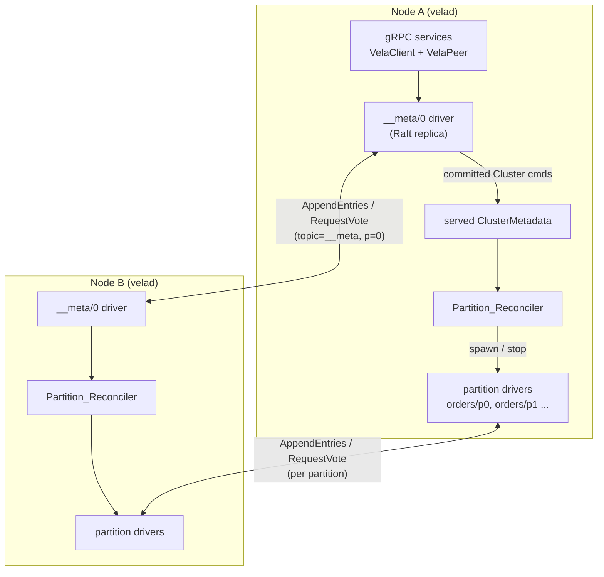

# Design Document

## Overview

This feature finishes the **dedicated metadata Raft group** the original
`vela-streaming-platform` design chose ("Option A"), replacing the bespoke
per-node-`__meta` + epoch/ack/laggard/`SyncMetadata`-push scaffolding that grew
up around the implementation's divergence. After this change there is **one
consensus mechanism** in the system: `vela-raft`, used for both partition data
and cluster metadata.

The catalogue (`ClusterMetadata`: topics, partitions, replica assignments, log
backends) is agreed by a single cluster-wide Raft group keyed `("__meta", 0)`
whose voters are all statically configured nodes. Topic-admin changes become
`ClusterCommand` log entries; once **committed** (replicated to a majority,
Raft §5.3), every node applies them to its served catalogue in log order and a
**reconciler** aligns that node's running partition drivers with the new
catalogue — spawning a driver for each partition it now replicates and stopping
drivers for partitions that are gone or unassigned. With every replica of a
partition running, each partition's Raft group reaches a majority, elects a
leader, and serves produce/consume across the cluster.

### How this maps onto what already exists

The change is mostly *wiring*, because the building blocks are present:

- `MetadataController` already hosts `("__meta", 0)` in a `RaftGroupFleet` and
  already accepts a peer set (`MetadataController::new(node_id, peers)`); today
  the server passes `Vec::new()` and steps it inline with a `BootstrapClock`.
- `PartitionDriver` already drives a replica asynchronously with a real
  `TimerClock` and a `GrpcTransport`, answering inbound peer RPCs synchronously.
- `VelaPeerService::dispatch_rpc` already routes inbound `AppendEntries` /
  `RequestVote` to a driver by `(topic, partition)` via `node.handle(...)`.
- `StateMachine::apply` already classifies `PayloadKind::Cluster` entries as
  "applied, assigns no record offset," so metadata entries pass cleanly through
  the same replica machinery as records.

So the metadata group becomes "just another driven group," registered under
`("__meta", 0)`, with one addition: a **commit-apply seam** that folds committed
`Cluster` entries into the node's served `ClusterMetadata` and invokes the
reconciler — where a partition group instead assigns record offsets.

### Reference: the Raft paper

Behavior follows *In Search of an Understandable Consensus Algorithm (Extended
Version)* (Ongaro & Ousterhout), `context/raft.pdf`:

- **§5.1–5.2** roles, terms, election with randomized timeouts, one leader/term.
- **§5.3** log replication: leader appends, replicates via `AppendEntries`, an
  entry commits once on a majority, followers apply committed entries in order,
  the leader retries until followers converge; servers persist log + term + vote.
- **§5.4** safety: election restriction (§5.4.1) and the current-term commit rule
  (§5.4.2); Leader Completeness and State Machine Safety.
- **§7** log compaction / snapshot install for a lagging follower.
- **§8** clients address the leader; a non-leader redirects to it.

The metadata group is an ordinary Raft group, so these guarantees apply to the
catalogue exactly as they already apply to partition data.

## Architecture



Two RPC planes share one transport. The metadata group and every partition group
are all `(topic, partition)`-keyed Raft groups multiplexed over the same
`VelaPeer` channel; `__meta/0` is distinguished only by its reserved key and its
commit-apply seam.

### Control flow: create a topic

1. A client calls `CreateTopic` on some node.
2. If that node is **not** the `__meta/0` leader, it returns `NotLeader` with the
   metadata leader hint; the client retries against the leader (Raft §8). The
   `AdminClient` already follows `NotLeader` hints via `ClientCore::dispatch`.
3. On the metadata leader: validate the request and compute replica assignments
   against the leader's applied catalogue, then **propose** a
   `ClusterCommand::CreateTopic` entry to `__meta/0` and await its commit.
4. The entry replicates via `AppendEntries` and commits on a majority (§5.3).
5. On commit, **every** node's `__meta/0` driver applies the command to its
   served `ClusterMetadata` and invokes the reconciler, which spawns the
   partition drivers this node now replicates.
6. Those partition groups elect leaders and serve produce/consume.

Delete is symmetric: a committed `ClusterCommand::DeleteTopic` is applied on every
node and the reconciler stops the deleted topic's drivers.

## Components and Interfaces

### 1. The metadata group as a driven Raft group (`vela-server`)

Today `NodeShared::new` recovers `__meta/0` with `Vec::new()` peers and the rest
of the code steps it inline through `propose_to_metadata_group` /
`BootstrapClock`. This design replaces inline stepping with an async driver,
exactly like a partition group.

Startup (`NodeShared::new`) changes:

- Recover `__meta/0` durably (unchanged path: `metadata_data_path`,
  `SyncPolicy::Always`), but pass the **real peer set** — the `raft_node_id` of
  every other configured node — so the recovered group is a multi-node voter set
  (Req 1.2, 2.x).
- Build the served `ClusterMetadata` from the recovered committed log (unchanged
  recovery logic; Req 9.2).
- Spawn a driver task for `__meta/0` wired with a `TimerClock` and a
  `GrpcTransport::new("__meta", 0, self_id, pool, tx)`, and register its
  `DriverHandle` so `node.handle("__meta", 0)` resolves it. Inbound metadata Raft
  RPCs then route through the **existing** `VelaPeerService::dispatch_rpc` with
  no change (Req 1.1, 1.4).
- Reconcile once after recovery to start partition drivers for recovered topics
  (Req 9.3) — the same reconciliation invoked on every later commit.

The peer `PeerPool` must know each metadata voter's address. Membership already
registers peer addresses keyed by `raft_node_id`; the metadata voters reuse those
registrations (unified identity, prerequisite decision 5).

Removed: the inline `BootstrapClock` election/propose in `NodeShared`, and the
single-node assumption in `propose_to_metadata_group`.

### 2. The commit-apply seam (generalize the driver)

`PartitionDriver` already folds `RaftOutput.committed` into a `PartitionReplica`
(assigning record offsets). The metadata group needs a *different* apply:
committed `Cluster` entries update the served catalogue and trigger
reconciliation. Introduce a small seam so one driver shape serves both:

```rust
/// What a driver does with the entries that commit on each step.
pub trait CommitSink: Send {
    /// Apply newly committed entries (ascending index), in order, exactly once.
    fn apply_committed(&mut self, entries: &[LogEntry]);
}
```

- Partition groups use a `RecordSink` wrapping the existing `StateMachine` (the
  current behavior — assign offsets, serve reads).
- The metadata group uses a `MetadataSink` that, for each committed
  `PayloadKind::Cluster` entry, decodes the `ClusterCommand` (server-owned codec,
  `convert::cluster_command_from_bytes`), applies it to the shared served
  `ClusterMetadata`, and **enqueues a reconcile request**. Apply must stay fast:
  the reconciler runs **off** the Raft loop (§5), never inline, so applying a
  commit never blocks metadata heartbeats. Non-`Cluster` entries (a leader's
  `Noop`) are ignored (Req 5.1, 5.4, 10.4).

`apply_committed` is driven off `RaftOutput.committed`, which `vela-raft` emits in
ascending index order exactly once, so apply is in-order and idempotent over the
committed log (Req 5.1, 5.2; Raft §5.3).

> Implementation note: the seam may be realized either as the trait above or by
> making the metadata group its own `MetadataDriver` that reuses the same
> `DriverCommand` queue and `after_step` dispatch. Either keeps `PartitionDriver`
> focused; the tasks phase will pick the smaller diff. The behavior contract
> above is what matters.

### 3. Proposing admin commands and awaiting commit

Admin changes need a propose-and-await-commit path on the metadata group,
analogous to `PartitionDriver::handle_produce` but for `ClusterCommand`s. Add a
driver command:

```rust
DriverCommand::ProposeCluster {
    command: ClusterCommand,                 // already validated + assigned
    reply: oneshot::Sender<Result<(), CoreError>>,
}
```

- If the metadata replica is not `Role::Leader`, reply `NotLeader { leader }`
  where `leader` is the replica's known current leader id (Req 4.1).
- Otherwise append the encoded `Cluster` payload, record the target index as
  pending (reuse the `Pending`/commit-timeout pattern), and resolve the reply
  when that index commits (Req 3.1–3.4) or with `CommitTimeout` after the
  deadline (Req 3.5; existing `COMMIT_TIMEOUT_MS`).

The commit that resolves the proposal is the **same** commit the `MetadataSink`
applies, so by the time the client sees success the change is applied and
reconciled on the leader, and replication carries it to followers (Req 3.6).

### 4. `NodeShared::create_topic` / `delete_topic` become leader-routed proposals

The current methods validate on a snapshot and commit inline to the single-node
group. They become:

```text
create_topic(name, partitions, backend):
  if not metadata_leader:           return Err(NotLeader { metadata_leader_hint })   # Req 4.1
  validate(name, partitions, backend) against applied catalogue                      # unchanged rules
  assignment = assign_replicas(...)  # crates/vela-core/src/topic.rs, on the leader
  command = ClusterCommand::CreateTopic { name, partitions: assignment, backend }
  await propose_cluster(command)?    # appends + awaits commit on __meta/0          # Req 3
  return the applied Topic           # read from served view after commit
```

- Validation and replica assignment run **only on the leader**, before the
  propose. Followers never re-validate; they apply the already-committed command
  via `apply_command` (Req 5.1), which is exactly its current contract.
- `delete_topic` mirrors this: validate (exists, not already deleting), propose
  `DeleteTopic`, await commit.
- The `CreateTopicResponse` / driver spawning that `VelaClientService` does today
  **moves out** of the RPC handler into the reconciler (driven by the commit), so
  spawning happens on every replica node, not just the origin (Req 6).

`VelaClientService::create_topic` / `delete_topic` then simply call these methods
and map `NotLeader` to the redirect status the client already understands. When
`__meta/0` has no leader, the propose path returns a "no metadata leader" error
(Req 4.2).

### 5. Partition reconciliation (`Partition_Reconciler`)

A new component, invoked by the `MetadataSink` after each applied metadata change
and once after restart recovery. Given the node's served `ClusterMetadata` and
its `partitions` table:

```text
reconcile():
  desired = { (topic, p.index) : topic in view, p in topic.partitions,
              self in p.replicas }                                   # Req 6.5
  running = keys(partitions) \ {("__meta", 0)}                       # Req 6.6
  for key in desired \ running:   spawn_partition(topic, p)          # Req 6.1, 6.4
  for key in running \ desired:   stop_partition(topic, p)           # Req 6.2
  # keys in desired ∩ running are left untouched                      # Req 6.3
```

- `spawn_partition` already registers peer replica addresses before the driver
  runs (Req 6.4) and already leaves a durable-log-open failure unstarted while
  continuing (Req 6.7) — reused unchanged.
- The reconciler never touches `("__meta", 0)` (Req 6.6).
- **Off the Raft loop (H1).** Reconciliation opens durable logs, registers peers,
  and spawns/stops driver tasks — work that can be slow. It therefore runs as its
  own task driven by a reconcile signal (e.g. a dedicated `tokio` task consuming a
  `reconcile` channel / notify that the `MetadataSink` pokes), **not** inline on
  the metadata driver's commit path. Coalescing multiple pending signals into one
  pass is fine because `reconcile()` is an idempotent diff. This keeps metadata
  heartbeats and elections unaffected by reconciliation latency.
- **Retry (Req 6.8):** a periodic reconciliation tick (e.g. reuse the membership
  cadence) re-runs `reconcile()`, so a partition left unstarted by a transient
  log-open failure is retried until it starts or is unassigned. Reconciliation is
  idempotent (it diffs desired vs running), so periodic re-runs are safe.

### 6. Live-leader routing and `FindLeader` (`Req 8`)

The metadata `leader` field is no longer authoritative for partition routing.

- Each partition driver exposes its **known current leader**: its own id when
  `Role::Leader`, otherwise the `leader_id` it last learned from an
  `AppendEntries` (Raft §5.2 followers track the current leader). This is surfaced
  via a new `DriverCommand::KnownLeader { reply }` (or a shared atomic the driver
  updates on role/leader change).
- `Produce` / `Consume` that reach a non-leader replica reply `NotLeader` with
  that known-leader hint (Req 8.3); the client retries (existing dispatch loop).
  This replaces today's use of the stale metadata `leader` field for the hint.
- `FindLeader(topic, p)` resolves to the live leader: if the node hosts the
  replica, return its known leader; otherwise reply with no-leader/redirect so the
  client retries against a replica (Req 8.2). Replica locations still come from
  the served catalogue.
- Any `leader` field carried in `ClusterMetadata` is treated as a non-authoritative
  initial hint only (Req 8.4); partition elections do **not** propagate through
  the metadata group (original design: leadership learned locally).

### 7. Removed: the bespoke propagation machinery

With agreement and replication owned by the metadata Raft group, the following
are removed (or reduced to dead code to delete):

- `MetadataController::record_ack`, `acked`, `laggards`,
  `confirm_delete_propagation`, and the `acks: HashMap<u64, …>` field.
- The `ClusterMetadata.epoch`-as-propagation-version usage and the
  `METADATA_PROPAGATION_TIMEOUT_MS` deadline. (`epoch` may remain as a harmless
  applied-change counter; it is no longer a propagation-ordering device.)
- `VelaPeerService::sync_metadata`'s adopt-fresher-snapshot logic. `SyncMetadata`
  is not used for agreement (decision 2). The RPC may remain wired as a no-op /
  reserved for a future snapshot-install path (Raft §7), but is not on the commit
  path. Metadata reaches every node via `AppendEntries`, not a push.
- `NodeShared::propose_to_metadata_group` and `commit_cluster_command`'s
  single-node inline commit, replaced by the driver propose path (§3).

## Data Models

Minimal changes; the catalogue types are unchanged.

- `ClusterCommand` (`vela-core`) — unchanged (`CreateTopic`, `DeleteTopic`,
  `SetAvailability`). Encoded/decoded by the server codec already used for the
  durable metadata log (`convert::cluster_command_{to,from}_bytes`), satisfying
  the round-trip property (Req 10.2).
- `DriverCommand` (`vela-server`) — add `ProposeCluster { command, reply }` and a
  way to read the replica's known leader (`KnownLeader { reply }` or a shared
  atomic).
- `CommitSink` seam (`vela-server`) — new trait (or `MetadataDriver`) per §2.
- `MetadataController` (`vela-core`) — drop the ack/laggard fields and methods;
  keep `step`, `apply`, `metadata`, `recover_durable`, `find_leader`, and the
  group hosting. `recover_durable` is called with real peers now.
- No proto/wire changes are required: `__meta/0` uses the existing
  `AppendEntries` / `RequestVote` messages, which already carry `(topic,
  partition)`. `SyncMetadata` stays defined but off the commit path.

## Error Handling

- **Admin to a non-leader** → `CoreError::NotLeader { leader }` carrying the
  metadata leader hint; surfaced as the existing `NotLeader` status the client
  redirects on (Req 4.1; Raft §8).
- **No metadata leader** (no majority / mid-election) → an error indicating no
  metadata leader is available; the admin request is not committed (Req 2.5,
  4.2). The client may retry.
- **Commit timeout** → `CoreError::CommitTimeout` if a proposed entry does not
  commit within `COMMIT_TIMEOUT_MS`; the operation is not reported as succeeded
  (Req 3.5). **`CommitTimeout` is indeterminate, not failure (H2):** an entry
  that was appended and replicated but not yet committed when leadership changed
  may still commit later under the new leader, so the admin change may still take
  effect. The caller must re-check (e.g. `DescribeTopic`) rather than assume it
  failed. To make a safe retry possible, topic-admin is **idempotent on topic
  name**: re-creating an existing topic is a no-op success (or `TopicExists`),
  and re-deleting an absent topic is a no-op success — so a client that retries
  after a `CommitTimeout` cannot corrupt the catalogue.
- **Decode failure** of a committed payload → the `MetadataSink` records an error
  and leaves the served catalogue unchanged by that payload, never applying a
  partial/default value (Req 10.4).
- **Durable-log-open failure** during reconcile → the partition is left unstarted
  with a structured error and reconciliation continues; the periodic pass retries
  it (Req 6.7, 6.8). Existing `SpawnError` path.
- **Partition has no leader** (no majority) → `Produce`/`Consume` rejected with
  partition-unavailable; committed records retained (Req 7.3).

## Testing Strategy

The metadata group is an ordinary Raft group, so the existing deterministic
simulation harness (used for partition groups) covers its consensus behavior
directly; only the apply/reconcile seam and the multi-node wiring are new.

**Unit / property (deterministic, no runtime)**

- `MetadataSink` apply: committed `Cluster` entries fold into the served
  catalogue in index order, idempotently; `Noop` ignored; undecodable payload
  leaves the catalogue unchanged (Req 5, 10.4).
- Reconciler diff: for arbitrary (served catalogue, running set, self id), the
  computed spawn/stop sets equal `desired \ running` and `running \ desired`, and
  never include `("__meta", 0)` (Req 6.1–6.6). A property test over random
  catalogues/membership.
- `ClusterCommand` log-payload round-trip (Req 10.2) — already covered by
  `convert` tests; extend if needed.
- Metadata-group election safety reuses `vela-raft` property tests (one
  leader/term, election restriction); no new consensus code (Req 2, Raft §5.2,
  §5.4).

**Integration (multi-node, real runtime)**

- *Create → cross-node produce/consume:* stand up a 3-node in-process cluster,
  create a topic on a follower (exercise the `NotLeader` redirect to the metadata
  leader), then produce by key and consume from the assigned partition; assert
  the record round-trips through a partition whose leader is a *different* node
  (Req 4, 5, 7).
- *Apply on every node:* after the create commits, assert `ListTopics` on every
  node shows the topic and each replica node is running the expected partition
  drivers (Req 5.3, 6.1).
- *Restart recovery:* commit several topics, restart a node, assert it recovers
  the full catalogue (including peer-originated topics) from its durable metadata
  log and re-spawns its partition drivers (Req 9.2, 9.3).
- *Follower catch-up:* hold one node down during creates, bring it up, assert the
  metadata leader brings its metadata log up to date via `AppendEntries` and the
  node converges and reconciles (Req 3.6, 9.4).
- *Delete:* delete a topic, assert it commits, is applied on every node, and each
  node stops the topic's drivers (Req 6.2).

**Existing local-cluster smoke**

- The `docker-compose` flow that previously failed end-to-end (`vela-ctl`
  create → produce → consume across nodes) becomes the manual acceptance check
  this feature must satisfy.

## Correctness Properties

Derived from the requirements; each is a single property/integration test.

### Property 1: In-order, idempotent metadata apply

*For any* committed metadata log prefix delivered in any redelivery or
re-replication pattern, applying it yields the same served catalogue, and each
committed entry is applied exactly once in ascending index order.

**Validates: Requirements 5.1, 5.2, 5.4** (Raft §5.3, State Machine Safety §5.4.3)

### Property 2: Reconciler diff correctness

*For any* served catalogue, running-driver set, and node identity, reconciliation
starts exactly the partitions in `desired \ running`, stops exactly those in
`running \ desired`, leaves `desired ∩ running` untouched, and never starts or
stops the `__meta/0` group, where `desired` is the partitions assigned to this
node.

**Validates: Requirements 6.1, 6.2, 6.3, 6.5, 6.6**

### Property 3: Convergence to one catalogue

*For any* sequence of committed admin commands, two nodes that have applied the
metadata log up to the same commit index hold identical served topic catalogues.

**Validates: Requirements 5.3**

### Property 4: Serialization round-trip

*For all* `ClusterCommand` values, encoding to the metadata log payload and
decoding back yields an equal command; *for all* catalogue snapshots, encode then
decode yields an equal snapshot.

**Validates: Requirements 10.2, 10.3**

### Property 5: One metadata leader per term

*For any* execution of the metadata group, at most one leader is elected in any
single term, and a vote is granted only to an at-least-as-up-to-date candidate
(inherited from `vela-raft`).

**Validates: Requirements 2.2, 2.3** (Raft §5.2, §5.4.1)

### Property 6: Durable recovery of the full catalogue

*For any* node restarted after a set of committed admin commands, the node
recovers the full committed catalogue — including topics originated by peers —
from its durable metadata log and re-spawns a driver for every recovered
partition whose replica set contains it.

**Validates: Requirements 9.2, 9.3**

## Migration / sequencing notes

- The change is internal; no proto or `vela-ctl` changes. `docker-compose`
  already supplies the unified `id@host:port` peers the metadata voter set needs.
- **Existing `__meta` state (G4).** Switching from per-node single-node `__meta`
  to a cluster-wide voter set changes the group's membership and log semantics.
  This is a pre-1.0, greenfield change: existing durable `__meta` volumes are
  wiped (`docker compose down -v`) rather than migrated. The node must not
  silently misread an old single-node `__meta` log as a multi-node one — confirm
  recovery either reads it compatibly or fails fast.
- Suggested build order (for the tasks phase): (1) commit-apply seam + reconciler
  in isolation with unit tests; (2) wire `__meta/0` as a driven multi-node group
  at startup; (3) leader-routed propose path for create/delete; (4) live-leader
  routing for `FindLeader`/produce/consume; (5) remove the bespoke
  ack/laggard/`SyncMetadata`-adopt machinery; (6) multi-node integration +
  restart/failover tests.

### Deferred follow-ons (out of scope, scheduled later)

- **Metadata log compaction / snapshot install (G1).** The `__meta` log grows
  with every create/delete, and a recovering or catching-up node replays the
  whole history. The catalogue is small derived state, so snapshot-the-state +
  discard-the-log (and `InstallSnapshot`, Raft §7) pays off here — the metadata
  group is the natural first customer for `InstallSnapshot`. Deferred so the log
  does not grow unbounded on a long-lived cluster.
- **Metadata voter subset at scale (G2).** All nodes are metadata voters this
  milestone, which is right for a 3–5 node static cluster but a scaling cliff at
  larger N (every metadata commit needs a whole-cluster majority). Running the
  control group on a fixed odd subset (3 or 5) is the standard answer when
  clusters grow; deferred (also a non-goal above).
