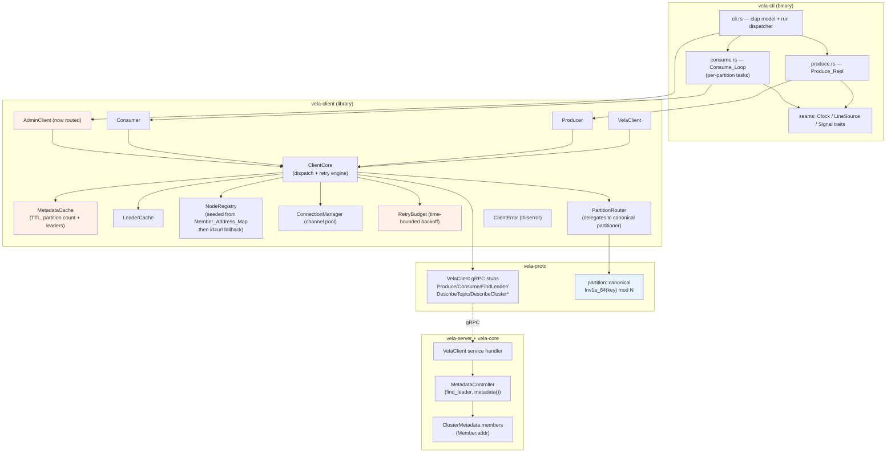
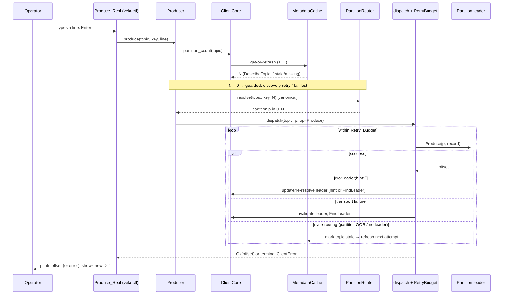
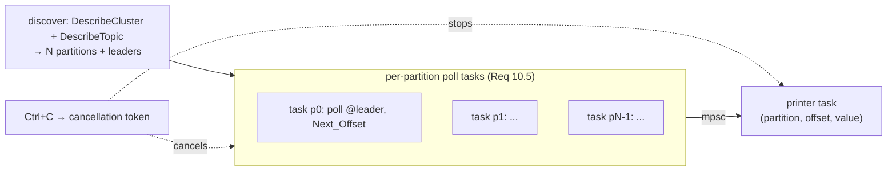

# Design Document

## Overview

This feature makes every `vela-ctl` command leader-aware and turns the one-shot
`produce`/`consume` commands into long-running interactive tools. The work is
overwhelmingly concentrated in the existing `vela-client` crate (the
`Client_Core` routing layer) and `vela-ctl` (the REPL/poll loops), with one
small, backward-compatible addition to the `vela.proto` client-facing contract
and its `vela-server` handler so programmatic clients can seed a node-id→address
registry from server-provided member addresses.

The guiding principle is *reuse and generalize what already works*. The codebase
already has the right bones:

- `ClientCore::dispatch` (crates/vela-client/src/core.rs) already runs a
  per-attempt operation against a partition's believed leader and retries on a
  `NotLeader` redirect via the pure `plan_retry`/`resolve_leader` folds.
- `ClientCore::refresh_leader` already probes *every* configured node and accepts
  a leader named by any reachable replica (Requirement 2.2), distinguishing
  "no elected leader" (`ClientError::NoLeader`) from "all nodes failed".
- `LeaderCache`, `NodeRegistry`, and `ConnectionManager` already provide the
  cache/registry/pool seams.
- Two near-identical `PartitionRouter` implementations exist (vela-client and
  vela-core), both pinning the same FNV-1a constants.

What is missing, and what this design adds:

1. A **topic-metadata cache with a TTL** (default 30s) and refresh, replacing the
   permanent-cache `topic_partitions: Mutex<HashMap<String, u32>>` in
   `ClientCore`, plus a zero-partition produce guard and a fail-fast router.
2. A **unified dispatch/retry engine** that handles *both* `NotLeader` (today)
   *and* transport/connection failures (new: invalidate + re-resolve), governed
   by a time-bounded `Retry_Budget` with exponential backoff (today's fixed
   `MAX_RETRIES`/`RETRY_DELAY_MS` are replaced). The engine is generalized so
   `AdminClient` mutations route through it too (today they bypass routing).
3. A **canonical partitioner** shared by `vela-ctl`, the `Producer`, and any
   internal repartition/key_by stage — resolving the current duplication.
4. A **member-address discovery** path: a new `DescribeCluster` RPC on
   `VelaClient` exposing the `Member_Address_Map` (built from
   `Member.addr`, which already exists in `vela-core`'s `ClusterMetadata`), with
   `id=url` endpoints kept as the fallback.
5. The **Producer REPL** and **continuous Consumer** loops in `vela-ctl`, built
   on injectable clock/stdin/transport traits so the long-running loops are
   deterministically testable.

The design adheres to the project steering: Rust + tokio, tonic/prost on the
wire, `thiserror` for library errors, traits at crate seams for determinism,
clippy-clean, no `unsafe`, and inward-only crate dependencies
(`vela-ctl → vela-client → vela-proto`; server side in `vela-core`/`vela-server`).

### Scope and non-goals

- No consumer-group coordination or offset persistence — the consumer is a
  standalone, in-memory, non-committing reader (Requirement 8.8).
- No change to the per-partition Raft model or the `Produce`/`Consume`/
  `FindLeader`/`DescribeTopic` semantics. The only wire change is the additive
  `DescribeCluster` RPC (Requirement 12.6, 12.7).
- Existing one-shot behavior is subsumed by the loops; the `vela-ctl` command
  surface gains options (`--offset-reset`, `--poll-interval`, `--metadata-ttl`,
  keyless strategy) but keeps its current flags working.

## Architecture

### Component diagram



`*DescribeCluster` is the new backward-compatible RPC (Requirement 12.7, 12.8).
Blue marks the shared canonical partitioner; orange marks the principal new/changed
pieces.

### Dependency direction

Dependencies point strictly inward, matching the steering:

```
vela-ctl ─┐
          ├─> vela-client ─> vela-proto
vela-server ─> vela-core ─> vela-raft ─> vela-log
          └─> vela-proto
```

- `vela-ctl` depends on `vela-client` and (only for wire message shapes it prints)
  `vela-proto`. The REPL/loop seams (`Clock`, `LineSource`, `Signal`) live in
  `vela-ctl`.
- `vela-client` depends on `vela-proto` only — it must **not** depend on
  `vela-core`. The canonical partitioner therefore cannot live in `vela-core` if
  `vela-client` is to call the *same* code; see "Canonical partitioner" for the
  resolution (it moves to `vela-proto`, the one crate both already depend on).
- `vela-server` maps `vela-core`'s `MetadataController`/`ClusterMetadata` onto the
  new `DescribeCluster` reply; `vela-core` is unchanged because `Member.addr`
  already exists.

### Request lifecycle (produce, end to end)



## Components and Interfaces

### 1. Canonical partitioner (`vela-proto::partition`)

Both `vela-client/src/router.rs` and `vela-core/src/router.rs` currently contain
byte-identical `fnv1a_64` + `FNV_OFFSET_BASIS`/`FNV_PRIME` constants and the same
`hash(key) % count` rule. Requirement 5.5 demands a *single shared implementation*
used by `vela-ctl`, the `Producer`, and any internal repartition/key_by stage.

Because `vela-client` must not depend on `vela-core` (steering: inward only), the
canonical function is placed in **`vela-proto`** — the one crate both `vela-client`
and `vela-core` already depend on — as a small, dependency-free module:

```rust
// crates/vela-proto/src/partition.rs
/// FNV-1a 64-bit offset basis (pinned; Canonical_Partitioner).
pub const FNV_OFFSET_BASIS: u64 = 0xcbf2_9ce4_8422_2325;
/// FNV-1a 64-bit prime (pinned; Canonical_Partitioner).
pub const FNV_PRIME: u64 = 0x0000_0100_0000_01b3;

/// Deterministic 64-bit FNV-1a hash of a byte slice.
pub fn fnv1a_64(bytes: &[u8]) -> u64 { /* unchanged algorithm */ }

/// The Canonical_Partitioner: map a non-empty key to a partition of a topic
/// with `partition_count` partitions (Requirement 5.1, 5.5).
///
/// Returns `None` when `partition_count == 0` so callers fail fast rather than
/// dividing by zero (Requirement 1.9). A valid topic always has N >= 1.
pub fn partition_for_key(key: &[u8], partition_count: u32) -> Option<u32> {
    (partition_count != 0).then(|| (fnv1a_64(key) % u64::from(partition_count)) as u32)
}
```

Both `PartitionRouter`s keep their per-topic keyless round-robin state (that state
is process-local and not shared), but their keyed branch and constants now
*delegate* to `vela_proto::partition`. This removes the duplication while leaving
the round-robin/sticky behavior where it belongs (it is not part of the canonical,
cross-process key→partition contract; only the keyed mapping must agree
byte-for-byte). `vela-core`'s `PartitionRouter::resolve` keeps returning
`PartitionIndex`; `vela-client`'s keeps returning `u32`.

Open decision (noted, not guessed): an alternative home is a new tiny
`vela-partition` leaf crate. `vela-proto` is preferred because it already sits at
the bottom of both dependency chains and requires no new workspace member. Flagged
for confirmation.

### 2. `PartitionRouter` (client) — keyless strategy + fail-fast

The client router (crates/vela-client/src/router.rs) gains:

- **Keyed branch** delegates to `vela_proto::partition::partition_for_key`.
- **Keyless strategy** selectable as `RoundRobin` (current behavior) or
  `Sticky` (Requirement 5.2, 5.6). Sticky assigns a run of consecutive keyless
  records to one partition before rotating; modeled as `(current_partition,
  remaining_in_run)` per topic behind the existing `Mutex`. Round-robin is the
  default to preserve today's behavior and tests.
- **Zero-partition fail-fast**: `resolve` returns `Result<u32, RouteError>` (or a
  dedicated `Option`) so a `partition_count == 0` rejects the record rather than
  clamping to `1` as it does today (Requirement 1.9, 5.3). The current `.max(1)`
  clamp is removed; the caller (`Producer`) maps the rejection to discovery/retry.

```rust
pub enum KeylessStrategy { RoundRobin, Sticky { run_length: u32 } }

impl PartitionRouter {
    /// Resolve to a partition in 0..partition_count, or fail fast on a zero count.
    pub fn resolve(&self, topic: &str, key: Option<&[u8]>, partition_count: u32)
        -> Result<u32, RouteError>;
}
```

### 3. `MetadataCache` (new module `metadata_cache.rs` in vela-client)

Replaces `ClientCore::topic_partitions`. Caches, per topic, the partition count,
each partition's leader node id, and the time the entry was learned, behind a
`Mutex`. The cache uses an injected `Clock` so TTL behavior is deterministic in
tests.

```rust
pub struct TopicMeta {
    pub partition_count: u32,
    pub leaders: Vec<Option<String>>, // index i → leader node id, if known
    pub learned_at: Instant,          // via Clock
}

pub struct MetadataCache { entries: Mutex<HashMap<String, TopicMeta>>, ttl: Duration }

impl MetadataCache {
    pub fn get_fresh(&self, topic: &str, now: Instant) -> Option<TopicMeta>; // None if absent or aged past ttl
    pub fn put(&self, topic: &str, meta: TopicMeta);
    pub fn invalidate(&self, topic: &str); // forces refresh on stale-routing errors
}
```

`ClientCore` consults `get_fresh`; on `None` (absent or aged beyond `Metadata_TTL`,
Requirement 1.3, 1.5) it issues `DescribeTopic`, rebuilds `TopicMeta` (including
re-learning leaders and seeding the `LeaderCache`), and `put`s it. A stale-routing
failure (routed partition out of range, or leader resolution fails — Requirement
1.6) calls `invalidate` so the next routing attempt refreshes. The default TTL is
30s (Requirement 1.7), configurable from `vela-ctl`.

### 4. `RetryBudget` (new) — time-bounded backoff

Today's retry policy is a fixed redirect *count* (`MAX_RETRIES = 5`) with a fixed
`RETRY_DELAY_MS = 100`. Requirement 3.4/3.5 (and 4.3) demand a **total elapsed-time
budget** (default 5s) with **exponential backoff from 100ms, doubling, capped at
2s**. `RetryBudget` is a pure, `Clock`-driven helper so its bounds are unit/property
testable without sleeping:

```rust
pub struct RetryBudget { total: Duration, base: Duration, cap: Duration }
// defaults: total=5s, base=100ms, cap=2s

impl RetryBudget {
    /// Backoff before the nth retry (0-based): min(base * 2^n, cap).
    pub fn backoff(&self, attempt: u32) -> Duration;
    /// Whether another retry may start, given elapsed time since the first attempt.
    pub fn may_retry(&self, elapsed: Duration) -> bool;
}
```

The dispatch loop tracks elapsed time via the `Clock`; when `may_retry(elapsed)`
is false it returns `ClientError::NoLeaderAfterRetries` (Requirement 3.5, 4.4). The
existing pure `plan_retry`/`RetryPlan` decision is retained but extended to a
richer outcome classification (below).

### 5. Unified dispatch/retry engine (`ClientCore::dispatch`, generalized)

The current `dispatch` only branches on `not_leader_hint`. It is generalized to
classify each attempt's outcome and react accordingly, covering both
`NotLeader` *and* transport failures (Requirement 3.2, 3.3) plus stale-routing
refresh (Requirement 1.6). Classification is a pure function so it is testable
without a server:

```rust
pub(crate) enum AttemptOutcome {
    Success,                         // surface Ok
    NotLeader { hint: Option<String> }, // update/re-resolve leader, retry
    Transport,                       // invalidate leader, FindLeader, retry
    StaleRouting,                    // invalidate topic metadata, refresh, retry
    Fatal,                           // non-retryable application error: surface as-is
}

fn classify(err: &ClientError) -> AttemptOutcome;
```

- `NotLeader { hint }`: existing path — update from hint via `NodeRegistry`, else
  invalidate + `FindLeader` (existing `resolve_redirect`).
- `Transport` (a `tonic::Status` with `code() == Unavailable`, or a connection
  error): invalidate this partition's `LeaderCache` entry and re-resolve via
  `FindLeader` (Requirement 3.3, 10.2).
- `StaleRouting` (partition-out-of-range or `NoLeader`/`PartitionUnavailable` on a
  cached topic): `MetadataCache::invalidate(topic)` then retry (Requirement 1.6).
- `Fatal` (validation, topic-not-found, partition-not-found, payload-too-large):
  surface immediately without retrying (Requirement 3.6).

Every retry waits `RetryBudget::backoff(attempt)` and the loop stops when the time
budget is exhausted. The signature stays the same generic closure shape, so
`Producer` and `Consumer` need no structural change beyond the new error mapping.

### 6. `AdminClient` — routed through the engine (Requirement 4)

Today `AdminClient` calls `bootstrap_client()` directly and never retries.
`create`/`delete` (topic-mutating) are wrapped in a metadata-leader variant of the
retry engine: send to a configured node; on `NotLeader` redirect to the hinted
`Metadata_Leader` and retry; on transport failure re-resolve and retry; apply the
*same* `RetryBudget` (Requirement 4.1–4.4). Because admin requests are not
partition-scoped, a small sibling of `dispatch` —`dispatch_admin` — drives them,
re-using `RetryBudget`, `classify`, and the `NotLeader` hint extraction, but
resolving the target through the bootstrap set / hinted metadata-leader node id
rather than the `LeaderCache`. `list`/`describe` (read-only) send to a configured
node and only retry on transport failure (Requirement 4.5, 4.6), not on
`NotLeader`.

The `Metadata_Leader` node id arrives via the same `NotLeader` hint mechanism the
server already emits for admin requests (Requirement 12.3), so no new "find
metadata leader" RPC is required; reactive redirection remains the always-available
fallback (Requirement 12.4, 12.5).

### 7. Member-address discovery — `DescribeCluster` (Requirement 12.7, 12.8, 13)

**Wire change (`vela.proto`, additive only):**

```proto
// Describe the cluster's members so a programmatic client can resolve any
// leader node id to a transport address (Requirement 12.7, 12.8, 13.1, 13.2).
message DescribeClusterRequest {}

message DescribeClusterResponse {
  repeated Member members = 1; // id + addr (+ availability) per known member
  uint64 epoch = 2;            // the metadata epoch the view was taken at
}

service VelaClient {
  // ... existing RPCs unchanged ...
  rpc DescribeCluster(DescribeClusterRequest) returns (DescribeClusterResponse);
}
```

This reuses the existing `Member` message (which already carries `id` and `addr`).
Adding an RPC and two messages is backward compatible: existing clients neither
call nor depend on it, and no existing message changes (Requirement 12.6, 12.7).

**Server (`vela-server`):** a new handler builds the reply from
`MetadataController::metadata().members` — each `Member { id, addr, availability }`
already lives in `ClusterMetadata` (vela-core). No `vela-core` change is needed.

**Client seeding (Requirement 13.1–13.3, 13.5):** at startup (or lazily on the
first leader resolution), `ClientCore` calls `DescribeCluster` against a bootstrap
node and seeds `NodeRegistry` from the returned `Member_Address_Map` (node id →
addr) as the **primary** source. The `id=url` endpoints supplied to `vela-ctl`
remain the **fallback**, used when the server returns no members (older server) or
for a node not present in the map. If a `DescribeCluster` call fails, the client
proceeds with just the `id=url` registry — degraded but functional, exactly the
pre-feature behavior.

**Unresolvable leader (Requirement 13.4, 13.6):** when `FindLeader` returns a node
id absent from both the `Member_Address_Map` and the `id=url` endpoints,
resolution returns `ClientError::UnknownNode { node, .. }` (already exists); the
`vela-ctl` error mapping reports the unresolved node id and that an `id=url`
endpoint is required for it, exiting non-zero.

`vela-ctl` endpoint parsing (`derive_nodes`) is unchanged for the `id=url` case;
the synthetic `node-{i}` ids for bare addresses are still only used as bootstrap
addresses, now augmented by `DescribeCluster`-learned real ids.

### 8. Producer REPL (`vela-ctl::produce`)

A new `produce` module runs the `Produce_Repl`. It reads lines from an injected
`LineSource`, produces each via `Producer::produce`, prints the committed offset,
and loops until EOF or interrupt. Architecture:

```rust
#[async_trait] trait LineSource { async fn next_line(&mut self) -> io::Result<Option<String>>; }
#[async_trait] trait Signal     { async fn interrupted(&self);  } // resolves on Ctrl+C

pub async fn run_repl(
    producer: Producer, topic: String, key: Option<Vec<u8>>,
    mut lines: impl LineSource, signal: impl Signal, out: &mut impl Write,
) -> Result<(), CtlError>;
```

The loop uses `tokio::select!` over `lines.next_line()` and `signal.interrupted()`
so the prompt is responsive to Ctrl+C while blocked on input (Requirement 7.1,
7.2). Behavior:

- Print `> `, await a line (Requirement 6.1).
- On a line: `produce(topic, key.as_deref(), line)`, print the offset, print a new
  `> ` (Requirement 6.2). If keyed (`--key`), every line uses that key
  (Requirement 6.4).
- On a produce error: print the error, print a new `> `, do **not** terminate
  (Requirement 6.5).
- On EOF (`next_line` → `None`): exit zero (Requirement 6.6).
- On interrupt: stop reading, terminate (Requirement 7.1).

Production drivers: `LineSource` over `tokio::io::BufReader<Stdin>::lines()`;
`Signal` over `tokio::signal::ctrl_c()`. Tests inject a scripted line source, a
controllable signal, and a fake transport so the loop is fully deterministic.

### 9. Continuous consumer (`vela-ctl::consume`)

A new `consume` module runs the `Consume_Loop`. It discovers partitions and
leaders, then spawns **one independent poll task per partition** so a stuck or
dead leader cannot starve the others (Requirement 10.5). Each task owns its
partition's `Next_Offset` in memory (Requirement 8.8) and reports records over an
`mpsc` channel to a single printer task that emits `partition, offset, value`
(Requirement 9.6).



Per-partition task loop (Requirement 9.1–9.5, 10.1–10.4):

1. Initialize `Next_Offset` from `Offset_Reset`: `latest` (default) → the
   partition's latest committed offset; `earliest` → `0` / earliest committed
   (Requirement 8.6, 8.7).
2. `select!` over `consumer.consume(topic, p, next_offset, max)` and the
   cancellation token (Requirement 11.1, 11.2).
3. On records: set `next_offset = outcome.next_offset` (Requirement 9.4), send each
   record to the printer (Requirement 9.6).
4. On empty poll: wait `Polling_Interval` (default 500ms, Requirement 9.2, 9.5)
   via the injected `Clock`, then re-poll (Requirement 9.3 — late records arrive on
   a later poll).
5. On `NotLeader`/transport failure: the underlying `dispatch` already re-resolves;
   if the error still surfaces, the task invalidates the leader and waits
   `Polling_Interval` before re-resolving on the next poll (Requirement 10.1, 10.2),
   continuing rather than exiting (Requirement 10.4).
6. On `PartitionUnavailable` (no elected leader): wait `Polling_Interval` and retry
   resolution (Requirement 10.3).

Single-partition mode: when `--partition P` is supplied, only that partition's task
runs (Requirement 8.4). Zero-partition topic: discovery retries each poll until a
partition appears or a discovery timeout elapses, then errors non-zero
(Requirement 8.5). Initial offset discovery (`latest`/`earliest`) is derived from
`DescribeTopic`/a bounded `Consume` probe; the exact server affordance for "latest
committed offset" is noted as an open decision below.

The discovery/start-offset step is the one place the requirements may exceed the
current contract: there is no explicit "earliest/latest committed offset" RPC.
Options: (a) treat `latest` as "start at the `next_offset` returned by a zero-max
probe poll" and `earliest` as offset `0`; (b) add fields to `DescribeTopic`/
`PartitionInfo`. Option (a) needs no wire change and is the default direction;
flagged for confirmation.

### 10. `vela-ctl` CLI surface additions

`Command::Produce` gains nothing required beyond existing `--key` (keyless
strategy `--keyless {round-robin|sticky}` optional, default round-robin).
`Command::Consume` gains `--offset-reset {latest|earliest}` (default `latest`),
`--poll-interval <ms>` (default 500), and `--partition` becomes optional (absent →
all partitions). A global `--metadata-ttl <secs>` (default 30) configures the
`MetadataCache`. All new flags parse with `clap` value parsers, rejecting bad
values before any request (mirroring `parse_backend`).

## Data Models

### Client-side (vela-client)

| Type | Location | Purpose |
|------|----------|---------|
| `TopicMeta { partition_count: u32, leaders: Vec<Option<String>>, learned_at: Instant }` | `metadata_cache.rs` (new) | Cached topic metadata with TTL stamp |
| `MetadataCache { entries: Mutex<HashMap<String, TopicMeta>>, ttl: Duration, clock }` | `metadata_cache.rs` (new) | TTL-governed cache; replaces `topic_partitions` |
| `RetryBudget { total, base, cap }` | `core.rs` or `retry.rs` (new) | Time-bounded exponential backoff policy |
| `AttemptOutcome` | `core.rs` | Pure classification of a dispatch attempt |
| `KeylessStrategy { RoundRobin, Sticky { run_length } }` | `router.rs` | Keyless routing mode |
| `LeaderCache`, `NodeRegistry`, `ConnectionManager` | existing | Unchanged seams (registry now also seeded from `DescribeCluster`) |

`ClientCore` fields change: `topic_partitions: Mutex<HashMap<String,u32>>` →
`metadata: MetadataCache`; add `retry: RetryBudget` and `clock: Arc<dyn Clock>`.

### Wire (vela-proto) — additive

| Message / RPC | Change | Requirement |
|---------------|--------|-------------|
| `DescribeClusterRequest {}` | new | 12.7 |
| `DescribeClusterResponse { repeated Member members; uint64 epoch }` | new | 12.7, 12.8 |
| `VelaClient.DescribeCluster` | new RPC | 12.7, 13.1 |
| `partition` module (`fnv1a_64`, `partition_for_key`, FNV consts) | new | 5.5 |
| `Member`, `ProduceRequest`, `ConsumeRequest`, `FindLeaderResponse`, ... | unchanged | 12.6 |

### vela-ctl seams (deterministic testing)

| Trait | Production impl | Test impl |
|-------|-----------------|-----------|
| `Clock` (now/sleep) | `tokio::time` | manual/paused virtual time |
| `LineSource` | stdin `BufReader::lines()` | scripted `VecDeque<String>` |
| `Signal` | `tokio::signal::ctrl_c()` | triggerable oneshot/`Notify` |
| transport | real `VelaClient` gRPC stub | in-process fake `VelaClientServer` (as in cli.rs `example_tests`) |

### Configuration defaults

| Setting | Default | Requirement |
|---------|---------|-------------|
| `Metadata_TTL` | 30s | 1.7 |
| `Retry_Budget` total | 5s | 3.4 |
| backoff base / cap | 100ms / 2s | 3.4 |
| `Polling_Interval` | 500ms | 9.5 |
| `Offset_Reset` | `latest` | 8.6 |
| keyless strategy | round-robin | 5.2 |

## Correctness Properties

*A property is a characteristic or behavior that should hold true across all
valid executions of a system — essentially, a formal statement about what the
system should do. Properties serve as the bridge between human-readable
specifications and machine-verifiable correctness guarantees.*

These are the universally-quantified properties that will drive the
property-based (`proptest`) suite. Each is implemented by a *single* property
test (minimum 100 cases), tagged
`Feature: ctl-client-routing-and-repl, Property N: <text>`. Many properties test
pure functions (the canonical partitioner, the `resolve_leader` fold, `classify`,
`RetryBudget`, the metadata-cache freshness predicate) so they run without a live
server; the loop properties run against the injectable clock/stdin/transport
seams.

### Property 1: Canonical partitioner determinism and range

*For any* non-empty key and any partition count `N >= 1`, the canonical
partitioner resolves the key to the same partition on every call — on a single
router and on a freshly constructed one — and that partition index is always
within `0..N`.

**Validates: Requirements 5.1, 5.3**

### Property 2: Cross-implementation partitioner agreement

*For any* non-empty key and any partition count `N >= 1`, the `vela-client`
`PartitionRouter`, the `vela-core` `PartitionRouter`, and
`vela_proto::partition::partition_for_key` all resolve the key to the **same**
partition index.

**Validates: Requirements 5.5**

### Property 3: Zero-partition routing fails fast

*For any* topic and any key (present or absent), resolving against a partition
count of `0` returns a fail-fast rejection (never a partition index) and never
performs a modulo against zero or panics.

**Validates: Requirements 1.9, 5.3**

### Property 4: Keyed routing does not advance keyless position

*For any* interleaving of keyed and keyless resolutions on a topic, the sequence
of partitions produced by the keyless resolutions equals the sequence produced if
the keyed resolutions were removed entirely.

**Validates: Requirements 5.4**

### Property 5: Round-robin keyless routing covers all partitions in order

*For any* partition count `N >= 1` and any positive multiple `k`, `k * N`
consecutive keyless round-robin resolutions visit every partition `0..N` and
follow the exact cyclic order `0, 1, ..., N-1, 0, ...`.

**Validates: Requirements 5.2**

### Property 6: Sticky keyless routing batches then distributes evenly

*For any* partition count `N >= 1` and run length `R >= 1`, sticky keyless routing
assigns each run of `R` consecutive keyless records to a single partition before
rotating, and over `N` runs covers every partition `0..N`.

**Validates: Requirements 5.2, 5.6**

### Property 7: Leader resolution fold

*For any* sequence of per-node `FindLeader` probes, `resolve_leader` returns
`Found(x)` where `x` is the first probe that names a leader (regardless of how
many `Failed`/`NoLeader` probes precede or follow it); otherwise it returns
`NoLeaderElected` if at least one probe was reachable-but-leaderless, and
`AllFailed` only when no probe yielded a usable answer — so a partition with no
elected leader is always distinct from an all-transport-failure outcome.

**Validates: Requirements 2.2, 2.3**

### Property 8: Leader re-resolution on both NotLeader and transport failure

*For any* dispatch attempt that fails with either a `NotLeader` response or a
transport/connection failure, the engine re-resolves the partition's leader before
the next attempt — from the redirect's leader hint when present and resolvable,
and otherwise by invalidating the cached leader and re-resolving via `FindLeader` —
and the subsequent attempt is directed at the re-resolved address rather than the
failed one.

**Validates: Requirements 3.2, 3.3, 10.1, 10.2**

### Property 9: Non-retryable application errors pass through

*For any* non-retryable application error (validation / invalid-argument,
topic-not-found, partition-not-found, or payload-too-large), `classify` yields
`Fatal` and a dispatch surfaces the error after exactly one attempt, performing no
retries.

**Validates: Requirements 3.6**

### Property 10: Retry backoff bounds and monotonicity

*For any* retry attempt index `n`, the inter-retry backoff equals
`min(100ms * 2^n, 2s)`: it starts at exactly 100ms for the first retry, is
non-decreasing in `n`, and never exceeds the 2s cap.

**Validates: Requirements 3.4, 4.3**

### Property 11: Retry budget total-time bound and termination

*For any* leader that never settles, the dispatch loop performs only retries that
begin within the total elapsed-time budget (`may_retry(elapsed)` is false once
`elapsed >= total`), so the total simulated wait never exceeds the budget and the
loop terminates with a no-leader-after-retries error.

**Validates: Requirements 3.5, 4.4**

### Property 12: Metadata cache freshness and refresh idempotence

*For any* cached topic entry with learn time `t0` and any later time `t1`, the
cache treats the entry as fresh (reused, no `DescribeTopic`) exactly when
`t1 - t0 < Metadata_TTL` and as stale (triggering a single refresh) exactly when
`t1 - t0 >= Metadata_TTL`; consequently any number of routing operations within
one TTL window issues at most one `DescribeTopic` for that topic.

**Validates: Requirements 1.3, 1.5**

### Property 13: Stale-routing errors force a metadata refresh

*For any* routing failure caused by stale metadata on a cached topic — a routed
partition index out of range, or leader resolution returning no leader for the
topic — `classify` yields `StaleRouting` and the topic's metadata is invalidated so
the next routing attempt performs a `Metadata_Refresh` before retrying.

**Validates: Requirements 1.6**

### Property 14: Producer REPL produces exactly one record per input line, in order

*For any* finite sequence of input lines, the `Produce_Repl` produces exactly one
record per line whose value equals that line, in the same order, and displays a
prompt before awaiting each line.

**Validates: Requirements 6.3**

### Property 15: Keyed REPL applies the key to every record

*For any* finite sequence of input lines and any fixed key `K`, every record the
`Produce_Repl` produces carries key `K`.

**Validates: Requirements 6.4**

### Property 16: Producer REPL survives per-line produce errors

*For any* subset of input lines whose produce calls fail, the `Produce_Repl`
reports each error, continues to the next line, and runs to end-of-input without
terminating early — attempting every line exactly once.

**Validates: Requirements 6.5**

### Property 17: Consumer per-partition offset monotonicity and no-gap delivery

*For any* per-partition stream of committed records, the records the
`Consume_Loop` emits for that partition are in strictly ascending offset order with
no gaps and no duplicates, and each poll requests the `next_offset` returned by the
previous poll (the in-memory `Next_Offset` is non-decreasing).

**Validates: Requirements 8.3, 9.1, 9.4**

### Property 18: Eventual delivery of late records

*For any* records appended to a partition after the `Consume_Loop` has reached the
end of that partition's log, every such record is eventually delivered exactly
once and in offset order on a subsequent poll.

**Validates: Requirements 9.3**

### Property 19: Partition polling isolation and coverage

*For any* topic with `N` partitions and any single partition that fails with a
retryable error or stalls indefinitely, the `Consume_Loop` still polls and delivers
records from every other partition `0..N` — one slow, stuck, or failing partition
never starves the others.

**Validates: Requirements 8.2, 10.4, 10.5**

### Property 20: Consumer output renders partition, offset, and value

*For any* delivered record, the line the `Consume_Loop` prints contains that
record's partition index, its offset, and its value, so offsets remain
distinguishable across partitions.

**Validates: Requirements 9.6**

## Error Handling

The client library's single typed error stays `ClientError`
(crates/vela-client/src/error.rs, `thiserror`). It already carries most of the
variants this feature needs; the additions below complete the taxonomy. The CLI
keeps mapping `ClientError` into its two-variant `CtlError`
(`Connection` vs `Cluster`) plus the new fail-fast resolution case.

### `ClientError` variants (existing, reused)

| Variant | Used for |
|---------|----------|
| `NoNodes` | no bootstrap nodes / empty registry |
| `InvalidAddress { addr, source }` | unparseable endpoint |
| `NoLeader { topic, partition }` | partition exists but no elected leader (Req 2.3, 10.3) — the partition-unavailable result, distinct from transport failure |
| `UnknownNode { node, topic, partition }` | resolved leader id absent from registry (Req 2.4, 13.4) |
| `NoLeaderAfterRetries { topic, partition }` | `Retry_Budget` exhausted (Req 3.5, 4.4) |
| `Rpc(Box<tonic::Status>)` | transport/RPC failures (classified into transport vs application) |
| `MalformedResponse(String)` | missing required response field (e.g. empty `DescribeTopic`/`DescribeCluster`) |
| `InvalidBackend { value }` | rejected log-backend value |

### `ClientError` additions

```rust
/// The topic does not exist (DescribeTopic / routing reported it absent).
/// Surfaced to the CLI as a topic-not-found error with a non-zero exit
/// (Requirement 1.4).
#[error("topic `{topic}` not found")]
TopicNotFound { topic: String },

/// The topic exists but reports zero partitions and none appeared before the
/// discovery timeout elapsed (Requirement 1.8, 8.5).
#[error("topic `{topic}` has no partitions after discovery timeout")]
NoPartitions { topic: String },
```

`PartitionUnavailable` is represented by the existing `NoLeader` variant on the
client side (the client never needs to distinguish "no partition" from
"no leader" beyond `UnknownNode`/`NoLeader`/`TopicNotFound`).

### Mapping from `VelaError` / transport errors → `AttemptOutcome`

`classify(&ClientError) -> AttemptOutcome` (pure, property-tested) is the single
place errors are sorted for the retry engine:

| Source | `AttemptOutcome` | Action |
|--------|------------------|--------|
| `Ok` | `Success` | surface result |
| `Rpc` decoding to `VelaError{code: NOT_LEADER, leader}` | `NotLeader { hint }` | update from hint or re-resolve, retry (Req 3.2) |
| `Rpc` with `code() == Unavailable` (or connection error) | `Transport` | invalidate leader, `FindLeader`, retry (Req 3.3) |
| `Rpc`/`VelaError` `PARTITION_UNAVAILABLE`, or `NoLeader`, on a cached topic | `StaleRouting` | invalidate topic metadata, refresh, retry (Req 1.6) |
| routed partition index `>=` cached `partition_count` | `StaleRouting` | refresh metadata, retry (Req 1.6) |
| `VelaError` `VALIDATION` / `TOPIC_NOT_FOUND` / `PARTITION_NOT_FOUND` / `PAYLOAD_TOO_LARGE` | `Fatal` | surface without retry (Req 3.6) |
| `NoNodes`, `InvalidAddress`, `UnknownNode` | `Fatal` | surface without retry (configuration error) |

### CLI error mapping (`vela-ctl`)

`classify` in cli.rs already routes a transport `Unavailable` to
`CtlError::Connection` and everything else to `CtlError::Cluster` (non-zero exit,
Req 13.6/13.7). Additions:

- `ClientError::TopicNotFound` → `CtlError::Cluster`, message "topic not found",
  exit non-zero (Req 1.4).
- `ClientError::NoPartitions` → `CtlError::Cluster`, "no partitions", exit non-zero
  (Req 1.8, 8.5).
- `ClientError::UnknownNode { node, .. }` → a dedicated message stating the
  unresolved node id and that an `id=url` endpoint is required for it, exit non-zero
  (Req 13.4, 13.6). This is the "fail immediately rather than continue degraded"
  path.
- `ClientError::NoLeaderAfterRetries` → `CtlError::Cluster`, exit non-zero
  (Req 4.4).

REPL/loop errors are handled in-loop and never abort the session: produce errors
print and continue (Req 6.5); retryable poll errors are absorbed by `dispatch` and
the per-partition task (Req 10.1–10.4). Only a fatal discovery failure (topic not
found, no partitions after timeout, unresolvable leader) ends the process
non-zero.

## Testing Strategy

The suite combines **unit tests** (specific examples, edge cases, error mapping),
**property tests** (`proptest`, the 20 properties above), and **integration
tests** for the long-running CLI loops. This mirrors the existing conventions: pure
folds are unit/property tested in-crate, and end-to-end behavior is driven against
an in-process fake `VelaClientServer` exactly as `vela-ctl`'s `example_tests` and
`vela-client`'s `tests/leader_directed.rs` already do.

### Unit tests (examples and edge cases)

- **Partitioner**: empty key → keyless; single-partition topic always `0`; FNV
  constants pinned. (Extend existing router tests; keep them green after the
  delegation refactor.)
- **`classify`**: one example per `AttemptOutcome` branch, including the exact
  `VelaError` codes for `Fatal`.
- **Metadata cache**: hit within TTL, miss when absent, refresh at the TTL
  boundary, `invalidate` forces a fetch.
- **Error mapping**: each new `ClientError` → `CtlError`/exit-code path
  (`TopicNotFound`, `NoPartitions`, `UnknownNode`, `NoLeaderAfterRetries`).
- **`DescribeCluster` seeding**: registry resolves map ids; `id=url` fills gaps;
  empty members → fallback; unmapped id → `UnknownNode` (Req 13.1–13.6).
- **CLI parsing**: new flags (`--offset-reset`, `--poll-interval`,
  `--metadata-ttl`, keyless strategy, optional `--partition`) parse and reject bad
  values, following the `parse_backend` pattern.
- **Admin redirect/read-only**: examples for Req 4.1, 4.2, 4.5, 4.6, 12.3, 12.4
  against the fake server.
- **REPL/loop terminal cases**: prompt-then-EOF (6.1, 6.6), interrupt
  responsiveness (7.1, 7.2, 11.1, 11.2), single-partition selection (8.4),
  zero-partition discovery timeout (8.5), offset-reset start positions (8.6, 8.7),
  non-committing behavior (8.8), empty-poll interval wait (9.2).

### Property tests (`proptest`)

- A new property-testing dependency is added to `vela-client` and `vela-ctl`
  `Cargo.toml` (`proptest`, already used by `vela-core`/`vela-log`). Do **not**
  hand-roll generators of randomness.
- Each of the 20 properties is implemented by exactly one property test, minimum
  **100 cases** (`ProptestConfig::with_cases(100..)`), placed in the owning crate's
  top-level `tests/` directory following the existing `prop_*.rs` naming and the
  doc-comment + tag convention shown in `crates/vela-core/tests/prop_keyed_routing.rs`:

  ```rust
  //! Feature: ctl-client-routing-and-repl, Property 1: <text>
  //! Validates: Requirements 5.1, 5.3
  proptest! {
      #![proptest_config(ProptestConfig::with_cases(256))]
      #[test]
      fn canonical_partitioner_is_deterministic_and_in_range(/* generators */) { /* ... */ }
  }
  ```

- **Suggested files**: `vela-proto/tests/prop_canonical_partitioner.rs` (P1, P3);
  cross-crate agreement P2 in `vela-client/tests/prop_partitioner_agreement.rs`
  (it may depend on `vela-core` as a `dev-dependency` only — test-only, preserving
  the runtime inward direction); `vela-client/tests/prop_keyless_routing.rs`
  (P4–P6); `vela-client/tests/prop_leader_resolution.rs` (P7); `prop_retry_*`
  (P8–P11, P13); `prop_metadata_cache.rs` (P12); and in `vela-ctl`
  `prop_produce_repl.rs` (P14–P16), `prop_consume_loop.rs` (P17–P20).
- Pure-function properties (P1–P13) need no runtime or server. Loop properties
  (P14–P20) run on a `#[tokio::test(start_paused = true)]` virtual clock with the
  scripted `LineSource`/`Signal`/fake-transport seams, so timing and concurrency
  are deterministic and fast.

### Deterministic testing of long-running loops (traits at crate seams)

Per the steering's "traits at crate seams" guidance, the REPL and consume loops
never touch wall-clock time, real stdin, real signals, or a real socket directly:

- **`Clock`** — `backoff`/`Polling_Interval`/`Metadata_TTL`/discovery-timeout waits
  go through an injected clock. Production uses `tokio::time`; tests use
  `tokio::time::pause()`/`start_paused` virtual time (already demonstrated by
  cli.rs `timeout_maps_to_connection_error`). This makes Properties 10–12, 17–19
  and the timing examples (9.2, 8.5) deterministic with no real sleeping.
- **`LineSource`** — the REPL reads lines through this trait; tests feed a scripted
  `VecDeque<String>` ending in `None` (EOF), driving Properties 14–16 and the
  prompt/EOF examples (6.1, 6.6).
- **`Signal`** — Ctrl+C is a trait whose future resolves on demand; tests trigger
  it via a `Notify`/oneshot to assert interrupt responsiveness (7.1, 7.2, 11.1,
  11.2) without sending real signals.
- **transport** — the loops talk to `Producer`/`Consumer`, which talk to
  `ClientCore` over the `VelaClient` stub. Tests stand up an in-process
  `VelaClientServer` fake (the established pattern in cli.rs `example_tests` and
  `tests/leader_directed.rs`) that can be scripted to return offsets, record
  batches, `NotLeader` hints, transport `Unavailable`, or stalls — covering
  re-resolution (Property 8), isolation/stall (Property 19), and admin redirect
  examples. The fake records the requests it received so tests can assert routing
  targets, keys, and offsets.

### Integration tests

- **CLI end-to-end** (`vela-ctl/tests/`): drive `run` against the fake server for a
  full produce session (scripted lines → offsets), a consume session (multi-
  partition batches + late appends → eventual delivery), interrupt-driven shutdown,
  and the four admin commands with and without `NotLeader` redirection.
- **`DescribeCluster` contract** (`vela-server`-side test): a membership set in
  `ClusterMetadata` is returned with each member's id+addr (Req 12.7, 12.8), and an
  older-style call path (no members) leaves existing clients working (Req 12.6).
- **Server NotLeader behavior** (Req 12.2, 12.3) is already exercised by
  `vela-core`'s `prop_nonleader_redirect.rs`; the client-side honoring of the hint
  is covered by the dispatch examples/properties above.

### Quality gates

- `cargo fmt --check`, `cargo clippy --all-targets -- -D warnings` (clippy-clean,
  no `unsafe`).
- `cargo test` across the workspace; property tests at >= 100 cases.
- `cargo mutants` on the new pure logic (`classify`, `RetryBudget`,
  `MetadataCache` freshness, the partitioner delegation) — write asserts that
  meaningfully kill mutants (e.g. boundary at exactly `TTL`, backoff at the cap,
  budget at exactly `total`).

## Open Design Decisions

These are called out explicitly rather than guessed; each has a stated default
direction pending confirmation:

1. **Canonical partitioner home** — placed in `vela-proto` (shared by both
   `vela-client` and `vela-core` without violating inward dependencies). Alternative:
   a new `vela-partition` leaf crate. Default: `vela-proto`.
2. **Latest/earliest committed offset discovery** — no explicit RPC exists.
   Default: `earliest` = offset `0`; `latest` = the `next_offset` from a bounded
   (`max_count = 0`/small) `Consume` probe, avoiding a wire change. Alternative:
   extend `PartitionInfo`/`DescribeTopic` with committed-offset bounds.
3. **Cross-crate agreement test dependency** — Property 2 needs both routers in one
   test; default is a `dev-dependencies` edge from `vela-client` to `vela-core`
   (test-only, runtime direction preserved). Alternative: assert agreement
   indirectly via `vela_proto::partition` in each crate's own test.
4. **`DescribeCluster` vs extending an existing reply** — chosen a dedicated
   additive RPC for clarity. Alternative: add `repeated Member members` to
   `DescribeTopicResponse`/a metadata reply. Default: dedicated `DescribeCluster`.
