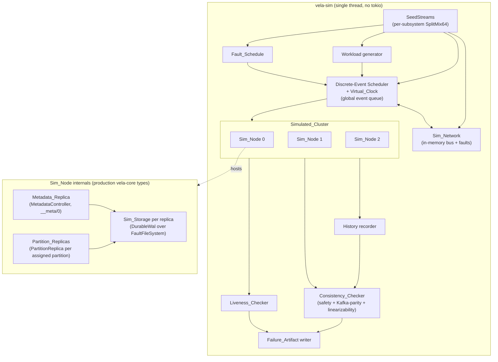

# Design Document

## Overview

This design introduces **Deterministic Simulation Testing (DST)** to Vela: a
test apparatus — the **DST_Harness** — that composes `N` simulated Vela nodes
into one in-process **Simulated_Cluster**, drives the *production* consensus,
replication, metadata-coordination, and WAL-recovery logic through Vela's
existing `Clock`, `Transport`, and `LogStorage` trait seams, injects
seed-derived faults (crash/restart, network partitions, message
drop/delay/reorder/duplication, clock skew, disk/WAL faults), records a client
**History**, and asserts a set of **Safety_Properties** and
**Liveness_Properties** after every run. A single 64-bit **Seed** plus the
**Scenario_Parameters** fully determine a run, so any failure replays
bit-for-bit and `proptest` can shrink it toward a minimal counterexample.

The harness is wired into the existing GitHub Actions CI so the suite runs on
every push and pull request, fails the build on any property violation, and
uploads a replayable **Failure_Artifact**. The review's outcome is captured as a
maintained **Guarantee_Specification** mapping each intended durability,
ordering, and availability guarantee to the DST property that checks it (or to a
documented gap) and recording the Kafka-parity comparison.

### Relationship to existing work (prior art that grounds this design)

`vela-raft` already contains a deterministic, single-threaded discrete-event
harness for **one** partition's Raft group — `crates/vela-raft/src/sim.rs`:
`SimCluster`, `ManualClock`, `InMemoryTransport`, and the in-house `SplitMix64`
PRNG. That module established the exact pattern this feature generalizes:

- `ManualClock` implements the `Clock` seam, advances time only when the
  simulation advances it, attributes armed timers to an "active" node
  (`set_active`), and applies seeded `[base, 2*base)` jitter to election timers
  (the production `TimerClock` instead draws jitter from the wall clock).
- `InMemoryTransport` + a shared `Bus` implement the `Transport` seam with
  seeded drop / delay / reorder / duplicate / partition faults and a
  `(deliver_at, seq)` total order over in-flight messages.
- `SimCluster::step` is a single discrete-event step: it advances logical time
  to the earliest of the next timer firing or message delivery, delivers exactly
  that event, and dispatches the resulting `RaftOutput.sends` back onto the bus.
  Timers win exact ties so ordering is fully deterministic.

This feature **raises** that model from a single Raft group to a full multi-node
cluster: each `Sim_Node` hosts a `Metadata_Replica` (the dedicated `__meta/0`
group) plus the `Partition_Replicas` for the partitions it replicates, all
backed by durable-WAL-fidelity storage, coordinated on topic creation through
the production metadata-commit-and-reconcile path, and exercised under crash /
restart / partition / storage faults with client-observable consistency and
liveness checked end-to-end.

### What makes this tractable: the core is already pure and synchronous

The single most important property of the existing codebase for this design is
that **the consensus core performs no I/O and is fully synchronous**:

- `RaftNode::step(input, clock) -> RaftOutput` folds one `RaftInput`
  (`Tick`/`Message`/`Propose`) plus state into new state and a pure description
  of effects — `RaftOutput { sends, committed, role_change, persist_error }`.
  It never touches the network, a real timer, or the disk; timing/randomness
  flow through the injected `Clock`.
- `vela-core` wraps this with equally synchronous composition:
  `PartitionReplica::step` drives the Raft node and folds newly committed entries
  into the partition `StateMachine` (assigning gap-free offsets); `apply_command`
  folds a committed `ClusterCommand` into `ClusterMetadata`;
  `MetadataController::step` drives the `__meta/0` group; `PartitionRouter`
  resolves a `(topic, key)` to a partition with a dependency-free FNV-1a hash.
- The `LogStorage` seam already has a durable implementation (`DurableWal`)
  that is itself generic over a `FileSystem` seam, and a deterministic,
  fault-injecting in-memory `FileSystem` (`MemFileSystem`) already exists in
  `vela-log` (today `#[cfg(test)]`).

The **only** non-deterministic machinery in production is the async runtime
glue in `vela-server`: `TimerClock` (wall-clock jitter + `tokio` sleeps),
`GrpcTransport` (`tokio::spawn` + real gRPC + real network), the per-partition
`tokio` driver tasks and their `mpsc` queues, the off-loop reconciler task, and
`HashMap` iteration in a few non-outcome-affecting places. DST replaces exactly
that glue with a deterministic, single-threaded discrete-event driver while
running the real consensus/log/state-machine/routing code unchanged.

### Determinism constraint (locked, end-to-end)

A run's Outcome MUST depend only on its Seed and Scenario_Parameters. The
harness MUST NOT consult wall-clock time, the OS thread scheduler, real network
or filesystem I/O, filesystem timestamps, or run-varying `HashMap` iteration
order for any decision that affects the Outcome. Section
[Determinism Strategy](#determinism-strategy) treats this as a first-class,
cross-cutting concern.

### Non-goals (inherited from requirements)

- Changing consensus, replication, or WAL behavior — DST only *exercises and
  verifies* existing logic. A surfaced bug is fixed under its owning feature.
- Real multi-process / networked clusters (those remain the job of the existing
  `vela-server` integration tests) — DST is in-process.
- Performance/throughput benchmarking — simulated time is logical.
- Byzantine fault tolerance — only crash-recovery and network/disk faults.
- Dynamic Raft membership — the node set and each Replica_Set are fixed per run.

## Research and Key Findings

The design is grounded in a direct read of the production code. The findings
that shaped it:

1. **Seams are already exactly where DST needs them.** `vela_raft::{Clock,
   Transport, LogStorage}` are the three boundaries, and `LogStorage` is
   re-exported through `vela-raft` from `vela-log`. `RaftNode<S: LogStorage>` is
   generic over storage; `PartitionLog` is the closed enum (`Durable` /
   `InMemory`) the server injects. DST adds a third backend behind the same
   enum-or-injection pattern without touching `vela-raft`.
2. **`SimCluster` is a working, proven template** for the discrete-event loop,
   seeded RNG, timer attribution, and network fault model — for one group. The
   harness is a generalization, not a green-field build.
3. **The driver glue is thin and mechanical.** `driver.rs` translates queue
   commands into `replica.step(...)`, dispatches `out.sends`, tracks pending
   produces until their target index commits (then assigns the offset via
   `offset_at`), resolves commit-timeouts, and answers known-leader queries. The
   metadata driver additionally folds committed `Cluster` entries through a sink
   and pokes the reconciler. None of this logic is intrinsically async — it is
   async only because production runs it on `tokio` tasks.
4. **Reconcile planning is already a pure function.** `plan_reconcile(metadata,
   running, self_id) -> ReconcilePlan` computes spawn/stop diffs with sorted,
   deterministic output and excludes `__meta/0`. DST reuses this directly to
   drive per-node partition-replica spawning on topic create/delete.
5. **Durable-WAL fidelity is achievable for near-free.** `DurableWal<F:
   FileSystem, C: Clock>` plus the existing `MemFileSystem` fault filesystem
   (torn-tail via `tear_last_write`/`truncate_file`, fsync failure via
   `arm_fsync_failure_*`, read failure via `arm_read_failure_for`, held locks,
   uncreatable dirs) means Sim_Storage can be the **real WAL over a deterministic
   in-memory disk**, giving R7.1 (observable equivalence to production WAL)
   structurally rather than by re-implementation.
6. **Routing and hashing are already deterministic.** `PartitionRouter` uses
   in-house FNV-1a (explicitly chosen over `DefaultHasher` to avoid per-process
   seed randomization), so the workload generator reuses the production
   partitioning rule with no determinism caveat.
7. **The `HashMap` audit is favorable.** Outcome-affecting iteration in the core
   is over ordered `Vec`s (`RaftNode::peers` for broadcast; `committed` in
   ascending index order). The per-peer `next_index`/`match_index` maps are
   accessed *by key*, not iterated for ordering. `ClusterMetadata.topics` is a
   `HashMap` but the harness controls its only outcome-affecting iteration
   (workload target selection, catalogue comparison), which DST performs over
   sorted keys. `plan_reconcile` already sorts its `stop` output.

## Architecture

### Crate placement

DST lives in a **new workspace crate, `vela-sim`** (`crates/vela-sim`), added to
the workspace `members`. Its dependency edges point strictly inward, consistent
with the steering's dependency direction (`server → core → raft → log`):

```
vela-sim ─> vela-core ─> vela-raft ─> vela-log
        └─> vela-raft (re-exported seams: Clock, Transport, LogStorage, NodeId, messages)
        └─> vela-log  (LogStorage, DurableWal, the FileSystem seam + fault FS)
   dev-dependency: proptest
```

Crucially, **`vela-sim` does NOT depend on `vela-server`**. The async runtime
(`tokio`), gRPC (`tonic`), `TimerClock`, and `GrpcTransport` are exactly the
non-deterministic machinery DST replaces; keeping them out of the harness's
dependency closure is what structurally guarantees no wall clock, no real
network, and no OS scheduler can leak into a run. This keeps production code
paths unpolluted: nothing in `vela-server` learns about the simulator.

Two small, behavior-preserving extractions in the inward crates let the harness
reuse production decision logic verbatim instead of re-implementing it (avoiding
model divergence — see the architectural decision below):

- **Promote the WAL `FileSystem` seam and a deterministic fault filesystem to a
  usable surface in `vela-log`.** Today `FileSystem`/`WalFile` and
  `MemFileSystem` are `#[cfg(test)]`/`pub(crate)`. This design exposes them
  behind a non-default `sim` Cargo feature on `vela-log` (e.g.
  `vela_log::sim::{FaultFileSystem, FileSystem}` and
  `DurableWal::open_with`/`open_with_clock`), so production builds are byte-for-
  byte unchanged (the feature is off) while `vela-sim` enables it. No production
  code path changes.
- **Lift `plan_reconcile` (pure) into `vela-core`** (e.g. `vela_core::reconcile`)
  so both `vela-server`'s reconciler and the harness call the *same* diff
  function. `vela-server` keeps its `tokio` task wrapper; only the pure planner
  moves down a layer. (If preferred, the harness may instead re-export and call
  the server's planner; lifting it to `vela-core` is recommended because it is
  domain logic with no async content and keeps `vela-sim` off `vela-server`.)

Regression seeds and the Guarantee_Specification are repository artifacts:

- `crates/vela-sim/proptest-regressions/` — `proptest`'s own persisted failing
  cases (the project already uses `proptest`, which writes and replays these
  automatically), satisfying the "persist failing seeds, replay them" contract.
- `crates/vela-sim/GUARANTEES.md` — the maintained Guarantee_Specification.

### The key architectural decision: how the harness drives the driver logic deterministically

The requirements deliberately leave open *how* the harness drives the production
async driver logic deterministically. This is the most consequential decision in
the design. Three options were considered.

#### Option A (recommended): generalize the synchronous discrete-event model

Extend `SimCluster`'s approach to a multi-node, multi-group **`SimRuntime`** that
runs entirely single-threaded and synchronously, with no `tokio`. The runtime
owns one global discrete-event queue (the `Virtual_Clock`), the `Sim_Network`
bus, and every `Sim_Node`. Each node hosts its `MetadataController` and a fleet
of `PartitionReplica`s — the **real `vela-core` types** — and the runtime plays
the role the `tokio` driver plays in production: on each event it feeds the
appropriate `RaftInput` to the right replica via `replica.step(input, clock)`,
routes the returned `out.sends` through the `Sim_Network`, applies `out.committed`
to the state machine / catalogue, resolves pending client operations when their
target index commits, and runs `vela_core::reconcile` to spawn/stop partition
replicas after a committed metadata change.

- **Pros:** The logic actually under test — consensus (`vela-raft`), log
  (`vela-log`/`DurableWal`), state machine and offset assignment, metadata apply,
  routing, reconcile planning — is the **production code, unchanged**. Builds
  directly on proven prior art (`SimCluster`). Determinism is structural: one
  thread, one event queue, seeded PRNG, no `tokio`, no wall clock. Zero new
  third-party dependencies (consistent with the steering's in-house bias and the
  in-house `SplitMix64` precedent). The harness cannot accidentally observe real
  time or scheduling because those crates are not even linked.
- **Cons:** The harness re-expresses the *orchestration glue* that `driver.rs`
  performs (pending-produce resolution, commit-timeout-as-budget, leader-redirect
  following, reconcile triggering). If that glue drifts from `driver.rs`, DST
  could verify a parallel orchestration model rather than production's.
- **Mitigation:** The glue is thin and the *non-trivial, runtime-independent
  decisions are shared*, not re-implemented: offset assignment already lives in
  `vela-core` (`StateMachine`/`fleet`), reconcile planning is the shared
  `vela_core::reconcile`, routing is `PartitionRouter`, and commit detection is
  `replica.raft().commit_index()`. What remains harness-side is purely the
  single-threaded event bookkeeping that has no production analog worth sharing
  (production's analog is `tokio` itself).

#### Option B: a deterministic async executor (seeded single-threaded runtime)

Build (or adopt) a deterministic executor that runs the **actual** `driver.rs`
`async fn run` tasks, with a virtual clock and seeded, deterministic task-poll
ordering, swapping `tokio` timers/network for simulated equivalents.

- **Pros:** Highest fidelity for the orchestration layer — it drives the real
  `PartitionDriver`/`MetadataDriver`/reconciler tasks, so the glue is verified
  too.
- **Cons:** Determinizing `tokio` is the hard part. Production calls
  `tokio::spawn` directly inside `TimerClock`, `GrpcTransport`, and the
  produce-timeout path, and uses `mpsc`/`oneshot`/`Notify`; making all of that
  deterministic requires either a heavyweight third-party runtime
  (`madsim`/`turmoil`, which demand compiling under a special cfg and swapping
  `tokio` workspace-wide — invasive, and at odds with the minimal-dependency
  steering) or a bespoke executor plus a `spawn`/timer/`mpsc` seam threaded
  through `vela-server` (polluting production code paths the non-goals warn
  against). High effort, high blast radius, and it still ultimately drives the
  same `replica.step` core that Option A drives directly.

#### Option C: third-party deterministic simulation framework

Adopt `madsim` or `turmoil`.

- **Cons:** Pulls a large dependency and a build-mode split into the workspace,
  contradicts the project's in-house/minimal-deps stance (in-house Raft, in-house
  `SplitMix64`, in-house CRC32C), and still cannot exercise the WAL/disk fault
  model as precisely as the existing `MemFileSystem`. Rejected.

#### Decision

**Adopt Option A.** It maximizes the fraction of *production* code exercised
(everything that matters for the guarantees under review), reuses proven prior
art, requires no new dependencies, makes determinism a structural property
rather than something policed across a runtime, and keeps production code paths
unpolluted. The residual cost — re-expressing thin orchestration glue — is
bounded and is reduced by sharing the non-trivial decisions through `vela-core`.

A future migration to Option B (to additionally cover the `tokio` driver glue)
is possible without invalidating this design: the `SimRuntime`'s node/group
interfaces are defined in terms of `replica.step` and the seams, so a
deterministic executor could later host the same nodes. Until the orchestration
glue is itself a likely source of consensus/durability bugs (it is not — the
risk lives in consensus, replication, and recovery), Option A is the right
investment.

### Component diagram



### Runtime model (how production async maps to deterministic events)

| Production (`vela-server`, async)                        | DST (`vela-sim`, synchronous discrete-event)                                        |
|----------------------------------------------------------|--------------------------------------------------------------------------------------|
| `TimerClock` → `tokio::sleep` → `DriverCommand::Tick`    | `SimClock` arms a `TimerFire` event at a Seed-jittered virtual instant               |
| `GrpcTransport` → `tokio::spawn` gRPC → reply on queue   | `Sim_Network` schedules a `MessageDeliver` event (latency + faults), routed in-proc  |
| per-partition `tokio` task + `mpsc` queue                | the scheduler steps the owning `PartitionReplica` directly, in event order           |
| `MetadataDriver` task + `MetadataSink` + `Notify`        | the scheduler steps the `MetadataController`, folds `committed`, calls `reconcile`    |
| off-loop reconciler `tokio` task                         | a synchronous `reconcile` call after each metadata commit (same `plan_reconcile`)    |
| produce/consume gRPC handler + `oneshot`                 | a `ClientOp` event; response recorded synchronously into the `History`               |
| commit-timeout via `tokio::time::sleep`                  | a budgeted number of Events / virtual-time deadline checked by the scheduler          |
| election jitter from wall clock                          | `[base, 2*base)` jitter from the seeded election RNG stream (as `ManualClock` does)  |

One discrete step never spans more than one event; an event is processed
atomically (a `replica.step`, its `out.sends` enqueued, `out.committed` applied)
before the next event is selected. This is the invariant that makes the entire
run a pure function of the Seed.

## Components and Interfaces

### Simulated_Cluster and Sim_Node

`SimulatedCluster` owns a `Vec<SimNode>` indexed by node id and the fixed
topology (node set, replication factor) for the run. A `SimNode` owns:

- a `MetadataController` for the `__meta/0` group (the production type, recovered
  via `MetadataController::recover_durable` over a Sim_Storage-backed WAL);
- a map `(topic, PartitionIndex) -> PartitionReplica` — the node's fleet of
  partition replicas, each the production `PartitionReplica` built over a
  Sim_Storage `PartitionLog`;
- its served `ClusterMetadata` mirror (the view the reconciler reads);
- a `running` flag (cleared on `Node_Crash`, set on `Node_Restart`);
- the Sim_Storage handles for each hosted replica (so a crash can drop volatile
  state and a restart can reopen the same backing disk).

Composition mirrors production `node.rs`/`reconciler.rs` exactly: on a committed
`CreateTopic` the metadata apply updates each node's served catalogue, then
`vela_core::reconcile` computes the spawn diff per node and the harness starts a
`PartitionReplica` for every partition whose `Replica_Set` contains that node;
on `DeleteTopic` it stops them. The `__meta/0` group is never started or stopped
by reconcile (Requirement 3.4, 6.x parity).

```rust
// vela-sim (illustrative signatures)
pub struct SimulatedCluster {
    nodes: Vec<SimNode>,
    topology: Topology,        // node ids, replication factor (fixed per run)
    streams: SeedStreams,      // per-subsystem RNG (see Determinism Strategy)
}

struct SimNode {
    id: NodeId,                       // domain string id
    raft_id: RaftNodeId,              // numeric id (raft_node_id(&id))
    running: bool,
    controller: MetadataController,   // __meta/0, production type
    fleet: HashMap<GroupKey, PartitionReplica>,
    served: ClusterMetadata,          // mirror the reconciler reads
    storage: HashMap<GroupKey, SimStorageHandle>,
}
```

`Replica_Set`s and the node set are fixed for the run (Requirement 3.5):
`Topology` is constructed once from Scenario_Parameters and never mutated.

### Discrete-event scheduler and Virtual_Clock

The scheduler is the heart of the harness, generalizing `SimCluster::step`. It
holds a single ordered event collection and the current logical instant.

```rust
struct Scheduler {
    now: VirtualInstant,           // logical time; never from the wall clock
    queue: BinaryHeap<Scheduled>,  // min-ordered by (at, tie_break)
    next_seq: u64,                 // monotonic global tie-break sequence
    budget: Budget,                // max events and/or max virtual duration
}

struct Scheduled { at: VirtualInstant, tie_break: TieBreak, event: Event }

enum Event {
    TimerFire { node: NodeId, group: GroupKey, kind: TimerKind, generation: u64 },
    MessageDeliver(Envelope),      // routed Raft message for a (node, group)
    ClientOp(ClientOp),            // a workload operation to issue
    FaultApply(Fault),             // crash, partition, skew, storage-fault arm
    FaultHeal(HealId),             // remove a transient network fault
}
```

`VirtualInstant` is a logical `u64` of nanoseconds from an arbitrary origin (not
an `Instant`, so it can never be compared against or seeded from the wall clock,
unlike `ManualClock`'s `Instant::now()` origin — this design uses a pure logical
counter to remove even that residual real-time touch).

The step loop:

1. Pop the earliest `Scheduled` by `(at, tie_break)`; if none or the budget is
   exhausted, end the run (Requirement 4.6).
2. Advance `now` to `at` (never backward; no event is processed before an
   earlier-scheduled one — Requirement 4.4).
3. Dispatch by kind (below), which may step a replica and enqueue follow-on
   events (timers re-armed, messages sent).
4. Record any role change / commit into the run state the checkers read.

**Timer arming.** A `SimClock` implements the `Clock` seam. Before stepping a
replica the scheduler calls `set_active(node, group)`; `Clock::arm(kind, dur)`
then enqueues a `TimerFire` at `now + delay`, where `delay` is the exact `dur`
for `Heartbeat` (Requirement 4.3) and `dur + jitter` for `Election`, with
`jitter` drawn from the seeded election stream within `[base, 2*base)` =
150–300 ms for the production base (Requirement 4.2), exactly as `ManualClock`
does. Re-arming a timer of the same `(node, group, kind)` supersedes the prior
one via a `generation` counter (mirroring `TimerClock::is_current`): a fired
`TimerFire` whose generation is stale is dropped, giving correct election-timer
reset without cancellation.

**Clock skew (Requirement 4.5).** A per-node bounded affine transform
`view(t) = offset + t * rate` (rate near 1.0, offset bounded) is applied when
computing a skewed node's timer firing instant from its armed `dur`, so the
node's *view* of elapsed time differs while the **global queue stays ordered by
true `VirtualInstant`**. Skew is bounded so it can never approximate reading the
wall clock; it only perturbs relative timer firing.

### Sim_Network (deterministic in-memory bus with fault injection)

`Sim_Network` is the `Transport` seam for every replica, generalizing
`SimCluster`'s `Bus`. Because the `Transport` trait's `send(to, msg)` carries no
sender or group, each replica is handed a per-`(node, group)` `SimTransport`
handle stamped with both — the same trick `GrpcTransport` uses to stamp
`(topic, partition)` and `self_id`. Outbound `out.sends` are dispatched through
these handles after each step (never inside the step), exactly as production and
`SimCluster` do.

On `send`, the bus consults the seeded **network** RNG stream and the current
fault configuration to decide delivery, then enqueues a `MessageDeliver` event:

- **Base latency** (Requirement 5.1): every delivered message gets a configured
  one-way latency added to its delivery instant.
- **Reorder** (Requirement 5.2): when enabled, a per-message Seed-derived extra
  delay within a bound is added, so `deliver_at` ordering can differ from send
  order (the `(deliver_at, seq)` total order keeps it deterministic).
- **Drop** (Requirement 5.3): with a Seed-derived probability the message is
  dropped and never enqueued.
- **Duplicate** (Requirement 5.4): with a Seed-derived probability a second copy
  is enqueued in addition to the original.
- **Partition** (Requirement 5.5, 5.6): a directed cut set blocks delivery when
  `(from, to)` lies across the partition; asymmetric partitions block one
  direction only. A crashed node is modeled as cut in both directions until
  restart (Requirement 6.2).
- **Heal** (Requirement 5.7): removing a partition restores delivery for
  messages **sent at or after** the heal; any still-configured drop/delay/
  reorder/duplication continues to apply.

All decisions draw from the network RNG stream so they are a deterministic
function of the Seed (Requirement 5.8). The bus also counts dropped/duplicated
messages for diagnostics, as `SimCluster`'s `Bus` already does.

### Sim_Storage (LogStorage with durable-WAL fidelity + faults)

Sim_Storage is the `LogStorage` seam for every replica. The design choice that
delivers Requirement 7.1 (observable equivalence to the production WAL) is to
make Sim_Storage the **real `DurableWal` running over a deterministic in-memory
`FaultFileSystem`**, rather than a hand-written log model. The WAL's own
framing, manifest, recovery, torn-tail classification, and sync semantics are
therefore exactly the production ones.

```rust
// PartitionLog already abstracts the backend the replica is built over.
// vela-sim adds a Sim variant (or injects DurableWal<FaultFileSystem> directly).
enum SimBackend {
    Durable(DurableWal<FaultFileSystem, SimWalClock>), // durable-topic fidelity
    InMemory(InMemoryLog),                             // in-memory-topic parity
}
```

A `SimStorageHandle` holds the node-and-partition's backing `FaultFileSystem`
(an `Arc<Mutex<…>>`-shared byte store, like `MemFileSystem`) so that:

- **Crash (Requirement 6.1, 7.2):** dropping the `DurableWal` handle discards
  volatile, unsynced state while the `FaultFileSystem` **retains exactly the
  bytes forced to stable storage**. Because `SyncPolicy::Always` is the
  consensus-safe policy production uses, every acknowledged append/commit was
  fsynced before returning, so a crash preserves all `Acknowledged_Record`s and
  the persisted `HardState` (Requirement 7.6). Modeling *loss of unsynced
  writes* requires the fault FS to track, per file, the last-fsynced length and
  truncate to it on `crash()`; this design extends the existing `MemFileSystem`
  (which already has `truncate_file`/`tear_last_write`) with a `crash()` that
  drops each file's un-fsynced tail.
- **Restart (Requirement 6.3, 6.4):** reopening a `DurableWal` over the same
  `FaultFileSystem` runs the **real recovery path** — restoring `current_term`,
  the vote, the committed prefix — and `PartitionReplica::recover` re-applies the
  committed prefix to a fresh `StateMachine`, regaining offsets. The harness then
  starts a replica for every recovered partition whose Replica_Set contains the
  node (Requirement 6.4) via the same reconcile pass.
- **Torn tail (Requirement 7.3):** armed via the fault FS's `tear_last_write`,
  so recovery discards the torn tail down to the last intact record using the
  WAL's own torn-vs-interior classification.
- **I/O error (Requirement 7.4):** armed via `arm_fsync_failure_*` /
  `arm_read_failure_for` / `arm_write_failure_for`, surfaced through the
  `LogStorage` `Result`/fail-stop contract at a Seed-derived operation, never as
  a silent success.

All storage-fault decisions (which operation, which node) draw from the seeded
**storage** RNG stream (Requirement 7.5). The `SimWalClock` is the WAL's `Clock`
seam (used only to pace the `Periodic` policy, which DST does not use under
`Always`) and reads logical time, never the wall clock.

### Seeded RNG strategy (per-subsystem stream derivation)

Determinism *and* independence require that distinct subsystems not march in
lock-step (the existing `SimCluster` already decorrelates its bus PRNG from the
clock PRNG by adding a constant to the seed). DST formalizes this as
`SeedStreams`: from the single 64-bit Seed, derive one independent `SplitMix64`
stream per subsystem, each seeded by a distinct, fixed derivation so streams are
mutually decorrelated:

```rust
struct SeedStreams {
    election: SplitMix64,   // timer jitter
    network:  SplitMix64,   // drop / delay / reorder / duplicate
    storage:  SplitMix64,   // storage-fault selection + timing
    faults:   SplitMix64,   // fault-schedule selection + timing
    workload: SplitMix64,   // op kind, topic/partition, key/value, lengths
    tiebreak: SplitMix64,   // event tie-break ordering at equal instants
}

impl SeedStreams {
    fn new(seed: u64) -> Self {
        // Distinct, fixed offsets per stream; SplitMix64 is the in-house PRNG
        // already used by SimCluster. Streams never share state.
        Self {
            election: SplitMix64::new(seed ^ 0x1111_1111_1111_1111),
            network:  SplitMix64::new(seed ^ 0x2222_2222_2222_2222),
            storage:  SplitMix64::new(seed ^ 0x3333_3333_3333_3333),
            faults:   SplitMix64::new(seed ^ 0x4444_4444_4444_4444),
            workload: SplitMix64::new(seed ^ 0x5555_5555_5555_5555),
            tiebreak: SplitMix64::new(seed ^ 0x6666_6666_6666_6666),
        }
    }
}
```

`SplitMix64` is reused from `vela-raft::sim` (or copied into `vela-sim` to keep
the dependency minimal — recommended to re-export it from `vela-raft` so there is
one implementation). All randomness in a run flows through these streams and
nothing else (Requirement 1.1, 1.2).

### Workload generator

The generator produces a `Workload` of exactly the configured number of
`Client_Operation`s from the `workload` RNG stream (Requirement 8.1), composed of
topic create/delete, produce, and consume. It reuses production rules:

- **Partitioning (Requirement 8.2):** keyed records route via the production
  `PartitionRouter` (FNV-1a `hash(key) % partition_count`); keyless records pick
  a partition as a Seed-derived function of the target topic's partition set
  (the harness draws the index from the `workload` stream rather than relying on
  the router's process-global round-robin counter, keeping selection a pure
  function of the Seed).
- **Record shape (Requirement 8.3):** value length in `0..=65_536`, key length
  in `1..=256` when keyed, both lengths and contents drawn from the `workload`
  stream.
- **Issuance interleaving (Requirement 8.7):** `ClientOp` events are scheduled
  across the run's virtual timeline, interleaved with the `Fault_Schedule`, and
  continue to be issued while crashes/restarts/partitions are in effect.
- **Leader redirection (Requirement 8.4, 8.5):** when an op targets a non-leader,
  the harness follows the returned redirect toward the current leader for up to 5
  hops; an op that does not resolve in 5 hops records an unresolved-redirection
  response (a valid response, not a violation).
- **No-leader (Requirement 8.6):** a no-leader error is recorded as a valid
  response.

Issuing a produce maps to stepping the target leader replica with
`RaftInput::Propose(EntryPayload{ Record, value })` and resolving the offset when
the target index commits (the production `offset_at` rule); a consume reads
committed records via `PartitionReplica::read`; topic create/delete proposes a
`ClusterCommand` to `__meta/0` and awaits commit, then reconciles — all the
production paths.

### History recorder

`History` records, per `Client_Operation`: type and arguments, invocation
`VirtualInstant`, response `VirtualInstant`, and response (Requirement 9.1).
Successful produce records target topic/partition, value, and the committed
offset returned (Requirement 9.2); successful consume records topic/partition,
start offset, and the ordered records returned (Requirement 9.3); failures and
redirections are recorded as the response rather than discarded (Requirement
9.4). Because every input is Seed-derived and processing is single-threaded and
event-ordered, the History is identical for identical Seed + Scenario_Parameters
(Requirement 9.5).

### Consistency_Checker (safety + Kafka-parity + linearizability)

The checker has total observability of every replica (logs, terms, commit
indices, applied entries) plus the History, since everything is in-process. It is
fed observations during the run (cheap invariants checked incrementally) and runs
final passes at the end.

**Raft safety (Requirement 10):**

- *Election Safety (10.1):* instrument each `role_change == Leader` with the
  replica's `current_term`; flag if two replicas hold leader in the same term for
  the same group. The checker *detects*, it does not prevent.
- *Log Matching (10.2):* for any two replicas of a group, if entries at the same
  index share a term, all entries up to that index are identical.
- *Leader Completeness (10.3):* a committed entry is present at the same index in
  every replica that becomes leader in a later term.
- *State Machine Safety (10.4):* no two replicas apply different entries at the
  same index (track the per-index applied entry).
- *Commit monotonicity (10.5):* each replica's commit index never decreases.
- Any violation ends the run with a failing Outcome naming the property and the
  detection instant (Requirement 10.6, 2.3).

**Client consistency / Kafka parity (Requirement 11):**

- *Durability (11.1, 11.2):* every `Acknowledged_Record` appears at its returned
  offset in the partition's committed log and remains for the rest of the run,
  across any sequence of crashes/restarts/failovers/partitions in which at most a
  minority of the Replica_Set fails at once.
- *Offset integrity (11.3):* committed offsets are contiguous from 0, strictly
  increasing, no gaps, no offset for two distinct records.
- *Consume validity (11.4, 11.5):* every consumed record is committed at the
  returned offset and returned in ascending offset order; no phantom reads (a
  record committed via replication/recovery without a client ack is not a
  phantom).
- *Per-partition linearizability (11.6):* the single-leader Raft committed log
  *is* the linearization; the checker verifies the History is consistent with it
  — each successful consume observes a contiguous prefix-range in ascending
  offset, and the returned offsets respect the real-time order of non-overlapping
  operations on the same partition (if op A responds before op B is invoked, A's
  offset ≤ B's). This specializes the general linearizability check to Vela's
  single-writer-per-partition offset model, which is tractable without a full
  history-search.
- *Metadata convergence (11.7):* two nodes that have applied `__meta/0` to the
  same commit index hold identical served catalogues (compared over sorted topic
  keys to avoid `HashMap` order dependence).

### Liveness_Checker

Liveness is asserted only under favorable conditions and within a bounded budget
(Requirement 12):

- While a majority of a group's voters are running and mutually reachable with no
  further faults, exactly one leader is elected within a bounded number of Events
  (12.1).
- After faults healed + majority available, a subsequently produced record
  commits, and a subsequent topic create/delete commits, within a bounded budget
  (12.2, 12.3).
- At a quiescent state with majority + all healed, every lagging replica's log has
  converged to the leader's committed log (12.4).
- A failure to make required progress is only declared **after** the bounded
  budget is exceeded (12.5), and no progress is required of a group lacking a
  reachable majority (12.6, and 6.6 for the crash case).

The checker tracks per-group "favorable since" markers (set when the condition
becomes true, cleared on any new fault) and verifies progress occurs before
`favorable_since + budget`.

### Failure diagnostics, minimization, and artifacts

On a failing Outcome the harness produces a `Failure_Artifact` (Requirement 13):
Seed, Scenario_Parameters, violated property, detection `VirtualInstant`, and a
replayable Event trace and/or the recorded History sufficient to reconstruct the
sequence. It emits structured diagnostics naming the affected group, term, and
replicas without requiring a re-run (13.5), and writes a run summary regardless of
Outcome plus the full artifact on failure to a CI-collectable path (13.4).

**Minimization (Requirement 13.3)** is delegated to `proptest`: scenarios are
generated by `proptest` strategies over `Scenario_Parameters` (cluster size,
replication factor, partition count, fault intensities, workload size, budget)
plus the 64-bit Seed. On failure `proptest` shrinks the structured scenario
toward a minimal counterexample that still reproduces the same violated property
(fewer nodes, lower fault intensity, shorter workload), and persists the failing
case under `proptest-regressions/` so it is replayed on every subsequent run
(Requirement 2.4, 2.2). Because a run is a pure function of (Seed,
Scenario_Parameters), re-execution reproduces the same Outcome and the same
violated property (Requirement 2.1, 2.2).

### CI integration

The existing `.github/workflows/ci.yml` already runs `cargo test --workspace`,
which will execute the `vela-sim` test target (and thus the persisted
`proptest-regressions/`) on every push to `main` and every PR — satisfying the
"runs in CI, locally reproducible via `cargo test`" contract (Requirement 14.1,
14.6). The design adds a dedicated **`dst` job** to make budgets and artifact
collection explicit:

- Runs the DST suite with a configured per-suite budget (a bounded number of runs
  and a bounded number of Events per run) via `PROPTEST_CASES` / a `VELA_DST_*`
  env budget, keeping CI duration bounded (Requirement 14.2, 14.5).
- Executes the persisted regression seeds plus a Seed-derived set of additional
  seeds within the budget (Requirement 14.2).
- Fails the build on any run failure, surfacing the failing Seed and violated
  property in the job log (and only for runs that actually failed — Requirement
  14.3).
- Uploads the `Failure_Artifact` (and `proptest-regressions/`) via
  `actions/upload-artifact` with `if: failure()`, and fails the build whether or
  not the upload succeeds (Requirement 14.4).

```yaml
  dst:
    name: deterministic simulation
    runs-on: ubuntu-latest
    steps:
      - uses: actions/checkout@v4
      - uses: dtolnay/rust-toolchain@stable
      - uses: Swatinem/rust-cache@v2
      - name: Run DST suite
        run: cargo test -p vela-sim --features sim --locked
        env:
          PROPTEST_CASES: "256"        # per-property run budget
          VELA_DST_MAX_EVENTS: "200000" # per-run event budget
      - name: Upload failure artifacts
        if: failure()
        uses: actions/upload-artifact@v4
        with:
          name: dst-failure-artifacts
          path: |
            crates/vela-sim/proptest-regressions/
            target/dst-artifacts/
```

### Guarantee_Specification

`crates/vela-sim/GUARANTEES.md` enumerates Vela's intended durability, ordering,
and availability guarantees as concrete, testable statements; maps each to the
DST Safety_/Liveness_Property that checks it or to a documented gap; records
whether each is at parity with Kafka and describes any divergence; and identifies
guarantees the current architecture cannot yet provide (Requirement 16.1–16.4). A
test asserts the mapping covers every property the suite defines, so the document
cannot silently drift from the suite.

## Data Models

DST introduces only harness-side types; all domain/consensus types
(`RaftNode`, `PartitionReplica`, `MetadataController`, `ClusterMetadata`,
`Topic`, `Partition`, `ClusterCommand`, `LogEntry`, `HardState`, `NodeId`,
`PartitionIndex`, `Offset`, `LogBackend`) are reused unchanged from `vela-core`,
`vela-raft`, and `vela-log`.

### Scenario configuration

```rust
pub struct ScenarioParameters {
    pub node_count: usize,          // >= 3 supported (Req 15.2)
    pub replication_factor: usize,  // <= node_count (Req 15.5)
    pub partition_count: u32,       // >= 1 (Req 15.5)
    pub faults: FaultIntensities,   // latency, drop/dup/reorder probs, crash/partition rates, storage-fault rates, skew bounds
    pub workload_size: usize,
    pub budget: Budget,             // max events and/or max virtual duration (Req 4.6, 15.1)
}

pub struct Budget { pub max_events: u64, pub max_virtual: VirtualDuration }
```

Unspecified parameters take documented defaults (Requirement 15.4); an internally
inconsistent set (replication factor > node count, partition count < 1) is
rejected with an error before any run (Requirement 15.5), while replication
factor == node count is accepted.

### Run inputs/outputs

```rust
pub struct RunConfig { pub seed: u64, pub params: ScenarioParameters }

pub enum Outcome {
    Passed,
    Failed { property: PropertyId, at: VirtualInstant, detail: ViolationDetail },
}

pub struct FailureArtifact {
    pub seed: u64,
    pub params: ScenarioParameters,
    pub property: PropertyId,
    pub at: VirtualInstant,
    pub trace: Vec<TraceEvent>,     // replayable event trace
    pub history: History,
    pub diagnostics: Diagnostics,   // affected group, term, replicas
}
```

### History

```rust
pub struct History { pub ops: Vec<RecordedOp> }

pub struct RecordedOp {
    pub kind: OpKind,               // CreateTopic | DeleteTopic | Produce | Consume
    pub args: OpArgs,
    pub invoked_at: VirtualInstant,
    pub responded_at: VirtualInstant,
    pub response: OpResponse,       // success(values/offset) | redirect | error
}
```

### Network and message envelope

```rust
struct Envelope {
    from: NodeId, to: NodeId,
    group: GroupKey,                // (topic, partition); ("__meta", 0) for metadata
    msg: RaftMessage,               // production RequestVote/AppendEntries (+replies)
    deliver_at: VirtualInstant,
    seq: u64,                       // tie-break
}
```

## Correctness Properties

*A property is a characteristic or behavior that should hold true across all
valid executions of a system — essentially, a formal statement about what the
system should do. Properties serve as the bridge between human-readable
specifications and machine-verifiable correctness guarantees.*

DST is itself a property-checking apparatus, so these properties fall into two
groups: properties of the **harness** (reproducibility, scheduling, fault
injection, recovery, workload, history) and the **system-under-test** safety,
durability, and liveness properties the Consistency_Checker and Liveness_Checker
assert. Each is validated by a property-based test driven by `proptest` over
random seeds and Scenario_Parameters (minimum 100 iterations), tagged
`Feature: deterministic-simulation-testing, Property {n}: {text}`. The
"deterministic-function-of-the-Seed" acceptance criteria (1.1, 1.4, 1.5, 5.8,
7.5, 9.5, 2.2) are consolidated into Property 1.

### Property 1: Reproducibility (a run is a pure function of its Seed)

*For any* Seed and Scenario_Parameters, two executions of the DST_Harness with
that identical Seed and parameters produce the identical ordered sequence of
delivered Events, the identical per-replica committed log for every partition
and for the metadata group, the identical recorded History, and the identical
Outcome — including, for a failing run, the identical violated property.

**Validates: Requirements 1.1, 1.2, 1.3, 1.4, 1.5, 2.2, 5.8, 7.5, 9.5**

### Property 2: Event ordering and bounded termination

*For any* run, the sequence of logical instants at which Events are processed is
non-decreasing (no Event is processed before an earlier-scheduled Event), and
the run terminates having processed no more than the configured maximum number
of Events and within the configured simulated-time budget.

**Validates: Requirements 4.4, 4.6**

### Property 3: Virtual-time timer semantics

*For any* run, every armed election timer fires within the randomized
`[base, 2*base)` (150–300 ms) window measured from its arming instant, every
armed heartbeat timer fires exactly the configured interval after its arming
instant, and where Clock_Skew is configured a skewed node's firings reflect its
bounded affine view of time while global Event ordering remains deterministic.

**Validates: Requirements 4.2, 4.3, 4.5**

### Property 4: Network faults behave exactly as configured

*For any* run and configured network faults, the Sim_Network satisfies, over all
messages: every delivered message incurs at least the base one-way latency; an
enabled reorder adds only a bounded extra delay; a dropped message is never
delivered; a duplicated message is delivered exactly one extra time; no message
whose sender and recipient straddle an in-effect Partition is delivered (and an
asymmetric Partition blocks only the configured direction); after a Heal,
messages sent at or after the Heal are deliverable while any still-configured
drop/delay/reorder/duplication continues to apply; and no message is delivered to
a crashed node until it restarts.

**Validates: Requirements 5.1, 5.2, 5.3, 5.4, 5.5, 5.6, 5.7, 6.2**

### Property 5: Storage model fidelity and durability boundary

*For any* sequence of `LogStorage` operations with no Storage_Fault configured,
Sim_Storage's observable results equal those of the production durable WAL for
the same sequence; and at a Node_Crash, Sim_Storage retains exactly the writes
forced to stable storage and discards those not forced — a torn-tail fault is
recovered by discarding the torn tail down to the last intact record, and an
I/O-error fault surfaces through the `LogStorage` result (or fail-stop) contract
rather than as a silent success.

**Validates: Requirements 7.1, 7.2, 7.3, 7.4**

### Property 6: Crash/restart recovery round-trip

*For any* Node_Crash followed by a Node_Restart with no Storage_Fault, the
restarted node recovers each Metadata_Replica and Partition_Replica from
Sim_Storage with the same current term, vote, committed log prefix, and applied
catalogue the durable contract guarantees, and then hosts a running
Partition_Replica for exactly the recovered partitions whose Replica_Set contains
it; the node set and each Replica_Set are unchanged across the run.

**Validates: Requirements 3.5, 6.1, 6.3, 6.4**

### Property 7: All inter-node messages flow through the Sim_Network

*For any* run, every `RequestVote`, `AppendEntries`, and reply exchanged between
replicas — for both partition groups and the metadata group — is dispatched and
delivered solely by the Sim_Network (the in-memory bus is the only message path;
delivered, dropped, and duplicated counts reconcile with what replicas emitted).

**Validates: Requirements 3.3**

### Property 8: Topic-create coordination

*For any* topic create that commits during a run, each Sim_Node whose
Replica_Set includes a partition of that topic ends up hosting a running
Partition_Replica for that partition, reached through the same
metadata-commit-and-reconcile path production uses.

**Validates: Requirements 3.4**

### Property 9: Workload generation invariants

*For any* Seed and Scenario_Parameters, the generated Workload contains exactly
the declared number of Client_Operations composed of create/delete/produce/
consume; every keyed produce routes to the partition the production partitioning
rule selects and every keyless produce routes to a Seed-derived partition of the
target topic; every produce's value length is in `0..=65_536` and every key
length (when keyed) is in `1..=256`; and Client_Operations continue to be issued
while Node_Crashes, Node_Restarts, and Partitions are in effect, following up to
5 leader redirections per operation.

**Validates: Requirements 8.1, 8.2, 8.3, 8.4, 8.7**

### Property 10: History completeness

*For any* run, every issued Client_Operation appears in the History with its
type, arguments, invocation instant, response instant, and response; a successful
produce records the target topic, partition, value, and committed offset; a
successful consume records the target topic, partition, start offset, and ordered
records; and a failed or redirected operation is recorded with its error or
redirection rather than discarded.

**Validates: Requirements 9.1, 9.2, 9.3, 9.4**

### Property 11: Election Safety (Raft §5.2)

*For any* run, for every partition group and for the metadata group, at most one
replica is leader in any single term; a same-term double-leader condition is
detected and flagged as a violation.

**Validates: Requirements 10.1**

### Property 12: Log Matching (Raft §5.3)

*For any* two replicas of the same group whose logs both contain an entry at a
given index with the same term, their logs are identical in all entries up to and
including that index.

**Validates: Requirements 10.2**

### Property 13: Leader Completeness (Raft §5.4)

*For any* entry committed in a given term, that entry is present at the same index
in the log of every replica that is or becomes leader in any later term.

**Validates: Requirements 10.3**

### Property 14: State Machine Safety (Raft §5.4.3)

*For any* log index, no replica applies a different entry at that index than any
other replica applies at that index.

**Validates: Requirements 10.4**

### Property 15: Commit monotonicity

*For any* replica, its committed index never decreases over the course of the run.

**Validates: Requirements 10.5**

### Property 16: Acknowledged-record durability

*For any* run in which at most a minority of a partition's Replica_Set fails at
once across any sequence of Node_Crashes, Node_Restarts, leader failovers, and
network Partitions, every Acknowledged_Record appears in that partition's
committed log at the offset returned to the client and remains present for the
remainder of the run (the no-Storage_Fault crash/restart case is the special
instance in which no acknowledged record is lost).

**Validates: Requirements 7.6, 11.1, 11.2**

### Property 17: Offset integrity

*For any* partition, its committed offsets are contiguous from 0 and strictly
increasing, with no gaps and no offset assigned to two distinct records.

**Validates: Requirements 11.3**

### Property 18: Consume read-validity (no phantom reads)

*For any* successful consume Client_Operation, every record it returns is a
committed record present in the target partition's committed log at the returned
offset, and the records are returned in ascending offset order; a record
committed through replication or recovery without a recorded client
acknowledgment is not treated as a phantom read.

**Validates: Requirements 11.4, 11.5**

### Property 19: Per-partition linearizability

*For any* partition, there exists a single total order of its committed appends —
the committed log — consistent with the offsets returned to clients and with the
real-time order of non-overlapping Client_Operations on that partition, of which
every successful consume observes a contiguous prefix-range.

**Validates: Requirements 11.6**

### Property 20: Metadata catalogue convergence

*For any* two Sim_Nodes that have applied the metadata group's log to the same
commit index, their served topic catalogues are identical.

**Validates: Requirements 11.7**

### Property 21: Liveness under healed faults

*For any* run, while a majority of a group's voters are running and mutually
reachable with no further faults introduced, exactly one leader is elected for
that group within the bounded budget; once faults affecting a partition (or the
metadata group) are Healed with a majority running and reachable, a subsequently
produced record (respectively, a subsequently submitted topic create/delete)
commits within the bounded budget; at a quiescent state with a majority available
and all faults Healed, every lagging replica's log has converged to the leader's
committed log; and no progress is required of — nor any Liveness violation raised
against — a group while fewer than a majority of its voters are available or a
Partition prevents a majority from communicating, with a Liveness violation
declared only after the bounded budget is exceeded.

**Validates: Requirements 6.6, 12.1, 12.2, 12.3, 12.4, 12.5, 12.6**

### Property 22: Scenario-parameter validation

*For any* Scenario_Parameters, the DST_Harness accepts the set if and only if the
replication factor is in `1..=node_count` and the partition count is at least 1
(so a replication factor equal to the node count is accepted, and a replication
factor greater than the node count or a partition count below 1 is rejected with
an error before any run executes).

**Validates: Requirements 15.5**

## Error Handling

DST distinguishes three kinds of "error", and conflating them would itself be a
bug, so the design treats each explicitly:

1. **Expected, in-simulation outcomes** (not failures). A produce/consume hitting
   a non-leader, an unresolved redirection after 5 hops, a no-leader window, a
   commit that does not occur while a majority is unavailable, and a surfaced
   `LogStorage` I/O error from an injected Storage_Fault are all **valid recorded
   responses**, not property violations (Requirements 8.5, 8.6, 6.6, 7.4, 12.6).
   They are written into the History with their specific error/redirection and
   the run continues.
2. **Property violations** (run failures). A Safety_Property or
   Liveness_Property breach ends the run with a failing Outcome that names the
   violated property and the detection `VirtualInstant`, emits structured
   diagnostics (affected group, term, replicas) without a re-run, and produces a
   Failure_Artifact (Seed, Scenario_Parameters, property, instant, replayable
   trace, History). `proptest` then shrinks toward a minimal counterexample and
   persists the failing case for replay.
3. **Harness/configuration errors** (refuse to run). An internally inconsistent
   Scenario_Parameter set is rejected with a typed error before any run executes
   (Requirement 15.5), surfacing as a `Result::Err` to the caller — never a
   panic, and never an executed invalid run.

Specific handling decisions:

- **Storage faults surface, never panic-by-default.** Injected I/O errors flow
  through the `LogStorage` `Result` (or the WAL's documented read fail-stop). The
  harness treats a returned `LogError` as a valid in-simulation event (the Raft
  core already handles `persist_error` by re-arming and retrying — DST verifies
  that path rather than crashing). The WAL's read fail-stop (a `panic!` on
  unrecoverable read corruption) is an expected, *asserted* outcome under an
  armed read-corruption fault: the harness runs that scenario in a controlled
  unwind boundary and records it as the modeled fault, not a harness crash.
- **Typed errors, no `anyhow` in the library.** Following the steering, harness
  library errors are `thiserror` enums (`ScenarioError` for validation,
  `RunError` for unexpected harness-internal failures). `anyhow` is reserved for
  any thin binary/entry-point (e.g. a future `cargo run` DST driver).
- **Determinism guard.** Property 1 (reproducibility) is itself the primary
  guard against accidental nondeterminism: any unseeded entropy that leaks in
  manifests as a reproducibility failure with a concrete diverging Seed, turning a
  whole class of latent harness bugs into a caught test failure.
- **CI robustness.** A property violation in CI fails the build and surfaces the
  Seed and violated property; artifact upload is attempted with `if: failure()`
  and the build fails whether or not the upload succeeds (Requirement 14.3, 14.4).

## Testing Strategy

DST is a testing apparatus, so "testing strategy" here means both how the
harness verifies the system under test and how the harness itself is tested.

### Dual approach

- **Property-based tests** validate the 22 correctness properties above over
  random Seeds and Scenario_Parameters. These are the heart of the suite: the
  Consistency_Checker and Liveness_Checker assertions (Properties 11–21) run
  against fault-injected random runs, and the harness's own properties
  (Properties 1–10, 22) verify reproducibility, scheduling, fault injection,
  recovery, workload, history, and validation.
- **Example/integration tests** cover the criteria classified EXAMPLE /
  EDGE_CASE / INTEGRATION / SMOKE: artifact content (2.1, 2.3, 13.1, 13.2, 13.5),
  the synthetic-violation meta-tests (10.6 — inject a fault that forces a known
  violation and assert the run fails naming the right property), redirect/no-leader
  terminal cases (8.5, 8.6), torn-tail and I/O-error edge cases (7.3, 7.4 — armed
  explicitly), regression persistence and shrinking (2.4, 13.3), the CI wiring
  (14.x), the scenario coverage matrix (15.2, 15.3 — dedicated election/failover,
  replication/catch-up, partition/heal, crash/restart, and concurrent-admin
  scenarios), defaults (15.4), and the Guarantee_Specification mapping (16.2).

### Property-based testing library and configuration

- **Library:** `proptest` (already a workspace dev-dependency and the project's
  established choice). DST does not implement property-based testing from
  scratch; the in-house `SplitMix64` is the *simulation* RNG inside a run, while
  `proptest` is the *search/shrink* engine over `(Seed, Scenario_Parameters)`.
- **Iterations:** each property test runs a minimum of 100 cases
  (`ProptestConfig::with_cases(…)`, ≥100; CI sets a higher per-suite budget via
  `PROPTEST_CASES`).
- **Tagging:** each property test carries a comment
  `Feature: deterministic-simulation-testing, Property {n}: {text}` referencing
  its design property, and each correctness-property test is implemented by a
  **single** property-based test, mirroring the existing `vela-core` /
  `vela-server` `prop_*.rs` convention.
- **Shrinking:** strategies generate structured `ScenarioParameters` (and the
  64-bit Seed) so a failure shrinks toward a minimal counterexample (smaller
  cluster, lower fault intensity, shorter workload) that still reproduces the
  same violated property; `proptest`'s `proptest-regressions/` persistence
  replays failing cases on every subsequent run.

### Balance and placement

- Property tests carry comprehensive input coverage (random topologies, fault
  intensities, workloads); unit/example tests pin specific behaviors, edge cases,
  and artifact/CI/documentation contracts.
- Tests live in `crates/vela-sim/tests/` (cross-cutting suite, one file per
  property family, e.g. `prop_reproducibility.rs`, `prop_raft_safety.rs`,
  `prop_kafka_parity.rs`, `prop_liveness.rs`, `prop_network_faults.rs`,
  `prop_recovery.rs`) plus `#[cfg(test)]` unit modules beside harness components
  (scheduler ordering, RNG stream independence, scenario validation), matching the
  steering's organization guidelines.
- The suite is runnable locally and in CI through the standard
  `cargo test -p vela-sim --features sim` workflow with identical deterministic
  behavior (Requirement 14.6), since no part of a run depends on the environment.
- The harness keeps the workspace clippy-clean and rustfmt-formatted; mutation
  testing (`cargo mutants`) applies to the harness's pure components (scheduler,
  RNG derivation, checker predicates, scenario validation) which assert behavior
  meaningfully enough to catch mutants.

### Mapping summary (design ↔ requirements)

| Component / Property | Requirements satisfied |
|----------------------|------------------------|
| `SimRuntime` discrete-event scheduler + `Virtual_Clock` (Property 2, 3) | 4.1–4.6 |
| `SeedStreams` + reproducibility (Property 1) | 1.1–1.5, 5.8, 7.5, 9.5, 2.2 |
| Replayable failures + artifacts + shrinking | 2.1, 2.3, 2.4, 13.1–13.5 |
| `SimulatedCluster`/`SimNode` over production seams (Property 6, 7, 8) | 3.1–3.5 |
| `Sim_Network` (Property 4, 7) | 5.1–5.8, 6.2 |
| Crash/restart (Property 6) | 6.1–6.6 |
| `Sim_Storage` over `DurableWal`+`FaultFileSystem` (Property 5) | 7.1–7.6 |
| Workload generator (Property 9) | 8.1–8.7 |
| History recorder (Property 10) | 9.1–9.5 |
| Consistency_Checker — Raft safety (Properties 11–15) | 10.1–10.6 |
| Consistency_Checker — Kafka parity (Properties 16–20) | 11.1–11.7 |
| Liveness_Checker (Property 21) | 12.1–12.6 |
| Scenario config + validation (Property 22) | 15.1–15.5 |
| CI `dst` job | 14.1–14.6 |
| `GUARANTEES.md` + mapping test | 16.1–16.4 |
