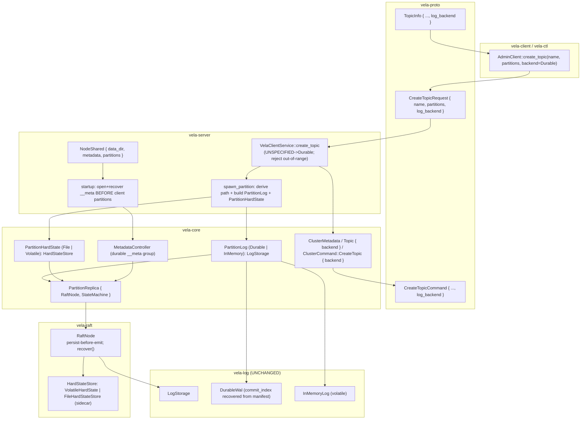

# Design Document

## Overview

This feature composes the already-merged durable WAL (`vela_log::DurableWal`)
into the running cluster and makes log durability a **per-topic,
client-selectable** property. It writes no new storage internals: the durable
WAL and `InMemoryLog` already implement `LogStorage`, and
`vela_raft::RaftNode<S: LogStorage>` already takes its log by injection. The
work is composition, configuration, and two consensus-safety additions —
durable Raft **hard state** (term + vote) and a **commit-index recovery
handoff** — that the log alone does not provide.

The change touches every layer but keeps each crate boundary intact and
inward-pointing (`server → core → raft → log`, per `structure.md`):

- **`vela-log`** — **unchanged.** No new format, no new trait method, no
  manifest change. (See *Key Decisions* for why hard state is *not* folded into
  the WAL manifest.)
- **`vela-raft`** — gains a dedicated hard-state seam. A new `HardStateStore`
  trait with a volatile no-op impl (`VolatileHardState`) and a durable,
  CRC'd/fsync'd sidecar impl (`FileHardStateStore`). `RaftNode` becomes generic
  over a *second* seam, `RaftNode<S: LogStorage, H: HardStateStore =
  VolatileHardState>`, persists term/vote through it **before** emitting any
  dependent message, and gains a recovering constructor that restores hard
  state and the commit index from the injected seams.
- **`vela-core`** — a new `PartitionLog` enum (`Durable | InMemory`) is the one
  concrete `LogStorage` injected into `PartitionReplica`, plus a parallel
  `PartitionHardState` enum (`File | Volatile`). `PartitionReplica` stops
  hardcoding `InMemoryLog`. The topic model and `ClusterCommand::CreateTopic`
  carry a `LogBackend`; path derivation and a durable, recovering metadata group
  live here.
- **`vela-proto`** — a proto3 `LogBackend` enum is added to
  `CreateTopicRequest`, `TopicInfo`, and `CreateTopicCommand`.
- **`vela-server`** — `Config` gains `data_dir` (`VELA_DATA_DIR`, fail-fast);
  `spawn_partition` reads the topic's backend, derives a per-partition path,
  constructs the matching `PartitionLog` + `PartitionHardState`, and injects
  them; the metadata group is opened/recovered durably **before** client
  partitions are spawned.
- **`vela-client` / `vela-ctl`** — `create_topic` takes an optional backend
  (default `Durable`), validates it, and `describe_topic` reports it.
- **Docker** — `docker-compose.yml` mounts a per-node named volume at the data
  directory and sets `VELA_DATA_DIR`.

### Goals

- Durability is chosen per topic at creation, flows client → RPC → replicated
  command → metadata, and is read back at spawn so every replica of a partition
  builds the same backend (R1–R5).
- A durable replica's committed records, term, and vote survive a process or
  container restart, and a full-cluster cold restart recovers the topic
  catalogue (R9–R11, R14, R16–R18).
- In-memory topics behave exactly as today; opting out of durability writes
  nothing to disk (R13).
- `vela-log` is untouched; the in-memory path stays volatile and identical to
  today.

### Non-Goals

- Changing the on-disk WAL format or `vela-log` internals (owned by the
  `durable-wal` spec).
- Follower catch-up / `InstallSnapshot`, and state-machine snapshotting for
  compacted partitions.
- Migrating or converting topics between backends; a backend is immutable after
  creation (A4 / R3.3).

## Key Decisions (and rejected alternatives)

These are the load-bearing decisions; the rest of the design follows from them.

### KD-1 — One injected log type is an `enum`, not a trait object

`PartitionLog` is a two-variant `enum` implementing `LogStorage` by
match-dispatch, not a `Box<dyn LogStorage>`. The backend set is closed (exactly
two — locked decision 2), so an enum models it exactly; it keeps
`RaftNode<PartitionLog>` a concrete, monomorphised type with zero-cost
(non-virtual) calls and frees `LogStorage` from having to stay object-safe.
*Rejected:* `Box<dyn LogStorage>` — adds an allocation and dynamic dispatch for
no benefit over a closed two-variant set, and would constrain future trait
evolution to object-safe signatures.

### KD-2 — Raft hard state lives behind a new `HardStateStore` seam, persisted to a dedicated sidecar file — `vela-log` is not touched

This is the hardest decision. Two mechanisms were considered:

- **(A) Fold hard state into the WAL manifest.** `DurableWal`'s manifest is
  already crash-atomic, double-buffered, CRC'd, and fsync'd, so it *could* carry
  `current_term`/`voted_for`. **Rejected** because the manifest and its slot
  codec are **internal** to `vela-log`'s `wal` module and are not exposed for
  arbitrary key/value; threading hard state through it means changing the WAL
  on-disk format (slot version bump, codec change) for a concern that is
  Raft's, not the log's. It also couples a consensus invariant to the log's
  storage format and forces a `LogStorage` API change to read/write it.

- **(B, chosen) A dedicated `HardStateStore` seam with a sidecar file.** Hard
  state is its own tiny, crash-safe file (`raft-hardstate`) inside the
  partition's data directory, written by a new seam **owned by `vela-raft`**.
  `vela-log` stays completely unchanged (no format change, no new trait method).
  Hard state — a consensus concern — stays in the consensus crate, decoupled
  from the WAL format. The seam is injected just like the log, so the
  deterministic simulation harness keeps working by injecting the volatile impl.

`RaftNode` is made **generic over a second seam** rather than receiving a
boxed store, mirroring how the log seam is already a generic parameter, and the
parameter **defaults to `VolatileHardState`** so every existing
`RaftNode<InMemoryLog>` reference (the entire `sim.rs` harness, all current
tests) compiles unchanged. *This requires touching `vela-raft`* — it is no
longer log-only — but the change is additive and backward-compatible: the
default type parameter and the volatile no-op preserve today's in-memory
behaviour byte-for-byte (R9.3, R13.1).

### KD-3 — Per-partition path uses an injective, reversible escape that provably cannot produce the reserved `__meta` component

`safe(topic)` escapes every byte outside `[A-Za-z0-9-]` (including `_`) as
`_` + two uppercase hex digits. It is uniquely decodable (injective), uses only
safe characters, is a pure function of the name (stable across restarts), and —
because an output `_` is *always* followed by a hex digit — can never contain
the substring `__`, so it can never equal the reserved `__meta` component
(R7.2–R7.4, R16.5). The metadata group uses the literal reserved component
`__meta`, a sibling of the client topic components under the data directory.
*Rejected:* a bare `t-<topic>` prefix or two-parent (`topics/` vs `__meta/`)
split — both work for disjointness but the prefix can push a max-length
(255-char) name past the 255-byte component limit, and the escape gives a
cleaner *literal* R16.5 guarantee (the encoder cannot emit `__meta`) without a
parent-directory split. The escape's own length edge is recorded as a residual
risk below.

## Architecture



### Data flow: create a durable topic, then survive a restart

1. **Create.** Client calls `create_topic(name, n, Durable)`. The backend
   travels on `CreateTopicRequest.log_backend`; the server maps an unspecified
   wire value to `Durable` (R2.2), validates it (R2.5), and records it through
   the replicated `CreateTopicCommand` so every node applying the committed
   command stores the same backend on its `Topic` (R3.2).
2. **Spawn.** For each partition it replicates, the node derives
   `<data_dir>/<safe(topic)>/<partition>/`, opens a `DurableWal` there with
   `SyncPolicy::Always`, opens a `FileHardStateStore` sidecar in the same
   directory, and injects both into a `PartitionReplica` (R5).
3. **Serve.** Records produced and committed are fsync'd before acknowledgement
   (WAL `Always`), and every term/vote change is fsync'd before the dependent
   Raft message is emitted (hard-state seam) (R9, R12, R14).
4. **Restart.** On startup the node opens the same paths; `DurableWal` recovers
   its committed extent and `commit_index`, `FileHardStateStore` reloads
   term/vote, `RaftNode::recover` restores both, and `PartitionReplica` re-applies
   the committed prefix to the `StateMachine` so records reappear at their
   original offsets (R10, R11, R14).

### Runtime model (unchanged seams)

- A node hosts **one independent Raft group per partition**, each driven by its
  own single-writer `PartitionDriver` task (`driver.rs`). The driver stays the
  sole writer of consensus state; that ownership model is unchanged.
- The metadata Raft group `__meta/0` is one more such group, hosted durably and
  bootstrapped first.
- Consensus depends only on the `LogStorage` and (new) `HardStateStore` seams.
  Both are injected, so the simulation harness drives consensus with the
  in-memory log and the volatile hard-state store exactly as today.

### Dependency direction

`vela-core` already depends on `vela-log` (`fleet.rs` names `InMemoryLog`,
`LogEntry`, `PayloadKind`) and on `vela-raft`. `PartitionLog` names `DurableWal`,
`WalConfig`, `SyncPolicy` — all re-exported from `vela-log`'s root — so **no new
crate edge is introduced**; the `vela-core → vela-log` edge already exists and
points inward, consistent with `structure.md`. The `HardStateStore` trait and
its two impls live in `vela-raft`; `FileHardStateStore` uses only `std::fs`, so
`vela-raft` gains no new dependency. `vela-core` re-exports `PartitionLog`,
`PartitionHardState`, `WalConfig`, and `SyncPolicy` so `vela-server` builds
configs without a direct `vela-server → vela-log` edge.

## Components and Interfaces

### 1. `HardStateStore` seam (`vela-raft`, new module `hard_state.rs`)

```rust
/// Raft persistent hard state required for safety (Requirement 9, 10).
#[derive(Debug, Clone, Copy, PartialEq, Eq, Default)]
pub struct HardState {
    /// Latest term the replica has seen.
    pub current_term: u64,
    /// Candidate voted for in `current_term`, if any (numeric raft id).
    pub voted_for: Option<NodeId>,
}

/// A persist/load failure from a durable hard-state store (Requirement 9.4).
#[derive(Debug, thiserror::Error)]
pub enum HardStateError {
    #[error("hard-state I/O failure during {op}: {source}")]
    Io { op: &'static str, source: std::io::Error },
    #[error("hard-state file is corrupt: {detail}")]
    Corrupt { detail: &'static str },
}

/// The durable-hard-state seam Raft persists term/vote through, mirroring how
/// `LogStorage` abstracts the log. Injected into `RaftNode` so consensus stays
/// deterministically testable (Requirement 9, 10).
pub trait HardStateStore {
    /// Persist `state`, returning only after it has reached stable storage.
    fn persist(&mut self, state: HardState) -> Result<(), HardStateError>;
    /// The hard state recovered at open, or `None` if none was ever persisted.
    fn load(&self) -> Result<Option<HardState>, HardStateError>;
}

/// Volatile no-op store: keeps hard state in memory only (Requirement 9.3).
/// The default `H` so every existing `RaftNode<InMemoryLog>` is unchanged.
#[derive(Debug, Default)]
pub struct VolatileHardState;

impl HardStateStore for VolatileHardState {
    fn persist(&mut self, _state: HardState) -> Result<(), HardStateError> { Ok(()) }
    fn load(&self) -> Result<Option<HardState>, HardStateError> { Ok(None) }
}

/// Durable sidecar store: a single small CRC'd file fsync'd via temp+rename.
#[derive(Debug)]
pub struct FileHardStateStore { path: PathBuf /* + cached loaded value */ }

impl FileHardStateStore {
    /// Open (or note-absent) the sidecar at `path`; loads any existing value.
    pub fn open(path: impl Into<PathBuf>) -> Result<Self, HardStateError> { /* ... */ }
}

impl HardStateStore for FileHardStateStore { /* persist: temp+fsync+rename+dir-fsync; load: read+verify CRC */ }
```

`FileHardStateStore` file layout is given under *Data Models*. `persist` writes a
new temp file, fsyncs it, atomically renames it over `raft-hardstate`, and fsyncs
the parent directory, so a crash never leaves a torn file and `persist` returns
only once the value is durable (R9.1, R9.2). `load` returns `None` for an absent
file (fresh partition) and a `Corrupt` error on a CRC mismatch (fail-stop rather
than silently forgetting a vote).

### 2. `RaftNode` second seam, persist-before-emit, and recovery (`vela-raft`)

`RaftNode` gains a second generic parameter defaulting to `VolatileHardState`:

```rust
pub struct RaftNode<S: LogStorage, H: HardStateStore = VolatileHardState> {
    current_term: u64,
    voted_for: Option<NodeId>,
    log: S,
    hard_state: H,            // new seam
    // ... volatile fields unchanged ...
}
```

Because `H` defaults to `VolatileHardState`, the type `RaftNode<InMemoryLog>`
still names `RaftNode<InMemoryLog, VolatileHardState>`, so `sim.rs`
(`Vec<RaftNode<InMemoryLog>>`, `RaftNode::new(id, peers, InMemoryLog::new())`)
and every current test compile unchanged.

Constructors:

```rust
impl<S: LogStorage> RaftNode<S, VolatileHardState> {
    /// Unchanged signature; volatile hard state, term 0, no vote.
    /// `commit_index`/`last_applied` initialise from the (empty) log.
    pub fn new(id: NodeId, peers: Vec<NodeId>, log: S) -> Self {
        Self::with_hard_state(id, peers, log, VolatileHardState)
    }
}

impl<S: LogStorage, H: HardStateStore> RaftNode<S, H> {
    /// Recover a replica from injected seams: restore `current_term`/`voted_for`
    /// from `hard_state.load()` and initialise `commit_index`/`last_applied`
    /// from `log.commit_index()`. For a volatile store + empty log this is the
    /// behaviour of `new` (term 0, no vote, no commit), so the fresh case and
    /// the restart case share one path (Requirement 10.1, 10.2, 11.1).
    pub fn with_hard_state(id: NodeId, peers: Vec<NodeId>, log: S, hard_state: H) -> Self {
        let hs = hard_state.load().unwrap_or_default().unwrap_or_default();
        let commit = log.commit_index();
        Self {
            current_term: hs.current_term,
            voted_for: hs.voted_for,
            commit_index: commit,
            last_applied: commit, // committed entries re-applied by the caller (R11.2)
            log, hard_state,
            role: Role::Follower, votes_granted: 0,
            next_index: HashMap::new(), match_index: HashMap::new(),
            replication_backoff: HashMap::new(), id, peers,
        }
    }
}
```

> A `load()` error at construction is treated as fail-stop by the caller
> (`spawn_partition` logs and leaves the partition unstarted, per R8) rather than
> silently defaulting; the `unwrap_or_default().unwrap_or_default()` shorthand
> above is illustrative — the real constructor returns `Result` so a corrupt
> sidecar does not erase a persisted term.

`step` persists **before** emitting at the three hard-state mutation points.
Because persisting is now real I/O, a failure is surfaced on `RaftOutput`:

```rust
#[derive(Debug, Clone, Default, PartialEq, Eq)]
pub struct RaftOutput {
    pub sends: Vec<(NodeId, RaftMessage)>,
    pub committed: Vec<LogEntry>,
    pub role_change: Option<Role>,
    /// Set when a hard-state persist failed this step. When present, the step
    /// made no externally visible term/vote transition and emitted no dependent
    /// message (Requirement 9.4). The driver logs it; the triggering peer
    /// retries. `None` for the volatile path, so existing output is unchanged.
    pub persist_error: Option<PersistError>,
}

#[derive(Debug, Clone, PartialEq, Eq)]
pub struct PersistError { pub op: &'static str } // "grant_vote" | "adopt_term" | "start_election"
```

Persist-before-emit at each point:

- **Grant a vote** (`handle_request_vote`): compute `grant`. If granting,
  `self.hard_state.persist(HardState { current_term: rv.term, voted_for:
  Some(rv.candidate_id) })` **first**. On `Ok`: set `current_term`/`voted_for`,
  re-arm the election timer, push the `vote_granted: true` reply. On `Err`: leave
  `current_term`/`voted_for` unchanged, push **no** grant, set
  `out.persist_error` (R9.1, R9.4).
- **Adopt a higher term** (`step_down`, reached from `handle_message` when
  `msg_term > current_term`): persist `HardState { current_term: msg_term,
  voted_for: None }` **first**. On `Ok`, adopt and continue handling the message.
  On `Err`, abort: do not adopt, emit nothing term-dependent, set
  `out.persist_error` (R9.2, R9.4).
- **Start an election** (`start_election`): the incremented term and self-vote
  are term-dependent (the broadcast `RequestVote` carries the new term). Persist
  `HardState { current_term: current_term + 1, voted_for: Some(self.id) }`
  **first**; on `Ok` mutate and broadcast; on `Err` stay a follower, broadcast
  nothing, set `out.persist_error`. The election timer re-arms so a later
  attempt retries once storage recovers (R9.2, R9.4).

For the volatile path every `persist` is `Ok(())`, so behaviour is identical to
today (R9.3, R13.1). The simulation harness keeps using `VolatileHardState`, so
elections remain deterministic.

### 3. `PartitionLog` — one injected log type (`vela-core/src/partition_log.rs`)

```rust
use vela_log::{
    CommitIndex, DurableWal, EntryPayload, InMemoryLog, LogEntry, LogError, LogStorage, Snapshot,
};

/// The single concrete `LogStorage` injected into a `PartitionReplica`. Holds
/// exactly one backend and dispatches every trait operation to it, returning
/// the backend's result unchanged (Requirement 4).
pub enum PartitionLog {
    Durable(DurableWal),     // DurableWal<RealFileSystem, RealClock> via defaults
    InMemory(InMemoryLog),
}

macro_rules! dispatch {
    ($self:ident, $m:ident $(, $a:expr)*) => {
        match $self { PartitionLog::Durable(w) => w.$m($($a),*), PartitionLog::InMemory(i) => i.$m($($a),*) }
    };
}

impl LogStorage for PartitionLog {
    fn append(&mut self, p: EntryPayload, t: u64) -> Result<u64, LogError> { dispatch!(self, append, p, t) }
    fn append_entries(&mut self, e: &[LogEntry]) -> Result<(), LogError> { dispatch!(self, append_entries, e) }
    fn read(&self, s: u64, e: u64) -> Vec<LogEntry> { dispatch!(self, read, s, e) }
    fn entry(&self, i: u64) -> Option<LogEntry> { dispatch!(self, entry, i) }
    fn last_index(&self) -> Option<u64> { dispatch!(self, last_index) }
    fn term_at(&self, i: u64) -> Option<u64> { dispatch!(self, term_at, i) }
    fn commit_index(&self) -> CommitIndex { dispatch!(self, commit_index) }
    fn commit(&mut self, i: u64) -> Result<(), LogError> { dispatch!(self, commit, i) }
    fn revert(&mut self, i: u64) -> Result<(), LogError> { dispatch!(self, revert, i) }
    fn snapshot(&self) -> Snapshot { dispatch!(self, snapshot) }
    fn flush(&mut self) -> Result<(), LogError> { dispatch!(self, flush) }
}
```

`vela-log` is unchanged, so `PartitionLog` implements exactly the existing
`LogStorage` surface (R4.1). It holds exactly one backend (R4.2) and returns the
held backend's result unchanged on every method (R4.3); the `InMemory` variant
therefore behaves observably identically to a bare `InMemoryLog` for any
operation sequence (R4.4, R13.1).

### 4. `PartitionHardState` — one injected hard-state store (`vela-core/src/partition_log.rs`)

A parallel enum mirrors `PartitionLog`, so `PartitionReplica` stays a concrete
(non-generic) type with no `dyn` and no allocation:

```rust
use vela_raft::{FileHardStateStore, HardState, HardStateError, HardStateStore, VolatileHardState};

/// The single concrete `HardStateStore` injected into a `PartitionReplica`.
pub enum PartitionHardState {
    File(FileHardStateStore),   // durable sidecar
    Volatile(VolatileHardState),
}

impl HardStateStore for PartitionHardState {
    fn persist(&mut self, s: HardState) -> Result<(), HardStateError> {
        match self { Self::File(f) => f.persist(s), Self::Volatile(v) => v.persist(s) }
    }
    fn load(&self) -> Result<Option<HardState>, HardStateError> {
        match self { Self::File(f) => f.load(), Self::Volatile(v) => v.load() }
    }
}
```

The orphan rule is satisfied: `PartitionHardState` is local to `vela-core`, which
can see the `HardStateStore` trait from `vela-raft`.

### 5. `PartitionReplica` injection + recovery (`vela-core/src/fleet.rs`)

`PartitionReplica` stops hardcoding `InMemoryLog`; its node becomes
`RaftNode<PartitionLog, PartitionHardState>`:

```rust
pub struct PartitionReplica {
    raft: RaftNode<PartitionLog, PartitionHardState>, // was RaftNode<InMemoryLog>
    state: StateMachine,
}

impl PartitionReplica {
    /// Build a replica over injected seams and reconcile the state machine with
    /// the recovered log. A fresh log (`commit_index() == None`) re-applies
    /// nothing, so this single path serves both the fresh-create and the
    /// restart cases (Requirement 5.2, 11).
    pub fn new(
        node_id: RaftNodeId,
        peers: Vec<RaftNodeId>,
        log: PartitionLog,
        hard_state: PartitionHardState,
    ) -> Result<Self, HardStateError> {
        let raft = RaftNode::with_hard_state(node_id, peers, log, hard_state); // (returns Result; see §2 note)
        let mut state = StateMachine::new();
        if let Some(commit) = raft.commit_index() {
            // `read` clamps to the retained range, so this is exactly the
            // committed prefix [0..=commit], applied once in ascending order.
            state.apply_committed(&raft.log().read(0, commit)); // R11.2, R11.3
        }
        Ok(Self { raft, state })
    }

    /// Test/back-compat shim: a fresh in-memory, volatile replica.
    pub fn in_memory(node_id: RaftNodeId, peers: Vec<RaftNodeId>) -> Self {
        Self::new(node_id, peers,
            PartitionLog::InMemory(InMemoryLog::new()),
            PartitionHardState::Volatile(VolatileHardState))
            .expect("volatile store never fails")
    }

    pub fn raft(&self) -> &RaftNode<PartitionLog, PartitionHardState> { &self.raft } // type updated
    // step/state_machine/role/high_water_mark/read unchanged.
}
```

The recovery handoff reuses the existing apply path in `fleet.rs`
(`StateMachine::apply_committed`, which assigns each `Record` entry its gap-free
0-based offset and skips `Noop`/`Cluster` entries), so a recovered partition
reports the same records at the same offsets it held before the restart
(R11.3, R14.1).

`RaftGroupFleet` gains injection-aware creation while keeping the
exactly-one-group-per-partition invariant; the existing
`create_group(key, node_id, peers)` is retained as a shim that injects
`InMemory` + `Volatile`:

```rust
impl RaftGroupFleet {
    pub fn create_group_with_log(
        &mut self, key: GroupKey, node_id: RaftNodeId, peers: Vec<RaftNodeId>,
        log: PartitionLog, hard_state: PartitionHardState,
    ) -> Result<(), FleetError> { /* reject duplicate key, else insert PartitionReplica::new(..)? */ }
}
```

### 6. Backend selection at spawn (`vela-server/src/node.rs`)

`NodeShared` gains `data_dir: PathBuf` (from `Config`). `spawn_partition` reads
the topic's backend and builds the matching seams. Its signature changes from
`-> bool` to `-> Result<bool, SpawnError>` so a durable-open failure propagates
to the caller without ever falling back to in-memory (R8):

```rust
pub(crate) fn spawn_partition(self: &Arc<Self>, topic: &str, partition: &Partition)
    -> Result<bool, SpawnError>
{
    if !partition.replicas.iter().any(|r| r.as_str() == self.self_id) { return Ok(false); }
    let key = (topic.to_string(), partition.index.0);
    let mut partitions = self.partitions.lock().expect("partitions mutex poisoned");
    if partitions.contains_key(&key) { return Ok(false); }
    // ... map peers, register addresses (unchanged) ...

    let backend = { /* read self.metadata topic backend; default Durable if absent */ };
    let (log, hard_state) = match backend {
        LogBackend::InMemory => (
            PartitionLog::InMemory(InMemoryLog::new()),               // R5.4
            PartitionHardState::Volatile(VolatileHardState),          // R9.3, R13.3 (no files)
        ),
        LogBackend::Durable => {
            let dir = partition_data_path(&self.data_dir, topic, partition.index.0); // R7
            let wal = DurableWal::open(WalConfig::new(&dir).with_sync_policy(SyncPolicy::Always)) // R12.1
                .map_err(|e| SpawnError::durable(topic, partition.index.0, e))?;       // R8.1, R8.2
            let hs = FileHardStateStore::open(dir.join("raft-hardstate"))
                .map_err(|e| SpawnError::hard_state(topic, partition.index.0, e))?;
            (PartitionLog::Durable(wal), PartitionHardState::File(hs))
        }
    };

    let replica = PartitionReplica::new(self_raft_id, peers, log, hard_state)
        .map_err(|e| SpawnError::hard_state(topic, partition.index.0, e))?; // R11/R8
    // ... build driver, insert into table, spawn (only on success) ...
    Ok(true)
}
```

`create_topic` / bootstrap call `spawn_partition` per partition and, on
`Err(SpawnError)`, log a structured error naming topic + partition and **continue
with the remaining partitions** — never starting an in-memory fallback (R8.1,
R8.2, R8.3):

```rust
for partition in &topic.partitions {
    if let Err(err) = self.node.spawn_partition(&name, partition) {
        tracing::error!(topic = %name, partition = err.partition, %err,
            "failed to start durable partition replica; leaving it unstarted");
        // continue: other partitions remain hosted (R8.3)
    }
}
```

### 7. Durable, recovering metadata group (`vela-server` + `vela-core`)

The metadata group `__meta/0` is always Durable at `<data_dir>/__meta/0/` with
`SyncPolicy::Always` and its own `FileHardStateStore` sidecar (R16.1, R16.2,
R16.6); it is never client-selectable. `MetadataController` gains a recovering
constructor, and node startup is reordered so the catalogue is rebuilt **before**
any client partition is spawned:

```rust
impl MetadataController {
    /// Open (or create) the durable __meta/0 group, restore its hard state and
    /// commit index, and rebuild ClusterMetadata by re-applying every committed
    /// ClusterCommand in the recovered log, in ascending order (R17, R18).
    pub fn recover_durable(node_id: RaftNodeId, peers: Vec<RaftNodeId>, data_dir: &Path)
        -> Result<Self, StartupError>
    {
        let dir = metadata_data_path(data_dir);                       // <data_dir>/__meta/0
        let wal = DurableWal::open(WalConfig::new(&dir).with_sync_policy(SyncPolicy::Always))?;
        let hs  = FileHardStateStore::open(dir.join("raft-hardstate"))?;
        let mut fleet = RaftGroupFleet::new();
        fleet.create_group_with_log(metadata_group_key(), node_id, peers,
            PartitionLog::Durable(wal), PartitionHardState::File(hs))?;
        // Rebuild the catalogue from committed Cluster entries (R17.4, R18.1).
        let mut metadata = ClusterMetadata::new();
        let replica = fleet.get(&metadata_group_key()).expect("just created");
        if let Some(commit) = replica.raft().commit_index() {
            for entry in replica.raft().log().read(0, commit) {
                if entry.payload.kind == PayloadKind::Cluster {
                    apply_command(&mut metadata, &decode_cluster_command(&entry.payload.bytes));
                }
            }
        }
        Ok(Self::from_parts(metadata, fleet))
    }
}
```

`NodeShared::new` becomes fallible (`Result<Arc<Self>, StartupError>`) and:

1. opens/recovers the `__meta` group durably (R16, R17, R18.1);
2. installs the recovered `ClusterMetadata` (catalogue incl. each topic's
   backend);
3. **then** iterates the recovered topics and `spawn_partition`s each local
   replica, so durable topics reopen their existing segments on their derived
   paths (R18.2, R18.3, R14).

Because the metadata group is just another `RaftNode<PartitionLog,
PartitionHardState>` with `Durable` + `File` seams, it gets identical
persist-before-emit (R17.1, R17.2), hard-state restore (R17.3), and commit-index
recovery (R17.4) as any durable client partition; the only difference is its
committed entries are `Cluster` commands folded into `ClusterMetadata` rather
than records fed to a record `StateMachine`.

> **Implementation note / residual risk.** The *currently running* server
> applies metadata directly to a `Mutex<ClusterMetadata>` in `NodeShared` and
> spawns partitions directly; `MetadataController` exists in `vela-core` but is
> not yet wired into the live `node.rs` path. Making the metadata group durable
> (R16–R18) therefore also requires routing the live catalogue through the
> `__meta` group's `MetadataController` at startup. This is in scope for the
> tasks phase and is flagged under *Residual Risks*.

### 8. Config (`vela-server/src/config.rs`)

`CliArgs` gains `data_dir`; `Config` gains `data_dir: PathBuf`; `from_cli` fails
fast when it is absent, reusing the existing `MissingRequired` mechanism that
already backs `node_id`/`listen_addr` (so the existing structured-log +
non-zero-exit path in `load_config`/`main` applies unchanged — R6.2):

```rust
#[arg(long, env = "VELA_DATA_DIR")]
pub data_dir: Option<String>,
// in from_cli:
let data_dir = require(args.data_dir.as_deref(), "data_dir")?; // R6.2 -> MissingRequired("data_dir")
```

A dedicated `MissingDataDirectory` variant was considered but rejected:
`MissingRequired` already names the field and matches the established pattern.
The validated `data_dir` is threaded onto `NodeShared` and is the root for every
durable partition on the node (R6.3). The check is unconditional, including for a
node that will only ever host in-memory topics (A1).

### 9. Proto + client + ctl

A proto3 `LogBackend` enum (see *Data Models*) is added to
`CreateTopicRequest`, `TopicInfo`, and `CreateTopicCommand`; `build.rs` needs no
change (it already compiles the single proto file). The client
`AdminClient::create_topic` keeps its current arity defaulting to `Durable`
(R1.2) and gains an explicit form:

```rust
impl AdminClient {
    /// Create a topic with the default Durable backend (R1.2).
    pub async fn create_topic(&self, name: &str, partitions: u32) -> Result<TopicInfo> {
        self.create_topic_with_backend(name, partitions, LogBackend::Durable).await
    }
    /// Create a topic with an explicit backend (R1.1, R1.3). `LogBackend` is a
    /// two-variant Rust enum, so an invalid value is unrepresentable — the
    /// client can only ever send Durable or InMemory on the wire.
    pub async fn create_topic_with_backend(&self, name: &str, partitions: u32, backend: LogBackend)
        -> Result<TopicInfo> { /* set request.log_backend; send */ }
}
```

`describe_topic` already returns `TopicInfo`; with the new field it now reports
the backend (R1.4, A3). `vela-ctl create` gains an optional
`--backend durable|in-memory` flag (default `durable`), rejecting any other
string before dispatch (R1.3).

## Data Models

### Proto: `LogBackend` (R2; proto3 enum conventions)

```protobuf
// A topic's selected log storage backend. Proto3 enums must define a zero
// value; it is the "unspecified" sentinel the server maps to Durable (R2.2).
enum LogBackend {
  LOG_BACKEND_UNSPECIFIED = 0; // wire default; server treats as Durable
  LOG_BACKEND_DURABLE     = 1; // vela_log::DurableWal
  LOG_BACKEND_IN_MEMORY   = 2; // vela_log::InMemoryLog
}

message CreateTopicRequest {
  string name = 1;
  uint32 partitions = 2;
  LogBackend log_backend = 3; // R1.1, R1.2, R2.1
}

message TopicInfo {
  string name = 1;
  uint32 partition_count = 2;
  repeated PartitionInfo partitions = 3;
  LogBackend log_backend = 4; // R2.4, A3 (describe reports backend)
}

message CreateTopicCommand {
  string name = 1;
  repeated PartitionInfo partitions = 2;
  LogBackend log_backend = 3; // R2.3 (replicated command carries the backend)
}
```

The enum is deliberately designed so **value 0 means "unspecified, treated as
Durable"**: an omitted field decodes to `LOG_BACKEND_UNSPECIFIED` and the server
maps it to `Durable` (R2.2). `prost` decodes an out-of-range integer as the raw
`i32`; the server validates via `LogBackend::try_from` and rejects anything
outside `{0,1,2}` with a `Validation` error, creating no topic (R2.5).

### Domain: `LogBackend` and `Topic.backend` (`vela-core/src/model.rs`)

```rust
/// A topic's log backend; exactly one of two values (locked decision 2).
#[derive(Debug, Clone, Copy, PartialEq, Eq, Default)]
pub enum LogBackend {
    #[default]
    Durable,   // backed by vela_log::DurableWal (the default — R1.2)
    InMemory,  // backed by vela_log::InMemoryLog
}

pub struct Topic {
    pub name: String,
    pub partitions: Vec<Partition>,
    pub state: TopicState,
    pub backend: LogBackend,   // R3.1: exactly one backend per topic
}

pub enum ClusterCommand {
    CreateTopic { name: String, partitions: Vec<Partition>, backend: LogBackend }, // R2.3, R3.2
    DeleteTopic { name: String },
    SetAvailability { node: NodeId, availability: NodeAvailability },
}
```

`ClusterMetadata::create_topic` takes a `backend: LogBackend` and stores it on
the `Topic`; `apply_command` for `CreateTopic` copies the command's backend onto
the inserted `Topic`, so every node applying the committed command records the
same backend (R3.2). No command mutates `backend` after insertion, so it is
immutable for the topic's lifetime (R3.3 / A4). The server↔core mapping for the
new field is added to `convert.rs` (`topic_to_proto`/`topic_from_proto`,
`create_topic_*`), with the wire↔domain backend mapping treating
`UNSPECIFIED → Durable`.

### On-disk layout

```
<data_dir>/                       # VELA_DATA_DIR (R6)
├── __meta/                       # reserved metadata-group component (R16.2, R16.3)
│   └── 0/                        # the single metadata partition
│       ├── *.wal                 # WAL segment files (vela-log; unchanged)
│       ├── wal.manifest          # WAL manifest (commit/extent; unchanged)
│       └── raft-hardstate        # hard-state sidecar (this feature)
└── <safe(topic)>/                # one dir per client topic (R7.1, R7.3)
    └── <partition>/              # 0, 1, 2, ... (R7.1)
        ├── *.wal
        ├── wal.manifest
        └── raft-hardstate
```

In-memory topics create **no** directory and write **no** files (R13.3).

### `FileHardStateStore` sidecar file layout (`raft-hardstate`)

A fixed-size, single-record, CRC-protected file written atomically (write temp →
fsync → rename over target → fsync parent dir):

| Field          | Type      | Notes                                            |
|----------------|-----------|--------------------------------------------------|
| `magic`        | `[u8; 4]` | `b"VRHS"` — Vela Raft Hard State                 |
| `version`      | `u8`      | format version (`1`)                             |
| `current_term` | `u64` LE  | Raft `current_term` (R9, R10)                    |
| `has_vote`     | `u8`      | `0` = no vote, `1` = `voted_for` present         |
| `voted_for`    | `u64` LE  | numeric raft node id; meaningful iff `has_vote`  |
| `crc32c`       | `u32` LE  | CRC over all preceding bytes (integrity check)   |

`load` returns `None` when the file is absent (fresh partition), the decoded
`HardState` when the CRC verifies, and `HardStateError::Corrupt` on a CRC
mismatch. Atomic rename guarantees a reader never observes a torn write, so the
restored `(current_term, voted_for)` always equals the last value `persist`
returned `Ok` for (R10.3).

## Key Algorithms

### A. Safe path-component derivation `safe(topic)` (R7.2, R7.3, R16.5)

```
safe(topic):
  out = ""
  for each byte b in topic.as_bytes():
      if b in [A-Za-z0-9-]:        # note: '_' is NOT passed through
          out.push(b as char)
      else:                        # includes '_' and any out-of-set byte
          out.push('_')            # escape introducer
          out.push_two_hex_upper(b)
  return out

partition_data_path(data_dir, topic, partition) = data_dir / safe(topic) / partition.to_string()
metadata_data_path(data_dir)                     = data_dir / "__meta" / "0"
```

Properties (each required clause proved):

- **Injective (R7.2).** The encoding is uniquely decodable: in the output every
  `_` introduces a fixed-width two-hex escape and every other character is a
  literal passthrough byte, so the decoder partitions the output unambiguously.
  Distinct topics therefore yield distinct components; combined with the decimal
  partition index as a separate component, distinct `(topic, partition)` pairs
  never resolve to the same `Partition_Data_Path`.
- **Safe (R7.3).** Output uses only `[A-Za-z0-9-_]`, a Safe_Path_Component, for
  any input byte.
- **Stable (R7.4).** `safe` is a pure, deterministic function of the topic name,
  so the same `(topic, partition)` always resolves to the same path and a durable
  partition reopens its existing segments after a restart.
- **Never `__meta` (R16.5).** In the output an `_` is always immediately
  followed by a hex digit `[0-9A-F]`, so the substring `__` can never occur. The
  reserved component `__meta` begins with `__`, so no topic can encode to it. The
  reserved literal `__meta` is itself a Safe_Path_Component (R16.3), and it never
  resolves to a client partition path because client components can never equal
  it (R16.4).

> **Residual risk — component length.** Valid topic names are pre-validated to
> `[A-Za-z0-9_-]` (`topic.rs::is_valid_topic_name`), so the only expansion is
> `_`→`_XX`. A pathological 255-char all-`_` name expands to 765 bytes, exceeding
> the 255-byte single-component limit on some filesystems. A documented fallback
> — hash the component to `h_<hex>` (which also never contains `__`) once it
> would exceed the limit — preserves every property above and can be added in the
> tasks phase; it is not implemented here.

### B. Wire backend → domain backend (R2.2, R2.5)

```
to_domain(log_backend_i32):
  match LogBackend::try_from(i32):
    Ok(UNSPECIFIED) | Ok(DURABLE) => Durable     # R2.2 (unspecified -> Durable)
    Ok(IN_MEMORY)                 => InMemory
    Err(_)                        => reject Validation, create nothing  # R2.5
```

## Error Handling

| Failure | Where | Handling | Requirement |
|---|---|---|---|
| `VELA_DATA_DIR` missing | `Config::from_cli` | `ConfigError::MissingRequired("data_dir")` → structured error log + non-zero exit | R6.2, A1 |
| Invalid `log_backend` on the wire | `create_topic` handler | `CoreError`→`VelaError{Validation}`; topic not created | R2.5 |
| Durable WAL open fails | `spawn_partition` | `SpawnError::Durable`; structured error (topic+partition); replica left unstarted; **never** in-memory fallback; other partitions continue | R8.1–R8.3 |
| Hard-state sidecar open/corrupt | `spawn_partition` / `recover_durable` | `SpawnError`/`StartupError`; replica/metadata-group left unstarted with structured error; never silently default a persisted vote | R8.2, R10 |
| Hard-state `persist` fails mid-step | `RaftNode::step` | dependent message **not** emitted; `RaftOutput.persist_error` set; driver logs; peer retries | R9.4 |
| WAL `append`/`commit` fails (`Always`) | `DurableWal` | propagates as `LogError` through `PartitionLog`; produce path surfaces it (no offset, commit not advanced) | R12, R14.3 |
| Metadata group durable open fails | node startup | `StartupError` → structured error + non-zero exit (catalogue cannot be recovered safely) | R16, R18 |

Durability is consensus-safe by construction: the WAL uses `SyncPolicy::Always`
(persist record before acknowledge) and the hard-state seam persists term/vote
before the dependent message is emitted, so an acknowledged committed record and
a granted vote are both durable before they are observable (R9, R12, R14).
`vela-server` configures only `Always` for consensus-backing logs and never
`Periodic`/`Never` (R12.2).

## Correctness Properties

*A property is a characteristic or behavior that should hold true across all
valid executions of a system — essentially, a formal statement about what the
system should do. Properties serve as the bridge between human-readable
specifications and machine-verifiable correctness guarantees.*

PBT (property-based testing) applies well here: most of the feature's risk lives
in pure, input-varying logic — match-dispatch equivalence, an injective path
encoder, hard-state persist/restore round-trips, and commit-index recovery —
where 100+ generated inputs find edge cases (long/odd topic names, arbitrary
term/vote sequences, interleaved record/noop/cluster entries) that a handful of
examples would miss. End-to-end durability across a real process/container
restart (R14, R15, R18) is verified by integration tests instead, since its
behaviour does not vary meaningfully with input and the cost of 100 iterations is
not justified. The properties below are the de-duplicated set from the prework.

### Property 1: Backend is recorded faithfully and deterministically

*For any* topic name, partition set, and `LogBackend` value, applying the
committed `CreateTopic` command records exactly that backend on the resulting
`Topic`, and applying the identical command to two independent `ClusterMetadata`
values yields equal `Topic.backend` — so every node that applies the command
records the same backend.

**Validates: Requirements 2.3, 3.1, 3.2**

### Property 2: `PartitionLog::InMemory` is observationally equal to `InMemoryLog`

*For any* sequence of `LogStorage` operations
(`append`/`append_entries`/`read`/`entry`/`last_index`/`term_at`/`commit_index`/
`commit`/`revert`/`snapshot`/`flush`), applying the sequence to a
`PartitionLog::InMemory` and to a bare `InMemoryLog` yields, for every operation,
an equal result and equal observable state.

**Validates: Requirements 4.3, 4.4, 13.1**

### Property 3: Backend selection constructs the matching backend for every replica

*For any* topic whose recorded backend is `B` and any set of replicas, the
backend selected when spawning each replica is `B` — `Durable` selects the
durable backend and `InMemory` selects the in-memory backend.

**Validates: Requirements 3.4, 5.1, 5.4**

### Property 4: Partition-path derivation is injective, safe, stable, and reserved-disjoint

*For any* topic name (arbitrary bytes) and partition index, `safe(topic)` uses
only Safe_Path_Component characters and never contains the substring `__` (so it
never equals the reserved `__meta`); the derived `Partition_Data_Path` lies
beneath the data directory; the same `(topic, partition)` always derives the
identical path; and any two distinct `(topic, partition)` pairs derive distinct
paths.

**Validates: Requirements 6.3, 7.1, 7.2, 7.3, 7.4, 16.4, 16.5**

### Property 5: Durable hard state is persisted before any dependent message is emitted

*For any* sequence of inputs driving a durable replica, every emitted vote grant
is preceded by a successful persist of that `(term, candidate)`, every emitted
term-dependent message carries a term no greater than the last successfully
persisted term, and whenever a persist fails the step emits no dependent message
and surfaces the failure (leaving in-memory term/vote unchanged).

**Validates: Requirements 9.1, 9.2, 9.4, 17.1, 17.2**

### Property 6: Hard state round-trips across restart and never regresses

*For any* sequence of term advances and vote grants applied to a durable replica,
restarting it on the same persisted hard state restores `current_term` and
`voted_for` equal to the values held immediately before the restart, and the
restored `current_term` is never lower than the highest term persisted before the
restart.

**Validates: Requirements 10.1, 10.2, 10.3, 10.5, 17.3**

### Property 7: A restarted replica never double-votes in a persisted term

*For any* durable replica that persisted a vote for candidate `A` in term `T`,
after a restart on that hard state the replica does not grant a vote to any
different candidate in term `T`.

**Validates: Requirements 10.4**

### Property 8: Commit-index recovery re-applies the committed prefix exactly once

*For any* durable log holding committed record entries, a restarted replica
initializes its `commit_index` from the recovered log and re-applies every
committed entry exactly once in ascending index order, so the recovered state
machine reports the same committed records at the same offsets it reported before
the restart and never a committed offset lower than before.

**Validates: Requirements 11.1, 11.2, 11.3, 14.3**

### Property 9: The metadata catalogue is rebuilt faithfully from its committed log

*For any* committed sequence of `ClusterCommand`s in the recovered metadata log,
`MetadataController::recover_durable` rebuilds a `ClusterMetadata` equal to
applying that sequence in order — so every recovered topic's backend equals the
backend recorded when it was created.

**Validates: Requirements 17.4, 18.3**

### Property 10: A topic's backend is immutable after creation

*For any* topic created with backend `B`, after any subsequent sequence of
cluster commands that does not delete-and-recreate it, the topic's recorded
backend is still `B`.

**Validates: Requirements 3.3**

## Testing Strategy

A dual approach: property tests for the universal logic above, example/edge unit
tests for concrete mappings and error paths, and integration tests for the
end-to-end durable-restart behaviour that property tests cannot cheaply cover.

### Property-based tests (proptest)

The workspace already uses `proptest` (see `crates/*/tests/prop_*.rs`). Each
property above is implemented as a **single** property test, configured for a
**minimum of 100 iterations**, and tagged with a comment in the form
`Feature: per-topic-log-durability, Property {n}: {text}`.

- **P2, P4, P10** — pure functions over generated inputs (op sequences, topic
  byte strings, command sequences); no I/O. Live in `vela-core`.
- **P1, P3, P9** — over generated `CreateTopic`/`ClusterCommand` sequences and
  backend values; `vela-core`.
- **P5, P6, P7, P8** — driven through `vela-raft` using injected seams:
  - A **recording/failing `HardStateStore`** test double (in-memory, records the
    persisted history and can be armed to fail) verifies persist-before-emit and
    the failure path (P5) deterministically, with no real fs.
  - The **simulation harness** (`sim.rs`) continues to use `VolatileHardState`
    for election/replication tests; for the restart properties (P6, P7, P8) the
    harness/tests construct a replica with an in-memory-but-recording hard-state
    store and an `InMemoryLog` pre-seeded to a committed state, then build a
    *second* replica via `RaftNode::recover`/`PartitionReplica::new` over the same
    persisted hard state and log snapshot, asserting the restored invariants.
    This keeps consensus tests deterministic and dependency-free.

### Unit tests (examples and edge cases)

- Client/ctl: default-Durable, explicit backend, `--backend` parse rejection
  (R1.1–R1.3); `describe` reports backend (R1.4).
- Wire mapping: `to_domain(UNSPECIFIED) == Durable` (R2.2), out-of-range integer
  rejected (R2.5), `CreateTopicRequest`/`TopicInfo`/`CreateTopicCommand`
  encode/decode round-trips carry the field (R2.1, R2.4).
- Config: `VELA_DATA_DIR` parsed (R6.1); missing → `MissingRequired("data_dir")`
  (R6.2).
- Spawn failure: forced durable-open error leaves the replica unstarted with a
  structured error and never an in-memory fallback, other partitions keep running
  (R8.1–R8.3).
- Sync policy: durable `WalConfig.sync_policy == Always`; never `Periodic`/`Never`
  for a consensus log (R12.1, R12.2).
- In-memory: spawn creates no directory/segment files (R13.3); volatile store
  writes nothing (R9.3).
- Metadata group: constructed `Durable` at `<data_dir>/__meta/0` with `Always`,
  `"__meta"` is a valid Safe_Path_Component (R16.1–R16.3, R16.6).
- `FileHardStateStore`: persist→load round-trip example; corrupt-CRC →
  `Corrupt`; absent file → `None`.

### Integration tests (real filesystem / process / container restart)

- **Single durable partition restart** (`vela-server`/`vela-log` integration,
  real `DurableWal` + sidecar in a `tempdir`): produce and commit records, drop
  and reopen the replica via the recovery path, assert each record returns at its
  original offset, the committed offset does not regress, and the partition
  serves new produce/consume (R14.1–R14.3).
- **Hard-state survives a real restart**: vote/advance term, reopen via
  `FileHardStateStore`, assert term/vote restored and a conflicting vote in the
  restored term is refused (R10, end-to-end confirmation of P6/P7).
- **Full-cluster cold restart** (extends `tests/cluster_smoke.rs`): bring up the
  multi-node cluster with `VELA_DATA_DIR` set to per-node temp dirs, create a
  durable and an in-memory topic, produce/commit, stop all nodes, restart with the
  same data dirs, and assert the durable topic and its backend are recovered, its
  partitions reopen on existing segments and return prior records, while the
  in-memory topic starts empty (R18.1–R18.3, R11.4, R13.2).
- **Docker volume wiring** (`tests/cluster_artifacts.rs`-style static checks +
  optional compose smoke): assert each service sets `VELA_DATA_DIR` and mounts a
  per-node named volume at it (R15.1, R15.2); the compose restart path confirms
  recovery from a reattached volume (R15.3).

## Requirements Traceability

| Req | Design element(s) | Verification |
|---|---|---|
| 1.1 | `AdminClient::create_topic_with_backend` sets `log_backend` (§9) | Unit (example) |
| 1.2 | `AdminClient::create_topic` defaults `Durable` (§9) | Unit (example) |
| 1.3 | `LogBackend` 2-variant enum; ctl `--backend` parse (§9) | Unit (example/edge) |
| 1.4 | `describe_topic` returns `TopicInfo.log_backend` (§9; Data Models) | Unit (example) |
| 2.1 | `CreateTopicRequest.log_backend` (Data Models) | Unit round-trip |
| 2.2 | `to_domain(UNSPECIFIED)→Durable` (Algorithm B) | Unit (example) |
| 2.3 | `ClusterCommand::CreateTopic{backend}`; `apply_command` (§7, Data Models) | **Property 1** |
| 2.4 | `TopicInfo.log_backend` (Data Models) | Unit round-trip |
| 2.5 | `to_domain` rejects out-of-range (Algorithm B) | Unit (edge) |
| 3.1 | `Topic.backend` single field (Data Models) | **Property 1** / unit |
| 3.2 | `apply_command` copies backend deterministically (§7) | **Property 1** |
| 3.3 | No command mutates `backend` (Data Models) | **Property 10** |
| 3.4 | Backend selection at spawn (§6) | **Property 3** |
| 4.1 | `impl LogStorage for PartitionLog` (§3) | Unit (compiles) |
| 4.2 | `PartitionLog` 2-variant enum (§3) | Unit (example) |
| 4.3 | match-dispatch returns backend result (§3) | **Property 2** |
| 4.4 | `PartitionLog::InMemory` ≡ `InMemoryLog` (§3) | **Property 2** |
| 5.1 | `spawn_partition` builds metadata-named backend (§6) | **Property 3** |
| 5.2 | `PartitionReplica::new(.., log, hard_state)` injection (§5) | Unit (example) |
| 5.3 | `WalConfig::new(partition_data_path)` (§6, Algorithm A) | Unit (example) |
| 5.4 | `InMemory` arm of selection (§6) | **Property 3** |
| 6.1 | `CliArgs.data_dir` / `Config.data_dir` (§8) | Unit (example) |
| 6.2 | `MissingRequired("data_dir")` fail-fast (§8) | Unit (example) |
| 6.3 | derivation beneath `data_dir` (§6, Algorithm A) | **Property 4** |
| 7.1 | `partition_data_path` (Algorithm A) | **Property 4** |
| 7.2 | injective `safe()` (Algorithm A) | **Property 4** |
| 7.3 | safe charset output (Algorithm A) | **Property 4** |
| 7.4 | pure/deterministic `safe()` (Algorithm A) | **Property 4** |
| 8.1 | durable-open error → no in-memory fallback (§6, Error Handling) | Unit (example) |
| 8.2 | `SpawnError`, structured error, unstarted (§6) | Unit (example) |
| 8.3 | loop continues on per-partition failure (§6) | Unit (example) |
| 9.1 | persist-before-grant in `handle_request_vote` (§2) | **Property 5** |
| 9.2 | persist-before-emit on term adopt/election (§2) | **Property 5** |
| 9.3 | `VolatileHardState` no-op (§1) | Unit (example) |
| 9.4 | `RaftOutput.persist_error`, no emit (§2) | **Property 5** |
| 10.1 | `RaftNode::with_hard_state` restores term (§2) | **Property 6** |
| 10.2 | restores vote (§2) | **Property 6** |
| 10.3 | restore round-trip (§1 sidecar, §2) | **Property 6** |
| 10.4 | restored vote refuses second candidate (§2) | **Property 7** |
| 10.5 | term monotonic across restart (§2) | **Property 6** |
| 11.1 | `commit_index = log.commit_index()` (§2) | **Property 8** |
| 11.2 | `apply_committed([0..=commit])` once (§5) | **Property 8** |
| 11.3 | recovered SM offsets equal (§5) | **Property 8** + integration |
| 11.4 | in-memory restart empty (§5/§6) | Unit + integration |
| 12.1 | `WalConfig::with_sync_policy(Always)` (§6) | Unit (example) |
| 12.2 | only `Always` for consensus (§6, Error Handling) | Unit (example) |
| 13.1 | `PartitionLog::InMemory` unchanged behaviour (§3) | **Property 2** |
| 13.2 | volatile restart empty (§5/§6) | Integration |
| 13.3 | in-memory writes no files (§6) | Unit (example) |
| 14.1 | durable recovery path (§5, §6) | Integration |
| 14.2 | resume serving after recovery (§6) | Integration |
| 14.3 | committed offset never regresses (§5) | **Property 8** + integration |
| 15.1 | compose sets `VELA_DATA_DIR` (§Overview, Docker) | Unit (artifact) |
| 15.2 | compose per-node named volume (Docker) | Unit (artifact) |
| 15.3 | restart with volume recovers (Docker) | Integration |
| 16.1 | metadata group `Durable`, not selectable (§7) | Unit (example) |
| 16.2 | `metadata_data_path = <data_dir>/__meta/0` (Algorithm A) | Unit (example) |
| 16.3 | `"__meta"` is Safe_Path_Component (Algorithm A) | Unit (example) |
| 16.4 | metadata path disjoint from client paths (Algorithm A) | **Property 4** |
| 16.5 | `safe()` never `__meta` (Algorithm A) | **Property 4** |
| 16.6 | metadata `Always` sync (§7) | Unit (example) |
| 17.1 | metadata group persist-before-emit (§7 reuses §2) | **Property 5** |
| 17.2 | metadata term persist-before-emit (§7 reuses §2) | **Property 5** |
| 17.3 | metadata hard-state restore (§7 reuses §2) | **Property 6** |
| 17.4 | catalogue rebuilt from committed log (§7) | **Property 9** |
| 18.1 | cold restart recovers metadata (§7) | Integration (logic: **Property 9**) |
| 18.2 | durable topics reopen existing segments (§7, Algorithm A) | Integration |
| 18.3 | recovered backend equals created (§7) | **Property 9** |

## Residual Risks (for the tasks phase)

1. **Metadata path is not yet wired through `MetadataController`.** The live
   server applies metadata to a `Mutex<ClusterMetadata>` and spawns partitions
   directly; `MetadataController` exists but is unused by `node.rs`. R16–R18
   require routing the catalogue through the durable `__meta` group at startup,
   which is a larger wiring change than the per-partition work. Sequence this
   first in tasks so durable client partitions can rely on a recovered catalogue.
2. **`RaftNode` second generic parameter ripples.** Adding `H: HardStateStore =
   VolatileHardState` is source-compatible for `RaftNode<InMemoryLog>` users, but
   any code that names the full type (e.g. `fleet.rs`, `driver.rs` via
   `PartitionReplica::raft()`) must update to `RaftNode<PartitionLog,
   PartitionHardState>`. Verify `cargo build` across the workspace after the raft
   change before touching core/server.
3. **`step` persist-before-emit must be exhaustive.** Every term/vote mutation
   point (grant, term-adoption step-down, election start) must persist first; a
   missed point is a silent safety hole. The persist-before-emit property (P5)
   must exercise all three, and a mutation-test pass (`cargo mutants`) should
   confirm the ordering assertions catch reordering.
4. **`safe(topic)` component length.** A pathological 255-char all-`_` name
   exceeds the 255-byte filesystem component limit. The hash-fallback is
   specified but not implemented; decide in tasks whether to implement it now or
   accept the bound (current topic-name validation permits such names).
5. **`spawn_partition` return-type change** (`bool` → `Result<bool, SpawnError>`)
   touches every caller (`create_topic`, bootstrap, existing tests). Keep the
   change mechanical and update the `node.rs` unit tests in the same step.
6. **`FileHardStateStore` placement vs `vela-log` CRC reuse.** The sidecar uses
   `std::fs` + a small CRC in `vela-raft` to keep `vela-log` unchanged; if a
   future refactor wants to share `vela-log`'s CRC32C, that would re-introduce a
   coupling this design deliberately avoids.
