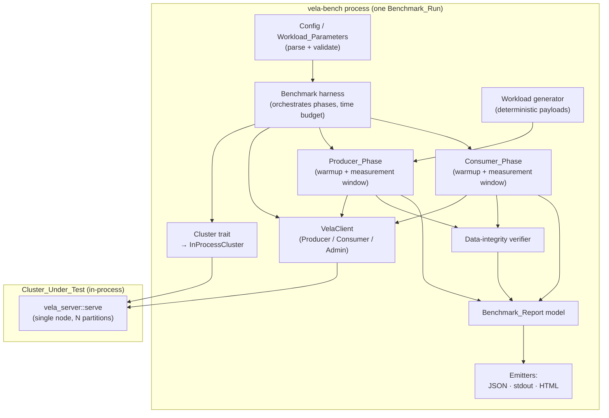
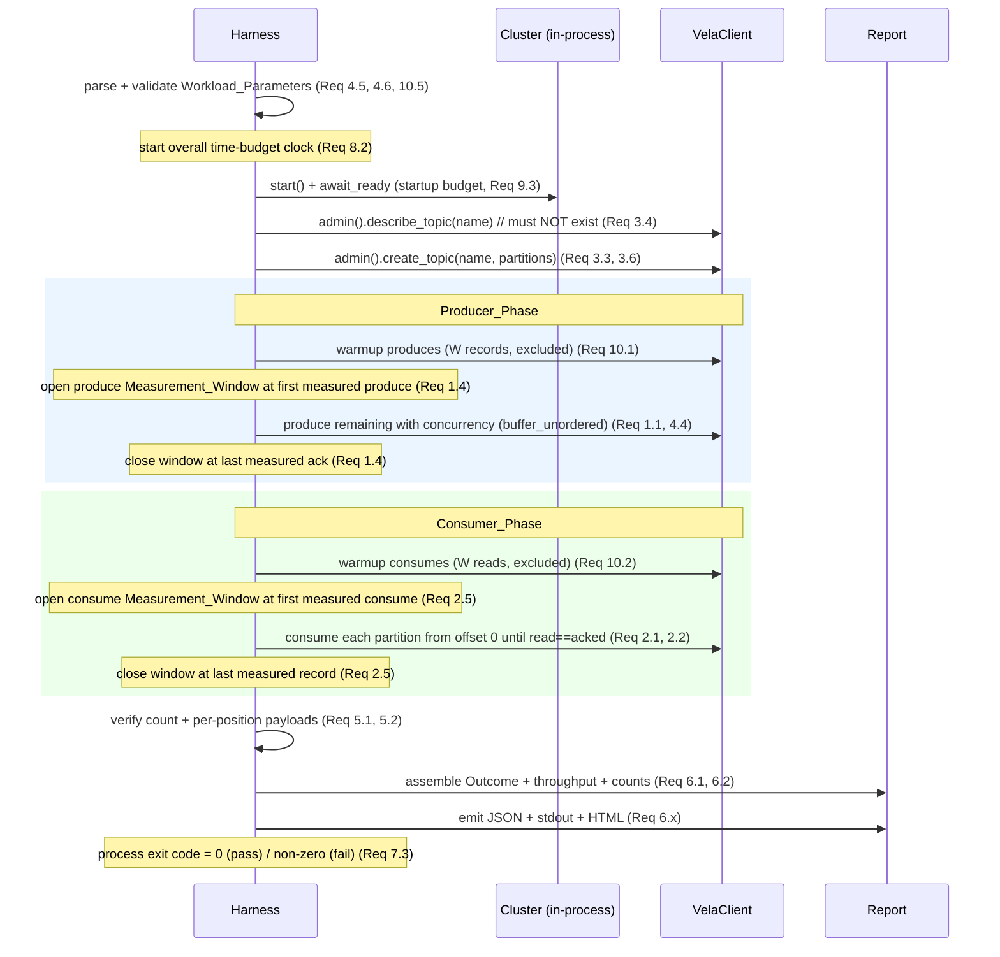
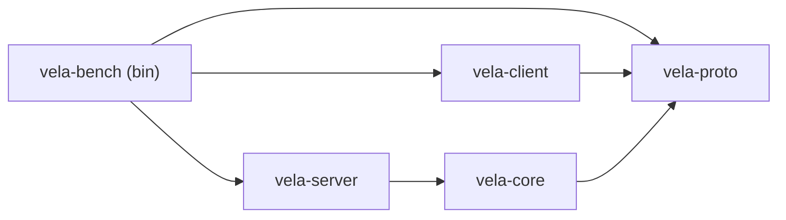

# Design Document

## Overview

The Throughput_Benchmark measures Vela's end-to-end produce and consume
throughput by driving the **public `vela-client` `Producer` and `Consumer`
APIs** against a running Cluster_Under_Test, verifying that every produced
record is read back, and emitting three coordinated outputs for one
Benchmark_Run: a machine-readable **Benchmark_Report** (JSON), a human-readable
**stdout summary**, and a self-contained **HTML_Report**. It is wired into the
existing CI workflow as its own job that fails the build on a benchmark error
(or a configured throughput floor) and uploads the structured report and the
HTML report as artifacts.

This design resolves the two implementation decisions that the requirements
deliberately deferred (see [Key Design Decisions](#key-design-decisions)):

1. **Implementation vehicle** — a dedicated `vela-bench` workspace crate that
   builds a controllable binary, *not* `cargo bench`/Criterion and *not* a
   `vela-ctl` subcommand.
2. **Cluster_Under_Test topology** — an **in-process single-node, multi-partition**
   Vela cluster started inside the benchmark process via `vela_server::serve`,
   with readiness detected by polling the cluster through the client.

The benchmark is grounded entirely in the client surface that already exists:

- `VelaClient::new([(node_id, addr)])` — bootstrap (no network I/O until first use).
- `client.admin().create_topic(name, partitions, LogBackend)` → `TopicInfo`.
- `client.admin().describe_topic(name)` → `TopicInfo` (carries `partition_count`),
  used to detect a pre-existing topic and to enumerate partitions.
- `client.producer().produce(topic, Option<&[u8]> key, value)` → committed `offset: u64`.
- `client.consumer().consume(topic, partition, offset, Option<u32> max)` →
  `ConsumeOutcome { records: Vec<ConsumedRecord>, next_offset: u64 }`.

The client already owns leader routing, `NotLeader` redirection, transport-failure
re-resolution, and a bounded retry budget. The benchmark therefore treats a
`Result::Err` returned from `produce`/`consume` as an **unresolved** operation
error (Requirement 3.7, 9.1, 9.2): the client's own retry path has already been
exhausted before the error surfaces.

### Key Design Decisions

#### Decision 1: A dedicated `vela-bench` crate and binary (not Criterion, not a `vela-ctl` subcommand)

**Recommendation: add a top-level `crates/vela-bench` crate producing a
`vela-bench` binary.**

| Option | Fit | Why / why not |
| --- | --- | --- |
| **Dedicated `vela-bench` crate + binary** (recommended) | Strong | Full control over Workload_Parameters, warmup/measurement windows, deterministic payloads, structured + HTML report emission, and a **non-zero process exit** on a failing Outcome — which is exactly what CI Requirement 7.3/7.5 needs. Mirrors the existing `vela-ctl` pattern (thin `main.rs` over a testable library crate). |
| `cargo bench` / Criterion | Poor | Criterion is built for low-variance micro/statistical benchmarking with its own harness, sampling model, and HTML output that we do not control. Requirements explicitly **reject** precise statistical gating on noisy CI runners (Introduction, Non-goals) and instead want a single controllable run that emits a specific report schema, verifies data integrity, enforces a time budget, and exits non-zero on error. Criterion's sampling fights all of these, and its report schema is not ours to shape. |
| `vela-ctl` subcommand | Weak | `vela-ctl` is an *operator* tool whose commands are interactive/continuous (produce REPL, continuous consume loop). A benchmark is a batch measurement job with a different lifecycle (stand up a cluster, run phases, emit reports, exit). Folding it into `vela-ctl` couples an operator CLI to a server dependency and a reporting subsystem it otherwise does not need. |

**Tradeoff accepted:** we forgo Criterion's statistical rigor (confidence
intervals, outlier classification). That is intentional and aligned with the
requirements: the CI benchmark is a *continuously exercised, regression-detecting
measurement that always runs and always reports*, gated only by errors,
data-integrity, the time budget, and an optional conservative floor — not by
run-to-run variance.

#### Decision 2: An in-process, single-node, multi-partition Cluster_Under_Test

**Recommendation: start the Cluster_Under_Test in-process via
`vela_server::serve`, single node, with the topic's partition count providing
parallelism across partitions.**

The server library already exposes the exact seam we need:
`vela_server::serve(Config)` binds the gRPC listener *before* signalling
readiness, and `Config::from_cli(CliArgs { .. })` builds a validated single-node
config (a node with an empty peer list and `replication_factor = 1`). The
integration tests (`cross_node_produce_consume.rs`) already demonstrate the full
pattern: pick a free localhost port, `tokio::spawn(serve(config))`, then poll
until the client connects.

| Option | Fit | Why / why not |
| --- | --- | --- |
| **In-process single node** (recommended) | Strong | Lowest startup latency and friction inside a single CI host (Non-goal: multi-machine load gen). Readiness is directly observable through the client. Per-partition Raft groups still give intra-node parallelism, exercising the real produce/consume request path (Requirement 3.1, 3.2). `replication_factor = 1` keeps a single-node partition able to elect itself leader and commit. |
| In-process local multi-node | Moderate | Exercises cross-node replication and `NotLeader` redirects, but adds election/convergence latency that eats into the ≤300 s CI budget (Requirement 8.1) and adds startup-race complexity. Out of proportion for a throughput signal on a noisy shared runner. |
| External/child-process cluster (`velad`) | Moderate | Avoids a `vela-server` dependency, but requires process orchestration, port wiring, and log-scraping for readiness. More moving parts for no measurement benefit on one host. |

**Topology abstraction.** The cluster is reached only through a `Cluster` trait
(see [Components](#components-and-interfaces)) exposing bootstrap addresses, a
readiness check, and shutdown. `InProcessCluster` is the concrete implementation;
the trait seam keeps the harness logic testable against a fake cluster and leaves
room to plug in a multi-node or external cluster later without touching the phase
logic. The benchmark connects to the cluster's bootstrap address(es) with a
`VelaClient`, exactly as a real client would.

**Readiness detection (Requirement 8.2, 9.3).** After spawning `serve`, the
harness polls readiness by attempting a lightweight client call against the
bootstrap node (`admin().describe_cluster()` / a connection attempt) on a fixed
interval until it succeeds or the **startup time budget** (default 60 s, range
1–600 s) elapses. Cluster startup and topic-creation time are included in the
overall time budget (Requirement 8.2) but **excluded** from both Measurement_Windows
(Requirement 10.3).

## Architecture

The benchmark is a single async (tokio) process that owns the Cluster_Under_Test
for the duration of one Benchmark_Run and drives it through the client.



### Benchmark_Run lifecycle



### Crate placement in the workspace

`vela-bench` is a **leaf application crate**: nothing depends on it. It is added
to `[workspace].members` alongside `vela-ctl`. It depends on `vela-client` (the
measured surface), `vela-proto` (record types), and `vela-server` (to start the
in-process Cluster_Under_Test). Because no core crate depends on `vela-bench`,
its dependency on both the client and the server does not violate the
inward-pointing dependency rule for the core graph — it sits *above* everything,
like a test/operator harness.



The crate follows the established `vela-ctl` split: a thin `main.rs` (parse args,
run, map Outcome to `ExitCode`) over a testable library (`lib.rs` + focused
modules), so the pure logic is reachable from `tests/` for property-based tests.

### Module layout (`crates/vela-bench/src`)

| Module | Responsibility |
| --- | --- |
| `main.rs` | Thin entry point: parse CLI, run a Benchmark_Run, map Outcome → `ExitCode` (Req 7.3). |
| `lib.rs` | Re-exports; crate docs. |
| `params.rs` | `WorkloadParameters`, defaults, range validation (Req 4.1, 4.2, 4.5, 4.6, 10.5). |
| `cli.rs` | `clap` argument model + CI flag surface; maps to `WorkloadParameters`. |
| `workload.rs` | Deterministic payload generation + key assignment (Req 4.3, 5.6). |
| `cluster.rs` | `Cluster` trait + `InProcessCluster` (start/ready/shutdown) (Req 3.2, 9.3). |
| `produce_phase.rs` | Producer_Phase: warmup, concurrency, measurement window (Req 1.x, 4.4, 10.1). |
| `consume_phase.rs` | Consumer_Phase: per-partition reads, warmup, window (Req 2.x, 10.2). |
| `verify.rs` | Count + per-position payload integrity verification (Req 5.1–5.5). |
| `metrics.rs` | Throughput math + Measurement_Window arithmetic (Req 1.3, 1.5, 2.4). |
| `report.rs` | `BenchmarkReport` model + JSON serialization + stdout summary (Req 6.1–6.5). |
| `html.rs` | Self-contained HTML_Report rendering (Req 6.6–6.8). |
| `outcome.rs` | Outcome determination: errors, integrity, time budget, floor (Req 5.3, 8.3, 11.x). |
| `run.rs` | The harness that sequences the above and owns the time budget (Req 8.2, 8.3). |

## Components and Interfaces

### Workload generation (`workload.rs`)

Payloads are a **deterministic function of the Workload_Parameters and the
record's 0-based position** (Requirement 5.6), so two runs with identical
parameters produce byte-identical payloads, and a consumer can recompute the
expected payload for any position without storing it.

```rust
/// Deterministic value payload for the record at 0-based `position`.
///
/// The first `min(8, value_size)` bytes encode `position` as little-endian
/// `u64`; the remaining bytes are a deterministic byte pattern derived from
/// `position` (e.g. a counter/hash fill). For `value_size == 0` the payload is
/// empty. Pure: depends only on `(position, value_size)`.
pub fn payload_for(position: u64, value_size: usize) -> Vec<u8>;

/// Recover the position encoded in a payload, when `value_size >= 8`.
/// Returns `None` for payloads too small to carry an embedded position.
pub fn position_of(value: &[u8], value_size: usize) -> Option<u64>;

/// The key for the record at `position` under the configured key mode.
/// Keyed → `Some(deterministic key bytes)`; Keyless → `None` (Req 4.3).
pub fn key_for(position: u64, mode: KeyMode) -> Option<Vec<u8>>;
```

Embedding the position in the payload prefix lets the verifier map any consumed
record back to its produce position regardless of which partition/offset it
landed at. When `value_size < 8` the position cannot be embedded; the verifier
falls back to a multiset/count comparison against the known expected payload set
(see `verify.rs`).

### Cluster seam (`cluster.rs`)

```rust
/// The Cluster_Under_Test the benchmark drives, behind a trait so the harness
/// is testable and the topology is swappable (Req 3.2).
#[async_trait]
pub trait Cluster {
    /// Bootstrap `(node_id, address)` pairs to seed a `VelaClient`.
    fn bootstrap(&self) -> Vec<(String, String)>;
    /// Resolve when the cluster can serve requests, or error on the startup
    /// budget elapsing (Req 9.3).
    async fn await_ready(&self, budget: Duration) -> Result<(), BenchError>;
    /// Tear the cluster down at end of run.
    async fn shutdown(self) -> Result<(), BenchError>;
}

/// In-process single node started via `vela_server::serve` on a tokio task,
/// bound to an ephemeral localhost port (Decision 2).
pub struct InProcessCluster { /* join handle, addr, node_id */ }
```

`await_ready` polls a cheap client call (connection / `describe_cluster`) on a
fixed interval until success or `budget` elapses.

### Producer_Phase (`produce_phase.rs`)

- Issue exactly `warmup` produce operations first; these complete before the
  Measurement_Window opens (Requirement 10.1). A warmup failure aborts the phase
  without opening the window (Requirement 10.6).
- Open the window timestamp at the **first measured produce invocation**
  (Requirement 1.4); issue the remaining `record_count - warmup` records keeping
  **up to `producer_concurrency` requests in flight** via
  `futures::stream::iter(..).map(|i| produce(payload_for(i,..), key_for(i,..))).buffer_unordered(concurrency)`
  (Requirement 4.4).
- A produce is counted only after it returns `Ok(offset)` — i.e. becomes an
  Acknowledged_Record — and only for measured (non-warmup) records (Requirement 1.2).
- Close the window at the **acknowledgment of the last measured record**
  (Requirement 1.4). Record `acked_count` and `acked_value_bytes`.
- Any `Err` from `produce` stops further produces and aborts the run with a
  failing Outcome carrying the operation type, topic, partition, and cause
  (Requirement 3.7, 9.1).

### Consumer_Phase (`consume_phase.rs`)

- Enumerate the target topic's partitions from `describe_topic(...).partition_count`.
- For each partition, consume from **offset 0** (Requirement 2.1), advancing by
  the returned `next_offset`, until the **total records read across all
  partitions equals `acked_count`** (Requirement 2.2).
- Apply the consume `warmup` (first `warmup` reads excluded); open the window at
  the first measured consume invocation and close at the last measured record
  (Requirement 2.5, 10.2).
- Each consumed record's value is handed to the verifier; reads are counted
  toward Consume_Throughput only after delivery and after warmup completes
  (Requirement 2.3).
- An `Err` from `consume` stops further consumes and aborts with a failing
  Outcome (Requirement 9.2). The per-run **time budget** bounds the wait for
  reads to reach `acked_count` (Requirement 5.4): if it elapses first, fail and
  retain the counts.

### Metrics (`metrics.rs`)

```rust
/// Records/sec and bytes/sec over a window, or a typed error if the window
/// duration is zero (Req 1.5) — never an undefined/NaN value.
pub fn throughput(records: u64, bytes: u64, window: Duration)
    -> Result<Throughput, ZeroWindow>;
```

### Report + emitters (`report.rs`, `html.rs`)

`BenchmarkReport` (see [Data Models](#data-models)) is the single source of truth;
all three outputs render from it (Requirement 6.1):

- **JSON** — `serde_json` to a file (CI artifact) and/or stdout. Every reported
  value is a separately named field (Requirement 6.2); absent phase figures
  serialize as `null`/absent, never as `0` (Requirement 6.5).
- **stdout summary** — human-readable lines stating Produce_Throughput and
  Consume_Throughput in both records/s and bytes/s, or an explicit
  `not measured` for any unavailable figure; the failure reason is printed on a
  failing Outcome (Requirement 6.3, 6.4).
- **HTML_Report** — a **self-contained** HTML document with **no external
  assets** (inline `<style>`, no CDN/JS fetches), rendered from a static template
  with the report values substituted. It shows Workload_Parameters, Outcome,
  both throughputs (records/s and bytes/s), Acknowledged_Record count, total
  payload bytes, total elapsed time, and — on failure — the failure reason; a
  phase that did not complete renders an explicit `not measured` indication
  (Requirement 6.6, 6.7, 6.8). Values are HTML-escaped on substitution.

### CLI / CI surface (`cli.rs`)

`clap` exposes every Workload_Parameter plus output paths
(`--report-json <path>`, `--report-html <path>`), the time budget, the startup
budget, and optional `--floor-produce-rps` / `--floor-consume-rps`. The
CI-designated parameters are passed by the workflow (see
[CI wiring](#ci-wiring-githubworkflowsciyml)).

## Data Models

```rust
/// Validated inputs to one Benchmark_Run (Req 4.1).
pub struct WorkloadParameters {
    pub record_count: u64,        // 1 ..= 1_000_000_000
    pub value_size: usize,        // 0 ..= 10_485_760 (bytes)
    pub key_mode: KeyMode,        // Keyed | Keyless
    pub partition_count: u32,     // 1 ..= 10_000
    pub producer_concurrency: u32,// 1 ..= 10_000
    pub topic: String,            // 1 ..= 255 chars
    pub warmup: u64,              // 0 ..= record_count - 1
    pub time_budget: Duration,    // 1 ..= 86_400 s (default 60 s)
    pub startup_budget: Duration, // 1 ..= 600 s (default 60 s)
    pub floor_produce_rps: Option<f64>, // optional throughput floor
    pub floor_consume_rps: Option<f64>,
}

pub enum KeyMode { Keyed, Keyless }

/// Throughput pair for one phase.
pub struct Throughput { pub records_per_sec: f64, pub bytes_per_sec: f64 }

/// pass/fail result of a Benchmark_Run.
pub enum Outcome { Passed, Failed { reason: FailureReason } }

/// Typed, named failure reasons → surfaced as a report field + stdout + HTML.
pub enum FailureReason {
    TopicAlreadyExists { topic: String },
    InvalidParameter { name: String, detail: String },
    TopicCreationFailed { topic: String, cause: String },
    ClusterNotReady { budget_secs: u64 },
    ProduceError { topic: String, partition: u32, cause: String },
    ConsumeError { topic: String, partition: u32, cause: String },
    WarmupFailed { phase: Phase, cause: String },
    ZeroMeasurementWindow { phase: Phase },
    TimeBudgetExceeded { budget_secs: u64, read: u64, expected: u64 },
    IntegrityCountMismatch { read: u64, expected: u64 },
    IntegrityPayloadMismatch { position: u64 },
    FloorBreachProduce { measured_rps: f64, floor_rps: f64 },
    FloorBreachConsume { measured_rps: f64, floor_rps: f64 },
}

pub enum Phase { Produce, Consume }

/// The single source of truth all three outputs render from (Req 6.1, 6.2).
/// Absent phase figures are `Option::None` so they serialize as absent, never
/// as a measured zero (Req 6.5, 6.8).
pub struct BenchmarkReport {
    pub params: WorkloadParameters,
    pub outcome: Outcome,
    pub produce_throughput: Option<Throughput>,
    pub consume_throughput: Option<Throughput>,
    pub acknowledged_records: u64,
    pub total_payload_bytes: u64,
    pub total_elapsed: Duration,
    pub failure_reason: Option<FailureReason>,
}
```

Records flow through the existing proto types: produce sends `value: Vec<u8>`
with `key: Option<&[u8]>`; consume returns `ConsumedRecord { offset, record:
Option<Record { key, value }> }`, and the verifier compares `record.value`
against `payload_for(position, value_size)`.

## Correctness Properties

*A property is a characteristic or behavior that should hold true across all
valid executions of a system — essentially, a formal statement about what the
system should do. Properties serve as the bridge between human-readable
specifications and machine-verifiable correctness guarantees.*

These properties are amenable to property-based testing because the benchmark's
core logic is a collection of **pure functions** over large input spaces: parameter validation,
deterministic payload generation, the warmup/measurement-window selection rule,
throughput arithmetic, integrity verification, outcome determination, floor
gating, and report rendering. These are tested with `proptest` (the workspace's
existing PBT library), each at a minimum of 100 iterations. The criteria that
are *not* amenable to PBT — driving the live client, wall-clock measurement, and
CI wiring — are covered by integration tests and workflow review (see
[Testing Strategy](#testing-strategy)).

### Property 1: Measured set excludes exactly the warmup operations

*For any* phase with a total operation count `total` (`total >= 1`) and a warmup
count `warmup` in `0..total`, the set of operations counted toward throughput is
exactly the positions `[warmup, total)`: the measured count equals
`total - warmup`, no warmup position (`< warmup`) is measured, and when
`warmup == 0` the measured set is every position including position 0.

**Validates: Requirements 1.2, 2.3, 10.1, 10.2, 10.4**

### Property 2: Throughput is correct for any positive window and rejects a zero window

*For any* record count `n`, byte total `b`, and window duration `d`: if `d > 0`
then `throughput(n, b, d)` is `Ok` with `records_per_sec == n / d.as_secs_f64()`
and `bytes_per_sec == b / d.as_secs_f64()` (both finite, within floating-point
tolerance); if `d == 0` then `throughput(n, b, d)` is `Err(ZeroWindow)` and never
returns a NaN, infinite, or otherwise undefined value.

**Validates: Requirements 1.3, 1.5, 2.4**

### Property 3: Payload generation is deterministic, verifiable, and tamper-evident

*For any* 0-based position `p` and value size `s`:
`payload_for(p, s)` is referentially transparent (two calls return byte-identical
vectors, so two workloads with identical Workload_Parameters produce identical
payload sequences), its length is exactly `s`, and when `s >= 8`
`position_of(payload_for(p, s), s) == Some(p)`. Consequently verification of a
correctly-read workload passes (records read equals Acknowledged_Records and
every payload matches its position), and *for any* single corrupted byte at
position `p` or any extra record beyond the acknowledged count, verification
fails identifying the affected position or the count mismatch.

**Validates: Requirements 5.1, 5.2, 5.5, 5.6**

### Property 4: Parameter validation accepts in-range inputs and rejects out-of-range ones by name

*For any* set of Workload_Parameters in which every field is within its accepted
range (record_count `1..=1_000_000_000`, value_size `0..=10_485_760`,
partition_count `1..=10_000`, producer_concurrency `1..=10_000`, topic length
`1..=255`, warmup `0..record_count`, time_budget `1..=86_400 s`, startup_budget
`1..=600 s`), validation succeeds and the validated struct echoes the inputs;
and *for any* set with exactly one field out of range (including
`partition_count < 1` and `warmup >= record_count`), validation fails with an
error naming that offending field and produces no side effects (no cluster start,
no topic creation, no phase entry).

**Validates: Requirements 3.5, 4.1, 4.5, 4.6, 10.5**

### Property 5: Defaults are in range and a fully-defaulted configuration validates

*For any* parameter left unsupplied, the documented default value lies within
that parameter's accepted range, and a configuration built entirely from defaults
passes validation.

**Validates: Requirements 4.2**

### Property 6: Key mode determines key presence for every record

*For any* position `p`: under `KeyMode::Keyed`, `key_for(p, Keyed)` is `Some` (a
key is attached to every produced record); under `KeyMode::Keyless`,
`key_for(p, Keyless)` is `None`.

**Validates: Requirements 4.3**

### Property 7: Outcome is determined solely by errors, integrity, time budget, and configured floors

*For any* run result: the Outcome is `Passed` if and only if no operation error
occurred, the cluster became ready within the startup budget, the time budget was
not exceeded, integrity holds (records read equals Acknowledged_Records and all
payloads match), and no configured floor was breached. When any of those
conditions fails the Outcome is `Failed` carrying the corresponding typed reason
(e.g. `TimeBudgetExceeded` retaining read/expected counts), and a `Failed`
Outcome never presents a measured throughput as a successful result. When no
floor is configured, the measured throughput values alone never change a `Passed`
Outcome to `Failed`.

**Validates: Requirements 5.3, 5.4, 8.3, 9.4, 11.3**

### Property 8: Floor gating fails strictly below the floor and passes at or above it

*For any* measured throughput `m` (records/sec) and configured floor `f` for a
phase: the floor is breached (Outcome set to failing, recording the breach, the
measured `m`, and the floor `f`) if and only if `m < f`; a value equal to or
above `f` passes. This holds independently for the produce floor and the consume
floor.

**Validates: Requirements 11.1, 11.2**

### Property 9: In-flight produce requests never exceed the configured concurrency

*For any* producer concurrency `c` (`c >= 1`) and measured record count `n`,
driving the Producer_Phase against an instrumented async producer that records
the maximum number of simultaneously in-flight calls, that maximum is `<= c`, and
all `n` records are still produced.

**Validates: Requirements 4.4**

### Property 10: The Benchmark_Report carries every required field and round-trips through JSON

*For any* run result, the assembled `BenchmarkReport` exposes the
Workload_Parameters, the Outcome, the produce and consume throughputs (each a
named field, or explicitly absent when its phase did not complete — never a
measured zero), the Acknowledged_Record count, the total payload bytes, and the
total elapsed time as individually named fields; and serializing the report to
JSON and deserializing it yields an equal report.

**Validates: Requirements 6.1, 6.2, 6.5**

### Property 11: stdout and HTML renderings present every figure, the failure reason, and "not measured" for incomplete phases

*For any* `BenchmarkReport`, both the stdout summary and the HTML_Report contain,
for each phase, a records/sec and a bytes/sec figure when that phase completed or
the literal `not measured` when it did not; when the Outcome is `Failed`, both
renderings contain the failure reason text (HTML-escaped in the HTML_Report); and
the HTML_Report is self-contained (no external asset references).

**Validates: Requirements 6.3, 6.4, 6.6, 6.7, 6.8**

### Property 12: Exit code reflects the Outcome

*For any* Outcome, the process exit code is `0` when the Outcome is `Passed` and
non-zero when it is `Failed`.

**Validates: Requirements 7.3**

## Error Handling

All recoverable failures map to a typed `FailureReason` (see
[Data Models](#data-models)) that becomes a named report field, a stdout line,
and an HTML element. The harness uses `thiserror` for the library error type
(`BenchError`) and reserves `anyhow` for the binary entry point only, per the
tech steering.

| Condition | Detection | Handling | Requirements |
| --- | --- | --- | --- |
| Out-of-range / invalid parameter | `params::validate` before any side effect | Abort with `InvalidParameter { name, .. }`; no cluster/topic/phase | 3.5, 4.5, 4.6, 10.5 |
| Cluster not ready in startup budget | `Cluster::await_ready` polling loop times out | Abort with `ClusterNotReady`; record in report | 9.3 |
| Topic already exists | `admin().describe_topic` succeeds at run start | Abort with `TopicAlreadyExists` before producing | 3.4 |
| Topic creation fails | `admin().create_topic` returns `Err` | Abort with `TopicCreationFailed`; do not enter Producer_Phase | 3.6 |
| Warmup operation fails | warmup loop sees `Err` before window opens | Abort phase **without** opening the Measurement_Window; `WarmupFailed { phase, .. }` | 10.6 |
| Produce error (unresolved by client retry) | `producer().produce` returns `Err` | Stop further produces; `ProduceError { topic, partition, cause }` | 3.7, 9.1 |
| Consume error (unresolved by client retry) | `consumer().consume` returns `Err` | Stop further consumes; `ConsumeError { topic, partition, cause }` | 3.7, 9.2 |
| Zero Measurement_Window | `throughput` sees `Duration::ZERO` | Fail with `ZeroMeasurementWindow`; never report undefined throughput | 1.5 |
| Time budget exceeded | overall run clock vs. `time_budget` while waiting for reads | Terminate, `TimeBudgetExceeded { budget, read, expected }`, retain counts | 5.4, 8.3 |
| Integrity count mismatch / over-read | verifier: `read != acked` | `IntegrityCountMismatch { read, expected }`, retain counts | 5.1, 5.5 |
| Integrity payload mismatch | verifier: payload `!=` `payload_for(position, ..)` | `IntegrityPayloadMismatch { position }`, retain counts | 5.2, 5.5 |
| Produce/consume floor breach | `outcome` compares measured rps `< floor` | `FloorBreachProduce/Consume { measured_rps, floor_rps }` | 11.1, 11.2 |

A failing Outcome always sets `BenchmarkReport.outcome = Failed`, records the
reason, and guarantees no throughput figure is presented as a successful result
(Requirement 9.4). The time budget spans the whole run — cluster startup and
topic creation included — but those segments are excluded from both
Measurement_Windows (Requirements 8.2, 10.3). The overall budget is enforced with
a `tokio::time::timeout` wrapping the run future so a hang cannot exceed it.

## Testing Strategy

A dual approach: **property tests** for the pure logic (universal correctness
across the input space) and **example/integration tests** for the live data
path, wall-clock accounting, and error wiring.

### Proptest coverage (≥100 iterations each)

Each correctness property above is implemented by a **single** proptest in
`crates/vela-bench/tests/`, tagged with a comment of the form:

`// Feature: throughput-benchmark, Property {n}: {property text}`

| Property | Test focus | Module under test |
| --- | --- | --- |
| 1 | measured-set selection over `(total, warmup)` | `produce_phase`/`consume_phase` window split |
| 2 | throughput arithmetic + zero-window error | `metrics::throughput` |
| 3 | payload determinism, round-trip, tamper detection | `workload`, `verify` |
| 4 | parameter range validation (accept/reject by name) | `params::validate` |
| 5 | defaults within range | `params` |
| 6 | key-mode → key presence | `workload::key_for` |
| 7 | outcome determination | `outcome` |
| 8 | floor gating (`< floor` fails, `>= floor` passes) | `outcome` floor check |
| 9 | in-flight concurrency bound (instrumented fake producer) | `produce_phase` |
| 10 | report completeness + JSON round-trip | `report` |
| 11 | stdout + HTML rendering completeness | `report`, `html` |
| 12 | Outcome → exit code | `outcome`/`main` mapping |

Property 9 uses an instrumented in-memory `Producer`-shaped fake (an async fn
that bumps and records a concurrency counter) rather than a live cluster, keeping
100+ iterations cheap. Properties that need a generator for `WorkloadParameters`
constrain fields to their accepted ranges (and a separate out-of-range generator
for the rejection clause of Property 4).

### Unit / example tests

- `FailureReason` → report field, stdout line, and HTML element rendering for each
  variant (specific examples complementing Properties 7, 11).
- `Cluster::await_ready` timeout path with a fake that never becomes ready
  (Requirement 9.3).
- Error-mapping examples: a fake client returning `Err` produces `ProduceError` /
  `ConsumeError` with the correct topic/partition/cause (Requirements 9.1, 9.2).

### Integration tests (in-process cluster, 1–3 examples each)

Run against a real `InProcessCluster` with a tiny workload (small record_count,
small value_size, ≥2 partitions), mirroring the existing
`cross_node_produce_consume.rs` harness pattern:

- End-to-end happy path: create → produce → consume → verify → `Passed`, with
  per-partition reads from offset 0 and total read == acked (Requirements 1.1,
  2.1, 2.2, 3.1, 3.2, 3.3).
- Topic-already-exists abort (Requirement 3.4).
- Wall-clock accounting: `total_elapsed` spans startup→consume completion; both
  Measurement_Windows are positive and exclude startup/creation (Requirements
  8.2, 10.3, 1.4, 2.5).
- Warmup excluded from windows for a `warmup > 0` run (Requirements 10.1, 10.2).

### Tooling conformance

`cargo fmt --all --check`, `cargo clippy --workspace --all-targets --all-features`
(clippy-clean, `-D warnings`), and `cargo test` all cover the new crate
automatically because it is a workspace member. No `unsafe`.

## CI Wiring (`.github/workflows/ci.yml`)

A new `benchmark` job is added, **distinct** from `fmt`, `clippy`, `test`,
`msrv`, and `dst` (Requirement 8.4), so a benchmark failure is attributable to
the benchmark. It follows the existing artifact-upload precedent set by the `dst`
job.

```yaml
  benchmark:
    name: benchmark
    runs-on: ubuntu-latest
    # Hard ceiling so a hung run can never exceed 30 minutes (Req 7.5).
    timeout-minutes: 30
    steps:
      - uses: actions/checkout@v4
      - name: Install stable toolchain
        uses: dtolnay/rust-toolchain@stable
      - uses: Swatinem/rust-cache@v2
      - name: Build benchmark
        run: cargo build -p vela-bench --release --locked
      - name: Run throughput benchmark
        # CI-designated Workload_Parameters (Req 7.2, 8.1); time budget <= 300 s
        # (Req 8.1). A failing Outcome exits non-zero and fails the job (Req 7.3).
        run: |
          ./target/release/vela-bench \
            --record-count 50000 --value-size 256 --key-mode keyless \
            --partition-count 4 --producer-concurrency 32 \
            --topic ci-bench --warmup 1000 \
            --time-budget-secs 120 \
            --report-json target/bench/report.json \
            --report-html target/bench/report.html
      - name: Upload benchmark reports
        # `always()` so reports publish regardless of Outcome (Req 7.4); the
        # bench step's non-zero exit still fails the job.
        if: always()
        uses: actions/upload-artifact@v4
        with:
          name: benchmark-report
          path: |
            target/bench/report.json
            target/bench/report.html
          retention-days: 7
          if-no-files-found: error
```

Key points:

- Exactly one job per push/PR to `main` (the workflow already triggers on
  `push`/`pull_request` to `main`), running exactly one Benchmark_Run
  (Requirements 7.1, 7.2).
- `timeout-minutes: 30` is the CI-level hard stop (Requirement 7.5); the
  benchmark's own `--time-budget-secs` (≤300) is the in-process budget
  (Requirements 8.1, 8.3).
- `if: always()` + `retention-days: 7` publishes both the structured report and
  the HTML report for at least 7 days regardless of Outcome (Requirement 7.4),
  while the bench step's non-zero exit on a failing Outcome still marks the
  workflow failed (Requirement 7.3).

## Requirements Traceability

How design components map back to the requirements.

| Requirement | Design component(s) |
| --- | --- |
| 1.1 Produce record_count via Producer API | `produce_phase.rs` → `producer().produce` |
| 1.2 Count only acked, measured records | Measured-set rule (Property 1); `produce_phase.rs` |
| 1.3 Compute Produce_Throughput | `metrics::throughput` (Property 2) |
| 1.4 Producer window boundaries | `produce_phase.rs` window open/close; integration test |
| 1.5 Zero window → fail | `metrics::throughput` `ZeroWindow` (Property 2); `ZeroMeasurementWindow` |
| 2.1 Consume every partition from 0 | `consume_phase.rs` per-partition reads |
| 2.2 Consume until read == acked | `consume_phase.rs` termination condition |
| 2.3 Count only delivered, post-warmup reads | Measured-set rule (Property 1) |
| 2.4 Compute Consume_Throughput | `metrics::throughput` (Property 2) |
| 2.5 Consumer window boundaries | `consume_phase.rs`; integration test |
| 3.1 Drive public client APIs | Architecture (uses `VelaClient` only) |
| 3.2 Run over standard request path | `cluster.rs` `InProcessCluster` |
| 3.3 Create topic with partition count | `run.rs` → `admin().create_topic` |
| 3.4 Existing topic → fail | `run.rs` `describe_topic` precheck → `TopicAlreadyExists` |
| 3.5 partition_count < 1 → fail | `params::validate` (Property 4) |
| 3.6 Topic creation failure → fail | Error handling → `TopicCreationFailed` |
| 3.7 Op error → fail | Error handling → `Produce/ConsumeError` |
| 4.1 Accept Workload_Parameters | `params.rs`, `cli.rs` (Property 4) |
| 4.2 Defaults within range | `params.rs` defaults (Property 5) |
| 4.3 Keyed attaches a key | `workload::key_for` (Property 6) |
| 4.4 Concurrency in flight | `produce_phase.rs` `buffer_unordered` (Property 9) |
| 4.5 Out-of-range → fail by name | `params::validate` (Property 4) |
| 4.6 warmup ≥ record_count → fail | `params::validate` (Property 4) |
| 5.1 Read count == acked | `verify.rs` (Property 3) |
| 5.2 Per-position payload match | `verify.rs` / `workload` (Property 3) |
| 5.3 All good → Passed | `outcome.rs` (Property 7) |
| 5.4 Time budget before complete → fail | `run.rs` budget + `outcome.rs` (Property 7) |
| 5.5 Over-read / mismatch → fail w/ position | `verify.rs` (Property 3) |
| 5.6 Deterministic payloads | `workload::payload_for` (Property 3) |
| 6.1 One report, all fields | `report.rs` `BenchmarkReport` (Property 10) |
| 6.2 Separately named fields | `report.rs` JSON schema (Property 10) |
| 6.3 stdout summary | `report.rs` summary (Property 11) |
| 6.4 Failure reason field + stdout | `report.rs`, `outcome.rs` (Property 11) |
| 6.5 Incomplete phase absent | `report.rs` `Option` fields (Property 10) |
| 6.6 One HTML_Report, all fields | `html.rs` (Property 11) |
| 6.7 Failure reason in HTML | `html.rs` (Property 11) |
| 6.8 Incomplete phase "not measured" in HTML | `html.rs` (Property 11) |
| 7.1 One job per trigger | CI workflow `benchmark` job |
| 7.2 One run, CI params | CI workflow run step |
| 7.3 Failing → non-zero exit | `main.rs` Outcome→`ExitCode` (Property 12) |
| 7.4 Publish artifacts ≥7 days | CI `upload-artifact` `if: always()`, `retention-days: 7` |
| 7.5 30-min cap → non-zero | CI `timeout-minutes: 30` |
| 8.1 CI params ≤300 s budget | CI run step `--time-budget-secs` |
| 8.2 Budget spans startup→consume | `run.rs` overall clock |
| 8.3 Budget exceeded → fail | `run.rs` `tokio::time::timeout` + `outcome.rs` (Property 7) |
| 8.4 Distinct CI job | CI workflow separate `benchmark` job |
| 9.1 Produce error recorded | Error handling → `ProduceError` |
| 9.2 Consume error recorded | Error handling → `ConsumeError` |
| 9.3 Startup budget → fail | `cluster.rs` `await_ready` → `ClusterNotReady` |
| 9.4 Failing never "successful" throughput | `outcome.rs` (Property 7) |
| 10.1 Producer warmup before window | `produce_phase.rs` (Property 1) |
| 10.2 Consumer warmup before window | `consume_phase.rs` (Property 1) |
| 10.3 Exclude startup/creation from windows | `run.rs` window timing |
| 10.4 warmup 0 → include all | Measured-set rule (Property 1) |
| 10.5 Invalid warmup → reject | `params::validate` (Property 4) |
| 10.6 Warmup op failure | Error handling → `WarmupFailed` |
| 11.1 Produce floor | `outcome.rs` floor check (Property 8) |
| 11.2 Consume floor | `outcome.rs` floor check (Property 8) |
| 11.3 No floor → outcome from errors/integrity/budget | `outcome.rs` (Property 7) |
