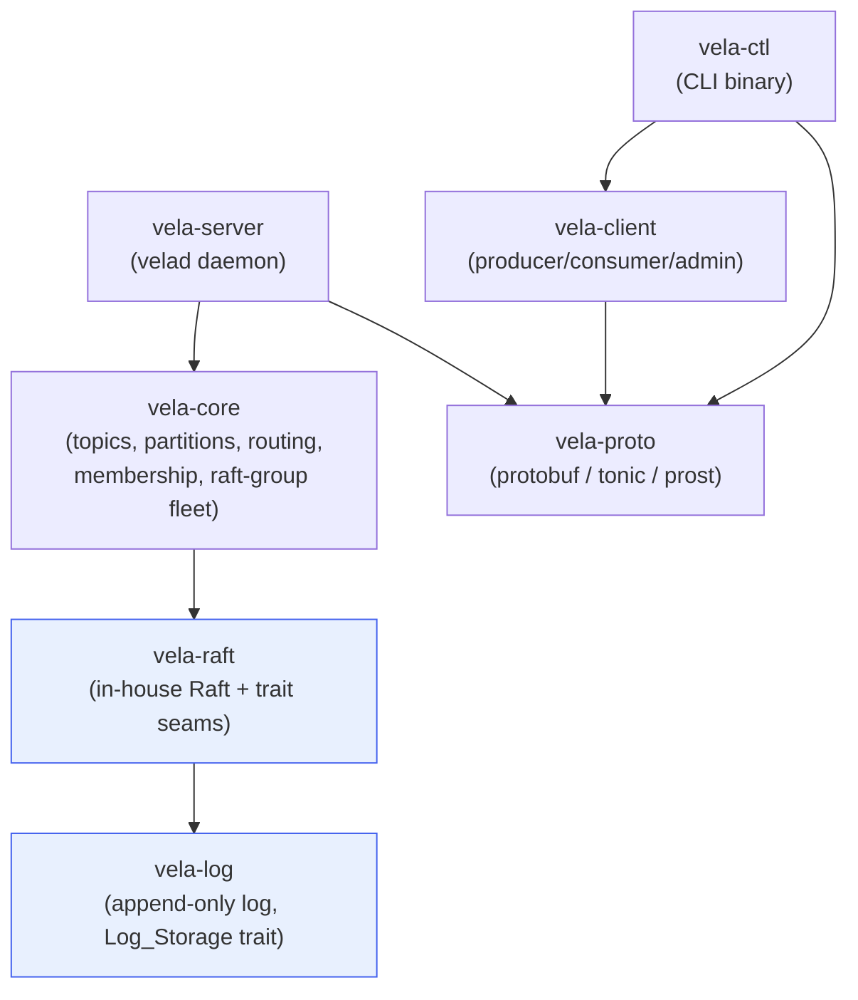
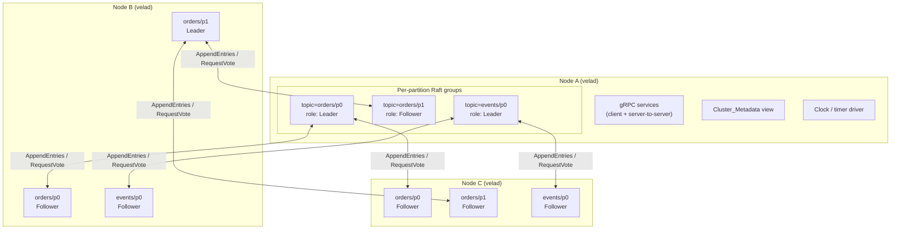
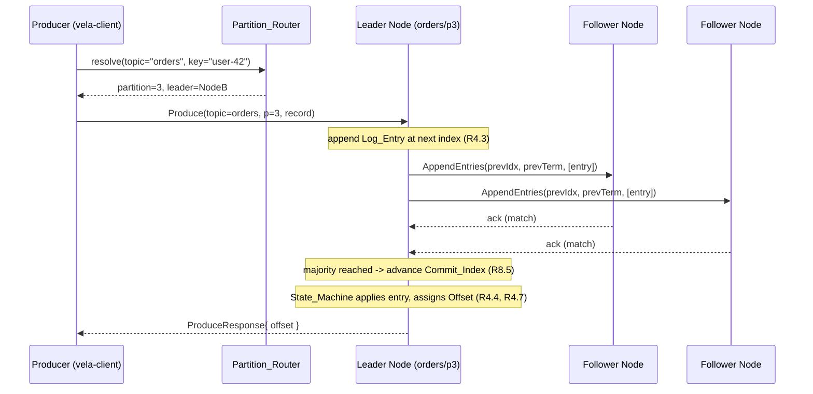

# Design Document

## Overview

Vela is a distributed event-streaming platform built as a Cargo workspace of seven
focused crates. Its defining trait is the consensus model: rather than running a
single cluster-wide Raft group (as kerala does), Vela runs **one independent Raft
group per partition per topic**. Leadership and write load are therefore spread
across every node in the cluster, and a single node concurrently hosts many small,
independently-driven Raft state machines.

This document describes the design for the first milestone: partitioned topics,
per-partition Raft leader election and log replication, an in-memory append-only log
behind a storage trait, cluster membership, client-to-leader routing, a CLI control
tool, and a local multi-node cluster via Docker Compose. Durable persistence and the
ark-lang processing runtime are explicit non-goals (the `Log_Storage` trait is the
seam that lets durability be added later without touching consensus).

The design is shaped by four hard constraints from the steering docs and the
requirements:

1. **In-house Raft** following the Ongaro & Ousterhout extended paper
   (`context/raft.pdf`) — persistent vs volatile state, RequestVote/AppendEntries,
   randomized election timeouts, the Log Matching Property, the election restriction
   for Leader Completeness, majority commit rules, and step-down on a higher term.
2. **Decoupled crate boundaries** — dependencies point strictly inward, and the
   consensus crate depends only on traits (log storage, transport, clock/timer) so
   it is unit-testable and deterministically simulatable.
3. **Per-partition consensus** — `vela-raft` is designed to be instantiated many
   times and driven independently; `vela-core` owns the fleet of per-partition Raft
   groups on a node.
4. **Property-first correctness** — Raft and log invariants are validated with
   `proptest` and a deterministic simulation harness (controllable clock + in-memory
   transport), not just example tests.

### Design Goals and Non-Goals

| Goal | Approach |
|------|----------|
| Distribute leadership | One Raft group per partition; balance leadership at assignment time |
| Testable consensus | Trait seams for storage, transport, clock; deterministic simulation harness |
| Swappable persistence | `Log_Storage` trait; in-memory impl now |
| Typed wire protocol | All messages in `vela-proto`; tonic/prost generated types |
| Easy local cluster | Single `Dockerfile` + `docker-compose.yml` |

Non-goals for this milestone (carried from requirements): durable persistence,
ark-lang runtime, consumer groups/server-side offsets, post-creation rebalancing,
and transport security.

## Architecture

### Crate Layout and Dependency Direction

Dependencies point inward only (Requirement 1.2–1.4). Lower layers (`vela-log`,
`vela-raft`) know nothing about topics, gRPC, or the server.



Key rule (Requirement 1.2): `vela-log` declares no dependency on any other Vela
crate; `vela-raft` depends only on `vela-log`. `vela-raft` abstracts transport and
timing behind traits, so it never depends on `vela-proto` or `tokio` networking
directly.

### A Node Hosting Many Per-Partition Raft Groups

Each node runs one `velad` process. That process hosts a replica of every partition
assigned to it, and each replica is an independent Raft node with its own role,
term, log, and timers (Requirement 7.1, 7.11).



Leadership for `orders/p0` lives on Node A, for `orders/p1` on Node B — leaders are
deliberately distributed (Requirement 7.11, 10.1). A single shared gRPC server-to-
server channel between any node pair multiplexes RPCs for all the partition groups
those two nodes co-host; RPCs are addressed by `(topic, partition)`.

### Produce Flow (client → leader → commit)



If the producer's request reaches a non-leader, that node rejects with a redirection
to the current leader (Requirement 4.6, 11.2), and the client retries against the
identified leader (Requirement 11.3).

### Consume Flow and Leader Redirection

```mermaid
sequenceDiagram
    participant C as Consumer (vela-client)
    participant N as Some Node (follower for p3)
    participant L as Leader Node (orders/p3)

    C->>N: Consume(topic=orders, p=3, offset=100, max=500)
    alt node is not leader
        N-->>C: NotLeader{ leader=NodeB }
        Note over C: wait >= 100ms, retry (R11.3); up to 5 retries (R11.4)
        C->>L: Consume(topic=orders, p=3, offset=100, max=500)
    end
    Note over L: return only committed records, ascending offset (R5.1, R5.2)
    L-->>C: ConsumeResponse{ records[100..], next_offset }
```

### Runtime Model (async tasks)

Within `vela-server`, each hosted partition replica is driven by a small set of
`tokio` tasks created when the partition is started (Requirement 3.2 stops them on
delete):

- A **driver task** owns the `RaftNode` state and processes a single command queue
  (incoming RPCs, RPC responses, client proposals, and timer ticks). The `RaftNode`
  core is a synchronous state machine; the task is the only writer, avoiding locks
  on consensus state.
- **Timer events** (election timeout, heartbeat interval) are delivered through the
  `Clock` trait as messages onto the same queue, so ordering is deterministic and
  the clock can be replaced in tests.
- **Transport** send/receive is handled by adapters that translate between the
  `Transport` trait and tonic gRPC calls.

This single-writer-per-partition model keeps each Raft group independent and makes
the consensus core reusable in a single-threaded simulation.

## Components and Interfaces

### vela-log

`vela-log` provides the append-only log and the `Log_Storage` trait it lives behind
(Requirement 6). It has zero Vela dependencies. Indices are 0-based.

```rust
/// A single element of a partition log.
pub struct LogEntry {
    pub index: u64,
    pub term: u64,
    pub payload: EntryPayload,
}

/// Commit position. `None` means "uncommitted state preceding index 0" (R6.7).
pub type CommitIndex = Option<u64>;

pub trait LogStorage {
    /// Append one entry at highest_index + 1 (or 0 if empty); return assigned index. R6.3, R6.4
    fn append(&mut self, payload: EntryPayload, term: u64) -> Result<u64, LogError>;

    /// Append entries that already carry index+term (used by replication / revert-then-append).
    fn append_entries(&mut self, entries: &[LogEntry]) -> Result<(), LogError>;

    /// Inclusive range read in ascending index order; empty (not error) if start > end. R6.5, R6.6
    fn read(&self, start: u64, end: u64) -> Vec<LogEntry>;

    /// Single-entry lookup; None if absent.
    fn entry(&self, index: u64) -> Option<LogEntry>;

    /// Highest stored index, or None if empty.
    fn last_index(&self) -> Option<u64>;
    /// Term of the entry at `index`, or None.
    fn term_at(&self, index: u64) -> Option<u64>;

    /// Current commit index. R6.7
    fn commit_index(&self) -> CommitIndex;

    /// Advance commit index if commit_index <= idx <= last_index and idx >= current. R6.8, R6.9
    fn commit(&mut self, index: u64) -> Result<(), LogError>;

    /// Remove entries with index > idx; rejected if idx < commit_index. R6.10, R6.11
    fn revert(&mut self, index: u64) -> Result<(), LogError>;

    /// Representation of committed state up to commit_index. R6.12
    fn snapshot(&self) -> Snapshot;
}

/// In-memory implementation for this milestone (R6.2).
pub struct InMemoryLog {
    entries: Vec<LogEntry>, // entries[i].index == i
    commit_index: CommitIndex,
}
```

Design notes:

- `EntryPayload` is generic over what Raft replicates. To keep `vela-log` free of
  domain types, the payload is opaque bytes plus a small tag (`Record` vs
  `ClusterCommand` vs a no-op leader entry). `vela-core` encodes/decodes the bytes.
- `commit` enforces monotonicity at the storage layer (Requirement 6.8, 8.7).
- `revert` is how a follower reconciles a conflicting suffix before appending
  leader entries; it must never discard committed entries (Requirement 6.11).
- `snapshot` returns committed state only; this is the seam a future durable
  implementation will extend.

### vela-raft

`vela-raft` is the in-house Raft implementation, following the extended Raft paper.
It expresses its three external boundaries as traits (Requirement 1.4) and is built
to be instantiated once per partition replica and driven step-by-step.

```rust
/// Boundary 1: where the replicated log lives (re-exported from vela-log).
pub use vela_log::LogStorage;

/// Boundary 2: how this node talks to peers. No knowledge of gRPC. R1.4
pub trait Transport {
    fn send(&self, to: NodeId, msg: RaftMessage);
}

/// Boundary 3: time. Lets tests drive elections deterministically. R1.4, R7.2
pub trait Clock {
    fn now(&self) -> Instant;
    /// Schedule a timer that fires after `dur`, delivered as a Tick to the driver.
    fn arm(&mut self, kind: TimerKind, dur: Duration);
}

pub enum Role { Follower, Candidate, Leader }

/// The synchronous Raft state machine for one partition replica.
pub struct RaftNode<S: LogStorage> {
    // Persistent state (would survive restart in a durable build): R-paper §5
    current_term: u64,
    voted_for: Option<NodeId>,
    log: S,
    // Volatile state
    role: Role,
    commit_index: CommitIndex,
    last_applied: CommitIndex,
    // Volatile leader state (per peer)
    next_index: HashMap<NodeId, u64>,
    match_index: HashMap<NodeId, u64>,
    // Group membership and identity
    id: NodeId,
    peers: Vec<NodeId>,
}

pub enum RaftInput {
    Tick(TimerKind),                 // election timeout / heartbeat elapsed
    Message(RaftMessage),            // RPC or RPC response from a peer
    Propose(EntryPayload),           // leader-side client proposal
}

pub struct RaftOutput {
    pub sends: Vec<(NodeId, RaftMessage)>, // RPCs to dispatch via Transport
    pub committed: Vec<LogEntry>,          // newly committed entries to apply
    pub role_change: Option<Role>,         // for structured logging (R15.4)
}

impl<S: LogStorage> RaftNode<S> {
    /// Pure-ish step function: input + current state -> new state + outputs.
    /// All randomness (election timeout) is injected via Clock so it is reproducible.
    pub fn step(&mut self, input: RaftInput, clock: &mut impl Clock) -> RaftOutput;
}
```

Behavioral rules implemented in `step`, mapped to the paper and requirements:

- **Election timeout**: a follower/candidate that receives no valid AppendEntries
  before its randomized timeout (150–300 ms) becomes candidate, increments term,
  votes for itself, and issues RequestVote to all peers (Requirement 7.2, 7.3, 7.5).
- **Heartbeat**: a leader arms a 50 ms heartbeat timer (< 150 ms minimum election
  timeout) and emits empty AppendEntries on each tick (Requirement 7.6).
- **Vote granting** uses the election restriction (candidate log at least as
  up-to-date by last term then last index) and at-most-one-vote-per-term
  (Requirement 7.7, 7.8); guarantees at most one leader per term (Requirement 7.10).
- **Step-down**: any message with a higher term sets `current_term` and reverts to
  follower (Requirement 7.9).
- **Replication**: leader sends ≤256 entries per AppendEntries carrying
  `(prev_log_index, prev_log_term)`; followers accept only on a matching previous
  entry, else reject for the leader to back up `next_index` (Requirement 8.1–8.4,
  8.9). This enforces the Log Matching Property (Requirement 8.10).
- **Commit**: leader advances `commit_index` to the highest index replicated on a
  majority *and* belonging to the current term (paper §5.4.2), monotonically
  (Requirement 8.5–8.7). Newly committed entries are surfaced in `RaftOutput.committed`
  for the state machine to apply exactly once in order (Requirement 8.8).

`RaftNode::step` performs no I/O and no real timing; this is what makes the
simulation harness and property tests possible.

### vela-proto

`vela-proto` owns every wire type as protobuf, compiled with `prost`/`tonic`
(Requirement 12.1). It defines two gRPC services:

- `VelaClient` — client-facing: `Produce`, `Consume`, `CreateTopic`, `DeleteTopic`,
  `ListTopics`, `DescribeTopic`, `FindLeader` (Requirement 12.2).
- `VelaPeer` — server-to-server: `AppendEntries`, `RequestVote`, plus membership
  `Heartbeat` and metadata propagation `SyncMetadata` (Requirement 12.3).

All RPCs carry `(topic, partition)` so a single channel multiplexes many groups.
A shared `VelaError` message (code + message + optional leader hint) is the typed
error returned across both services (Requirement 12.4, 11.2).

### vela-core

`vela-core` is the domain layer. It composes per-partition Raft groups, owns the
topic/partition model, partition routing, and the node's view of cluster metadata.
It depends on `vela-raft` and `vela-log` but not on gRPC.

Key components:

- **`PartitionReplica`** — wraps a `RaftNode` plus the partition's `State_Machine`
  (which assigns offsets and serves reads). One per partition replica hosted on the
  node.
- **`RaftGroupFleet`** — the collection of `PartitionReplica`s on the node, keyed by
  `(TopicName, PartitionIndex)`; handles lifecycle create/stop (Requirement 3.2).
- **`PartitionRouter`** — resolves `(topic, key)` → partition:
  - With a non-empty key: deterministic hash `partition = hash(key) % partition_count`,
    stable across calls (Requirement 4.1, 10.2).
  - With null/empty key: keyless round-robin across partitions (Requirement 4.2,
    10.3), using an atomic counter per topic.
- **`ClusterMetadata`** — topics, partitions, replica assignments, current leaders,
  and per-node availability (Requirement 9.3). Holds the assignment algorithm.
- **`Assignment`** — at topic creation, spreads each partition's replicas across
  member nodes so that per-topic leadership counts differ by at most one
  (Requirement 2.3, 10.1, 9.6), choosing distinct nodes per replica.
- **`MetadataController`** — manages how `ClusterMetadata` is agreed and propagated
  across the cluster (see "Cluster Metadata Management" below).

The `State_Machine` for a partition is intentionally simple: applying a committed
`Record` entry assigns it the next offset (equal to its log index among record
entries) and makes it readable; this gives monotonic, gap-free offsets starting at 0
(Requirement 4.7, 5.1).

### vela-server

`vela-server` is the only crate that wires networking to the core. It produces the
`velad` binary and:

- Parses configuration (listen address, peers, replication factor, node id) via
  `clap` and environment variables (Requirement 14.4, 15.1, 15.2).
- Implements the tonic `VelaClient` and `VelaPeer` services, translating between
  protobuf and core/raft types, and adapts the `Transport` trait onto outbound gRPC
  channels (Requirement 12.2, 12.3).
- Runs the per-partition driver tasks and the real-clock timer source, and emits
  `tracing` structured logs for startup, readiness, config errors, and every Raft
  role transition (Requirement 15.2–15.4).
- Runs the membership subsystem: peer connection with 5 s timeout and 1 s retry,
  1 s heartbeats, and the 3-missed-heartbeat unavailable rule (Requirement 9.1, 9.2,
  9.4, 9.5).

### vela-client

`vela-client` is the client library used by applications and by `vela-ctl`. It
provides `Producer`, `Consumer`, and `AdminClient`, and owns leader routing:

- Caches the leader location from `ClusterMetadata`/`FindLeader` and sends each
  partition request to the believed leader (Requirement 11.1).
- On a `NotLeader` redirection, retries against the identified leader after waiting
  ≥100 ms, up to 5 retries, then returns a "no leader found" error
  (Requirement 11.2–11.4).
- Wraps `Partition_Router` so produce calls resolve the partition before dispatch
  (Requirement 4.1, 4.2).

### vela-ctl

`vela-ctl` is a thin `clap` CLI over `vela-client` (Requirement 13):

| Command | Behavior | Requirement |
|---------|----------|-------------|
| `create <name> --partitions N` | send CreateTopic, report outcome | 13.1 |
| `delete <name>` | send DeleteTopic, report outcome | 13.2 |
| `list` | list topics with partition counts | 13.3 |
| `describe <name>` | per-partition leader node | 13.4 |

It exits 0 on success (Requirement 13.5), reports and exits non-zero on connection
failure within 5 s (Requirement 13.6) or on a cluster-returned error
(Requirement 13.7).

### Node Startup, Config, and Local Cluster

`velad` configuration fields: `node_id`, `listen_addr`, `peers` (list),
`replication_factor`. Provided via CLI flags or env vars (Requirement 14.4, 15.1).
A `Dockerfile` builds and runs `velad` (Requirement 14.1); `docker-compose.yml`
launches several nodes (kerala used 4) wired into one cluster with each node's peer
list pointing at the others (Requirement 14.2, 14.3, 14.5).

## Data Models

Rust type sketches for the core domain and wire/consensus types. (Wire types are
declared in protobuf in `vela-proto`; these structs are the in-memory shapes.)

```rust
// ---- Identity & numeric domains ----
pub struct NodeId(pub String);          // stable node identity
pub type Term = u64;                     // election epoch (R "Term")
pub type Index = u64;                    // 0-based log index
pub type Offset = u64;                   // 0-based committed record position (R "Offset")

// ---- Records & log ----
pub struct Record {
    pub key: Option<Vec<u8>>,            // opaque; partition key handled at routing
    pub value: Vec<u8>,                  // opaque payload
}
// Combined key+value must be <= 1 MiB (R4.8), validated before append.

pub enum EntryPayload {
    Record(Record),                      // a produced event
    Noop,                                // leader's no-op on election (paper §8)
    Cluster(ClusterCommand),             // metadata change (see controller)
}

pub struct LogEntry {
    pub index: Index,
    pub term: Term,
    pub payload: EntryPayload,
}

// ---- Raft state (persistent vs volatile, per the paper) ----
pub struct PersistentState {
    pub current_term: Term,              // latest term seen
    pub voted_for: Option<NodeId>,       // candidate voted for in current term
    // log lives behind LogStorage
}
pub struct VolatileState {
    pub commit_index: Option<Index>,     // None = nothing committed yet (R6.7)
    pub last_applied: Option<Index>,
    pub role: Role,
}
pub struct LeaderState {
    pub next_index: HashMap<NodeId, Index>,
    pub match_index: HashMap<NodeId, Index>,
}

// ---- RPC message types (mirrored in vela-proto) ----
pub struct RequestVote {
    pub term: Term,
    pub candidate_id: NodeId,
    pub last_log_index: Option<Index>,
    pub last_log_term: Option<Term>,
}
pub struct RequestVoteReply { pub term: Term, pub vote_granted: bool }

pub struct AppendEntries {
    pub term: Term,
    pub leader_id: NodeId,
    pub prev_log_index: Option<Index>,
    pub prev_log_term: Option<Term>,
    pub entries: Vec<LogEntry>,          // <= 256 per RPC (R8.1)
    pub leader_commit: Option<Index>,
}
pub struct AppendEntriesReply {
    pub term: Term,
    pub success: bool,
    pub conflict_hint: Option<Index>,    // lets leader back up next_index (R8.3)
}

pub enum RaftMessage {
    RequestVote(RequestVote),
    RequestVoteReply(RequestVoteReply),
    AppendEntries(AppendEntries),
    AppendEntriesReply(AppendEntriesReply),
}

// ---- Topic / partition / cluster model ----
pub struct PartitionIndex(pub u32);
pub struct Partition {
    pub index: PartitionIndex,
    pub replicas: Vec<NodeId>,           // distinct nodes; len == replication_factor
    pub leader: Option<NodeId>,          // current leader, None during election
}
pub struct Topic {
    pub name: String,                    // 1..=255, [A-Za-z0-9_-] (R2.1)
    pub partitions: Vec<Partition>,      // count 1..=10_000 (R2.1, R2.2)
    pub state: TopicState,               // Active | Deleting (R3.7)
}
pub enum TopicState { Active, Deleting }

pub enum NodeAvailability { Available, Unavailable }
pub struct Member { pub id: NodeId, pub addr: String, pub availability: NodeAvailability }

pub struct ClusterMetadata {
    pub members: Vec<Member>,            // R9.3
    pub topics: BTreeMap<String, Topic>, // keyed by name within namespace
    pub epoch: u64,                      // bumped on each committed metadata change
}

pub enum ClusterCommand {               // replicated metadata mutations
    CreateTopic { name: String, partitions: Vec<Partition> },
    DeleteTopic { name: String },
    SetAvailability { node: NodeId, availability: NodeAvailability },
}
```

### Cluster Metadata Management

`ClusterMetadata` (topics, partition/replica assignments, leaders, membership) must
itself be agreed across the cluster. Two pragmatic options were considered:

- **Option A — Dedicated metadata Raft group.** Reuse `vela-raft` for a single,
  well-known control group (e.g. `__meta/p0`) replicated across all (or a fixed
  subset of) nodes. `ClusterCommand`s are entries in that group's log; once
  committed, the new metadata is applied and propagated. **Pro:** consistent and
  reuses the consensus we already build and test; no second mechanism. **Con:** that
  one group's leader is a coordination point for admin operations (not for
  produce/consume, which stay distributed).

- **Option B — Designated coordinator node.** One node is elected/configured as the
  metadata owner and pushes updates. **Pro:** trivial to implement. **Con:** a new,
  separate failure/agreement mechanism to reason about and test, duplicating Raft.

**Decision:** use **Option A — a dedicated metadata Raft group** for this milestone.
It keeps the system to a single consensus mechanism, gives atomic topic
create/delete via committed `ClusterCommand`s (Requirement 3.1), and yields a
natural propagation path: after a metadata change commits, the leader pushes the new
metadata (carrying its `epoch`) to every reachable node via `SyncMetadata`, and
must observe acknowledgements within 5 s, reporting laggards on delete
(Requirement 2.8, 3.5, 3.6). Per-partition leadership (the field that changes most
often) is learned locally and reported through membership/leadership gossip rather
than requiring a metadata commit on every election, keeping the control group's load
low. The tradeoff — admin operations funnel through the metadata group's leader — is
acceptable for the in-memory milestone and is called out so it can be revisited when
durability and rebalancing are added.

## Correctness Properties

*A property is a characteristic or behavior that should hold true across all valid
executions of a system — essentially, a formal statement about what the system
should do. Properties serve as the bridge between human-readable specifications and
machine-verifiable correctness guarantees.*

These properties were derived from the acceptance criteria via the prework analysis.
Each is universally quantified and intended to be implemented as a single
`proptest`-driven test (minimum 100 iterations), most of them running over the
deterministic simulation harness described in the Testing Strategy. Structural
build-graph criteria, propagation/timing integration criteria, and CLI/observability
criteria are validated by smoke, integration, and example tests respectively rather
than by properties.

**Log Properties (vela-log)**

### Property 1: Append assigns the next sequential index

*For any* sequence of appends to a log (empty or not), each append stores the entry
at index 0 for the first entry and at exactly `highest_index + 1` thereafter, and
returns that assigned index.

**Validates: Requirements 6.3, 6.4**

### Property 2: Append/read round-trip preserves entries

*For any* sequence of appended entries with no intervening revert, reading the full
index range returns exactly those entries in the same order.

**Validates: Requirements 6.13**

### Property 3: Range read is ascending and gap-omitting

*For any* log and any range `start..=end`, a read returns the stored entries whose
indices fall within the range in ascending index order, omitting absent indices; and
*for any* range where `start > end` it returns zero entries without error.

**Validates: Requirements 6.5, 6.6**

### Property 4: Commit advances only within valid bounds and never backward

*For any* log and any index `idx`, `commit(idx)` advances the commit index when
`current_commit <= idx <= last_index`, and otherwise (when `idx < current_commit` or
`idx > last_index`) is rejected leaving the commit index and entries unchanged.

**Validates: Requirements 6.8, 6.9**

### Property 5: Revert truncates the uncommitted suffix and protects committed entries

*For any* log and any index `idx`, `revert(idx)` with `idx >= commit_index` removes
exactly the entries with index greater than `idx` and keeps the rest, while
`revert(idx)` with `idx < commit_index` is rejected leaving entries and commit index
unchanged.

**Validates: Requirements 6.10, 6.11**

### Property 6: Snapshot reflects exactly the committed prefix

*For any* log, a snapshot represents the committed entries up to and including the
commit index (and nothing uncommitted); on a log with no commit, the snapshot is
empty.

**Validates: Requirements 6.7, 6.12**

**Routing & Topic Properties (vela-core)**

### Property 7: Topic creation registers N partitions indexed 0..N-1

*For any* valid topic name and partition count N in `1..=10000`, a successful
creation registers a topic with exactly N partitions whose indices are exactly the
integers 0 through N-1.

**Validates: Requirements 2.1, 2.2**

### Property 8: Replica assignment uses replication-factor distinct member nodes

*For any* cluster with at least `replication_factor` member nodes and any created
topic, every partition is assigned exactly `replication_factor` replicas placed on
distinct nodes, and every replica node is a current cluster member.

**Validates: Requirements 2.3, 9.6**

### Property 9: Invalid topic-creation inputs are rejected without side effects

*For any* topic name outside 1–255 characters or containing characters outside
`[A-Za-z0-9_-]`, *or* any partition count outside `1..=10000`, *or* any cluster with
fewer member nodes than the replication factor, topic creation is rejected and the
cluster metadata is left unchanged.

**Validates: Requirements 2.5, 2.6, 2.7**

### Property 10: Keyed routing is deterministic

*For any* topic with a fixed partition count and any non-empty partition key,
resolving the topic and key repeatedly returns the same partition, and that
partition index is always within `0..partition_count`.

**Validates: Requirements 4.1, 10.2**

### Property 11: Keyless routing distributes across all partitions

*For any* topic with partition count N, resolving a sequence of N or more keyless
produce requests selects partitions such that every partition index in `0..N` is
chosen (round-robin coverage) rather than the deterministic key mapping.

**Validates: Requirements 4.2, 10.3**

### Property 12: Leadership is balanced across nodes per topic

*For any* cluster with 2 or more member nodes and any created topic, the difference
between the maximum and minimum number of partition leaderships assigned to any
single node for that topic is at most one.

**Validates: Requirements 10.1**

### Property 13: Deleting topics atomically removes all partitions

*For any* existing topic, a delete operation results in either all of the topic's
partitions being removed from metadata or none of them (even when a fault is
injected mid-operation); a partial removal never persists.

**Validates: Requirements 3.1**

### Property 14: Operations on a deleting topic are rejected

*For any* topic in the `Deleting` state, any produce or duplicate-delete request for
that topic is rejected with a "being deleted" error and appends no log entry.

**Validates: Requirements 3.7**

**Produce / Consume Properties (vela-core)**

### Property 15: Committed records receive unique, gap-free, monotonic 0-based offsets

*For any* sequence of records committed to a partition, the assigned offsets are
exactly 0, 1, 2, … in commit order, with each offset unique and increasing by one,
and each committed record is appended as a log entry on the leader before commit.

**Validates: Requirements 4.3, 4.4, 4.7**

### Property 16: Produce to a non-leader is redirected and writes nothing

*For any* partition replica that is not the current leader, a produce request returns
an error identifying the current leader and appends no log entry; from the client
side this redirection identifies the leader to retry against.

**Validates: Requirements 4.6, 11.2**

### Property 17: A record not replicated to a majority within the commit timeout is not committed

*For any* record whose entry fails to reach a majority of the Raft group before the
5000 ms commit timeout (simulated clock), the leader returns a not-committed error,
does not advance the partition's commit index, and returns no offset.

**Validates: Requirements 4.9**

### Property 18: Oversized payloads are rejected

*For any* record whose combined key and value size exceeds 1,048,576 bytes, the
produce request is rejected with a validation error and no log entry is appended;
records at or below the limit are not rejected for size.

**Validates: Requirements 4.8**

### Property 19: Consume returns only committed records in ascending offset order

*For any* partition log and any start offset in `0..=highest_committed_offset`, a
consume returns committed records in strictly ascending offset order beginning at the
requested offset, and never returns any record at an index beyond the commit index.

**Validates: Requirements 5.1, 5.2**

### Property 20: Consume respects the maximum-count bound

*For any* partition log and any requested maximum count in `1..=10000`, a consume
returns no more than that many records; and when no maximum is specified it returns
no more than 500.

**Validates: Requirements 5.5, 5.6**

### Property 21: Invalid consume parameters are rejected

*For any* requested start offset less than 0, or maximum count less than 1 or greater
than 10000, a consume returns an invalid-parameters error and returns no records.

**Validates: Requirements 5.7**

**Raft Election Properties (vela-raft)**

### Property 22: An idle follower becomes a candidate for the next term

*For any* follower or candidate that receives no valid AppendEntries before its
randomized election timeout (selected from `150..=300` ms) elapses, it transitions to
candidate, increments its current term by exactly one, votes for itself, and sends a
RequestVote carrying its current term and last log index/term to every peer; a
candidate that neither wins nor sees a leader before its timeout starts a fresh
election with a further incremented term.

**Validates: Requirements 7.2, 7.3, 7.5**

### Property 23: Vote decision follows term, log-currency, and single-vote rules

*For any* node state and RequestVote RPC, the node grants its vote — and adopts the
RPC's term — if and only if the RPC term is greater than or equal to its current
term, the candidate's log is at least as up to date as its own, and it has not
already voted for another candidate in that term; otherwise it denies the vote and
responds with its current term.

**Validates: Requirements 7.7, 7.8**

### Property 24: A higher term always forces step-down

*For any* node in any role that receives any RPC carrying a term greater than its
current term, the node adopts the greater term and transitions to follower.

**Validates: Requirements 7.9**

### Property 25: A majority of same-term votes elects exactly one leader per term

*For any* Raft group and term, a candidate that collects votes from a strict majority
of the group within that term becomes leader, and no term ever has more than one
leader.

**Validates: Requirements 7.4, 7.10**

### Property 26: Exactly one Raft group exists per partition

*For any* set of created topics, the number of instantiated Raft groups equals the
total number of partitions across all topics.

**Validates: Requirements 7.1**

### Property 27: A leader heartbeats faster than the minimum election timeout

*For any* node that is leader, heartbeat AppendEntries RPCs are emitted at the fixed
50 ms interval, which is strictly shorter than the 150 ms minimum election timeout,
so a stable leader prevents follower timeouts.

**Validates: Requirements 7.6**

**Raft Replication Properties (vela-raft)**

### Property 28: AppendEntries is bounded and carries the correct preceding entry

*For any* leader with a backlog of entries to replicate, each AppendEntries RPC
carries no more than 256 entries and the index and term of the entry immediately
preceding those it conveys.

**Validates: Requirements 8.1**

### Property 29: Followers accept matching and reject conflicting AppendEntries

*For any* follower and AppendEntries RPC, the follower appends the conveyed entries
and acknowledges when the preceding entry matches its log at the same index and term,
and otherwise rejects the RPC with a hint allowing the leader to retry from an earlier
entry.

**Validates: Requirements 8.2, 8.3**

### Property 30: Replication retries back up and use capped exponential backoff

*For any* follower that rejects or fails to acknowledge within the 1000 ms
AppendEntries timeout (simulated clock), the leader retries replication from an
earlier entry, increasing the backoff between successive retries up to a maximum
interval of 5000 ms.

**Validates: Requirements 8.4**

### Property 31: Commit index advances exactly to the highest majority-replicated current-term entry

*For any* leader and replication state, the commit index advances to an entry's index
when that entry (from the current term) is replicated on a majority of the group, and
does not advance past any entry that has not been replicated to a majority.

**Validates: Requirements 8.5, 8.6**

### Property 32: Commit index is monotonic

*For any* execution of a Raft group, the commit index of every node is
non-decreasing over time.

**Validates: Requirements 8.7**

### Property 33: The state machine applies committed entries once, in order, with no gaps

*For any* execution, as the commit index advances each node's state machine applies
every committed entry exactly once, in ascending index order, skipping no index.

**Validates: Requirements 8.8**

### Property 34: A lagging follower converges to the leader's log

*For any* leader and lagging follower given sufficient replication rounds, the
follower's log is brought into agreement with the leader's by receiving the missing
entries.

**Validates: Requirements 8.9**

### Property 35: Log Matching holds across the group

*For any* two Raft nodes in a group, if their logs each contain an entry with the
same index and term, then their logs are identical in every entry up to and including
that index.

**Validates: Requirements 8.10**

**Membership & Client Routing Properties**

### Property 36: Node availability is always exactly one of two states

*For any* sequence of membership events, each member node's recorded availability in
the cluster metadata is exactly one of `available` or `unavailable`.

**Validates: Requirements 9.3**

### Property 37: Three consecutive missed heartbeats mark a node unavailable, and recovery restores it

*For any* member node, after three consecutive missed 1-second heartbeat intervals
(simulated clock) the node is marked unavailable, and a subsequent successful response
from a node currently marked unavailable marks it available again.

**Validates: Requirements 9.4, 9.5**

### Property 38: Client retries redirections with a minimum delay and a bounded count

*For any* sequence of redirections, the client retries against the identified leader
waiting at least 100 ms before each retry, and after at most 5 retries without
locating a leader it stops and returns a no-leader error.

**Validates: Requirements 11.3, 11.4**

### Property 39: Typed error mapping round-trips

*For any* internal failure mapped to a `VelaError` protobuf message and decoded back,
the error code and identity are preserved.

**Validates: Requirements 12.4**

## Error Handling

Vela uses typed errors with `thiserror` in library crates and reserves `anyhow` for
binary entry points (`velad`, `vela-ctl`), per the tech steering doc. Errors are
classified by layer and mapped to a single `VelaError` protobuf type at the gRPC
boundary (Requirement 12.4).

### Error Taxonomy

```rust
#[derive(thiserror::Error, Debug)]
pub enum LogError {
    #[error("commit index {requested} out of bounds (commit={commit:?}, last={last:?})")]
    CommitOutOfBounds { requested: u64, commit: Option<u64>, last: Option<u64> },
    #[error("cannot revert below commit index (requested={requested}, commit={commit})")]
    RevertBelowCommit { requested: u64, commit: u64 },
}

#[derive(thiserror::Error, Debug)]
pub enum RaftError {
    #[error("not leader; current leader is {leader:?}")]
    NotLeader { leader: Option<NodeId> },
    #[error("commit not reached before timeout")]
    CommitTimeout,
}

#[derive(thiserror::Error, Debug)]
pub enum CoreError {
    #[error("topic {0} already exists")] TopicExists(String),
    #[error("topic {0} not found")] TopicNotFound(String),
    #[error("topic {0} is being deleted")] TopicDeleting(String),
    #[error("partition not found: {topic}/{index}")] PartitionNotFound { topic: String, index: u32 },
    #[error("invalid topic name")] InvalidTopicName,
    #[error("partition count {0} out of range 1..=10000")] InvalidPartitionCount(u32),
    #[error("record exceeds 1 MiB limit ({0} bytes)")] RecordTooLarge(usize),
    #[error("invalid consume parameters")] InvalidConsumeParams,
    #[error("insufficient nodes: have {have}, need {need}")] InsufficientNodes { have: usize, need: usize },
    #[error("partition unavailable (no leader)")] PartitionUnavailable,
    #[error("metadata not acknowledged by nodes: {0:?}")] MetadataPropagation(Vec<NodeId>),
}
```

### Handling Strategy by Category

| Category | Examples | Handling | Requirements |
|----------|----------|----------|--------------|
| Validation | bad topic name, count out of range, record > 1 MiB, bad consume params | Reject before any state change; metadata/log unchanged | 2.5, 2.6, 4.8, 5.7 |
| Not-found | unknown topic/partition | Typed not-found error; no records/no append | 3.4, 4.5, 5.4, 10.5 |
| Conflict / state | duplicate topic, topic being deleted | Reject, leave metadata unchanged | 2.4, 3.7 |
| Leadership | request hits non-leader, no leader elected | Redirect with leader hint, or `PartitionUnavailable` within 5 s | 4.6, 5.8, 10.6, 11.2 |
| Timeout | commit not reached in 5 s; AppendEntries no-ack in 1 s | Return error, do not advance commit; retry replication with capped backoff | 4.9, 8.4 |
| Propagation | metadata not acked by all nodes in 5 s | Return error naming laggards; retain acked changes (delete) | 2.8, 3.5, 3.6 |
| Membership | peer connect fail/timeout | Mark unavailable, retry every 1 s | 9.1, 9.2 |
| Config / startup | invalid/missing config | Structured `tracing` error log + non-zero exit | 15.2 |

### Boundary Mapping and Invariants

- Every `CoreError`/`RaftError`/`LogError` maps to a `VelaError` (code + message +
  optional `leader` hint) on the gRPC boundary; `vela-client` decodes it back into a
  typed client error (Requirement 12.4, 11.2). This mapping round-trips
  (Property 39).
- **No-side-effect-on-error** is a deliberate, tested invariant: validation,
  conflict, and timeout errors must leave the log and cluster metadata unchanged
  (Properties 9, 14, 17; Requirements 2.4–2.7, 3.7, 4.5, 4.9).
- Consensus errors never violate safety: a commit timeout or replication failure
  leaves `commit_index` and applied state untouched (Properties 31–33).

## Testing Strategy

Testing follows a dual approach: **property-based tests** (`proptest`) verify the
universal correctness properties above across many generated inputs, and
**example/unit/integration tests** cover specific behaviors, infrastructure wiring,
and the CLI. Mutation testing (`cargo-mutants`) guards test strength, so assertions
must be meaningful, not incidental.

### Deterministic Simulation Harness (core of consensus testing)

The most important testing asset is a **deterministic, single-threaded simulation
harness** in `vela-raft` test support, built on the trait seams:

- **`ManualClock`** implements `Clock`: time only advances when the test advances it,
  and election-timeout randomness is drawn from a seeded RNG so runs are reproducible.
  This makes the 150–300 ms election window, the 50 ms heartbeat, the 1 s/5 s
  replication backoff, and the 5 s commit timeout exactly controllable.
- **`InMemoryTransport`** implements `Transport`: messages are placed in queues the
  harness delivers explicitly, so the test can reorder, delay, drop, duplicate, and
  partition messages to exercise the full space of Raft scenarios.
- **`SimCluster`** instantiates N `RaftNode`s sharing one `InMemoryTransport` and one
  `ManualClock`, and exposes a `step()` that delivers one scheduled event. Properties
  drive a `SimCluster` through randomized event schedules and assert invariants
  (Election Safety, Log Matching, State Machine Safety, commit monotonicity,
  convergence) hold after every step.

Because `RaftNode::step` performs no real I/O or timing, the same consensus code runs
identically in the simulator and in production under `tokio` — only the `Clock` and
`Transport` implementations differ.

### Property-Based Testing Configuration

- Library: **`proptest`** (per tech steering). Property-based testing is **not**
  implemented from scratch.
- **Minimum 100 iterations** per property test (`ProptestConfig { cases: 100, .. }`
  or higher for cheap in-memory properties).
- Each property test is tagged with a comment referencing its design property in the
  format: `// Feature: vela-streaming-platform, Property {number}: {property_text}`.
- Each correctness property (Properties 1–39) is implemented by a **single**
  property-based test. Log, routing, and pure-logic properties run directly; election
  and replication properties run over the `SimCluster` harness.
- Generators: arbitrary `Record` (bounded payloads incl. around the 1 MiB edge),
  arbitrary entry sequences and terms, arbitrary valid/invalid topic names and
  partition counts, arbitrary cluster sizes and replication factors, and randomized
  message-delivery schedules (with drop/reorder/partition) for the simulator.

### Unit & Example Tests

Used for specific behaviors and edge cases that are not universal properties
(classified EXAMPLE/EDGE_CASE in prework):

- Initial commit state `None` (6.7), `start > end` empty read (6.6), offset beyond
  commit returns empty (5.3), default max 500 (5.6), unavailable-on-no-leader reads
  (5.8), duplicate/nonexistent topic errors (2.4, 3.4, 4.5, 5.4, 10.5).
- Topic-delete lifecycle ordering: Raft group stopped before log released (3.2, 3.3),
  verified with a mock fleet.
- `vela-ctl` commands: create/delete/list/describe output and exit codes, connection
  failure, cluster-rejection (13.1–13.7) — run against an in-process fake server.
- Node config parsing and startup/readiness/role-transition logs (14.4, 15.2–15.4),
  asserted with a `tracing` test subscriber.

### Integration Tests

For behavior that crosses process/transport boundaries and does not vary meaningfully
with input (classified INTEGRATION in prework) — 1–3 representative cases each:

- Metadata propagation within 5 s and partial-failure reporting (2.8, 3.5, 3.6).
- Peer connection timeout/retry and cluster discovery (9.1, 9.2, 14.3).
- gRPC listener bind on startup (15.1).
- End-to-end produce/consume against the Docker Compose cluster (14.5), and a
  multi-node leader-election + replication smoke run over real `tokio`/tonic to
  confirm the simulator-validated logic behaves the same with real timers.

### Smoke / Structural Checks

For build-graph and artifact facts (classified SMOKE in prework): seven workspace
members and inward-only dependencies (1.1–1.4), whole-workspace build (1.5),
`Log_Storage` trait existence and in-memory impl (6.1, 6.2), proto-owned wire types
and service surfaces (12.1–12.3), and presence of the `Dockerfile`/`docker-compose.yml`
(14.1, 14.2).

## Requirements Traceability

This maps each requirement to the design components and the properties/tests that
satisfy it.

| Requirement | Design components | Verification |
|-------------|-------------------|--------------|
| 1. Workspace & crates | Crate layout, dependency graph | Smoke 1.1–1.6 |
| 2. Topic creation | `ClusterMetadata`, `Assignment`, `MetadataController` | Properties 7, 8, 9; Integration 2.8; Edge 2.4 |
| 3. Topic deletion | `RaftGroupFleet`, `MetadataController` | Property 13, 14; Example 3.2, 3.3; Edge 3.4; Integration 3.5, 3.6 |
| 4. Producing records | `PartitionRouter`, `PartitionReplica`, `State_Machine`, `RaftNode` | Properties 10, 11, 15, 16, 17, 18; Edge 4.5 |
| 5. Consuming records | `State_Machine`, `PartitionReplica` | Properties 19, 20, 21; Edge 5.3, 5.4, 5.6, 5.8 |
| 6. In-memory log | `LogStorage` trait, `InMemoryLog` | Properties 1–6; Smoke 6.1, 6.2; Example 6.7; Edge 6.6 |
| 7. Raft election | `RaftNode`, `Clock`, `Transport` | Properties 22, 23, 24, 25, 26, 27; Example 7.11 |
| 8. Log replication | `RaftNode`, `LogStorage` | Properties 28–35 |
| 9. Cluster membership | `ClusterMetadata`, membership subsystem | Properties 8, 36, 37; Integration 9.1, 9.2 |
| 10. Assignment & routing | `Assignment`, `PartitionRouter` | Properties 10, 11, 12; Example 10.4; Edge 10.5, 10.6 |
| 11. Client-to-leader routing | `vela-client` leader routing | Properties 16, 38; Example 11.1 |
| 12. gRPC communication | `vela-proto`, `vela-server` services | Property 39; Smoke 12.1–12.3 |
| 13. CLI control tool | `vela-ctl` | Examples 13.1–13.7 |
| 14. Local cluster | `Dockerfile`, `docker-compose.yml`, config | Smoke 14.1, 14.2; Example 14.4; Integration 14.3, 14.5 |
| 15. Startup & config | `vela-server` config + `tracing` | Examples 15.2–15.4; Integration 15.1 |
